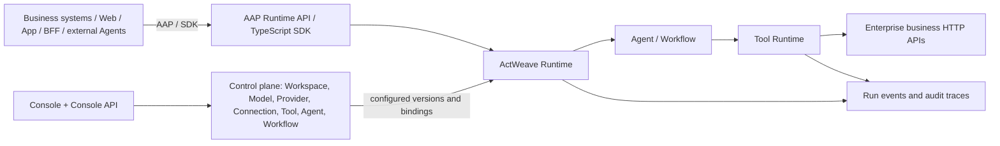
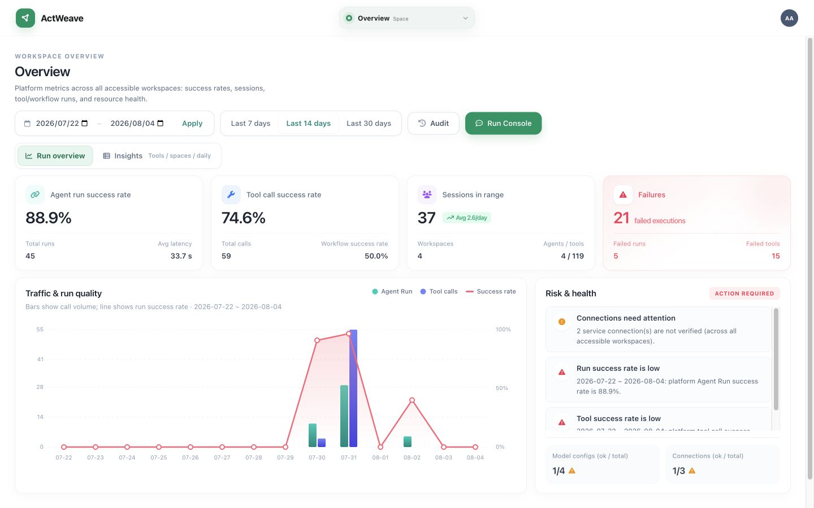
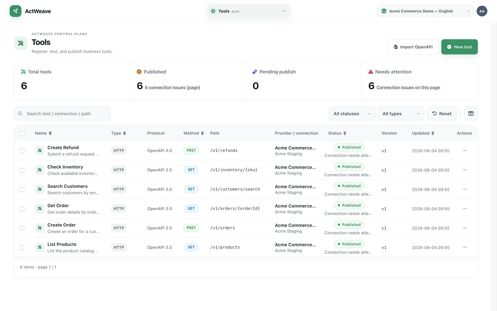
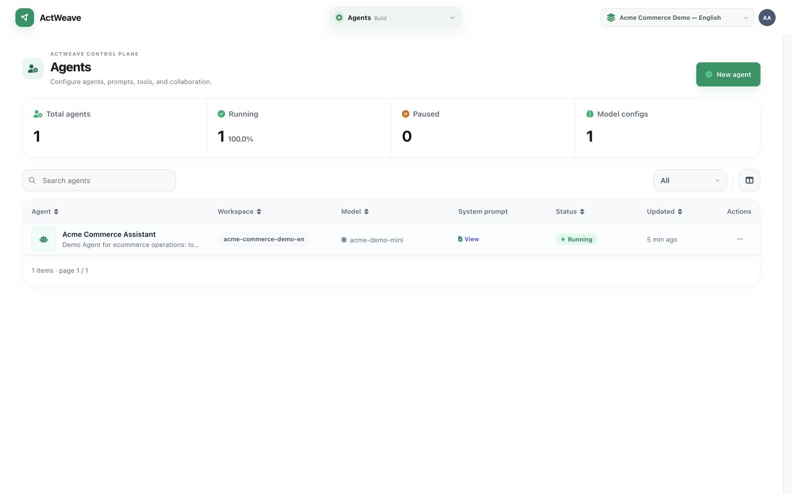
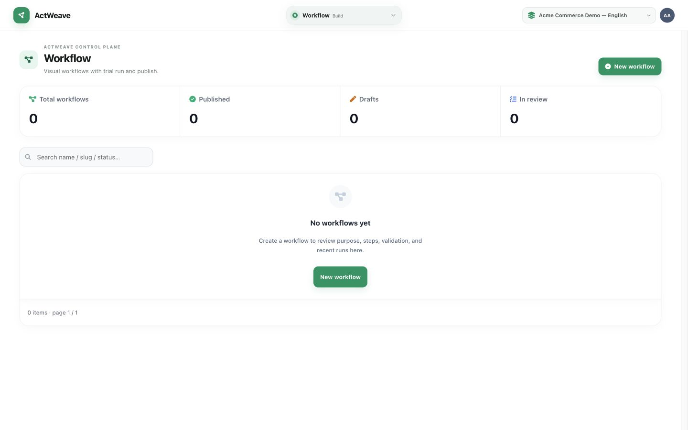
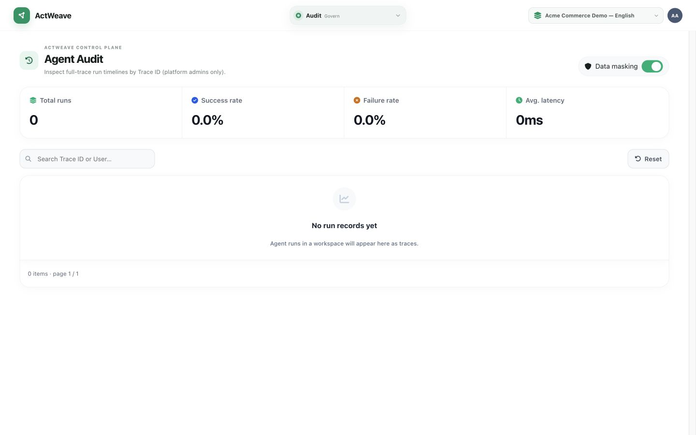

# ActWeave

[中文](./README.zh-CN.md) · [Quick start](./docs/getting-started.md) · [Documentation](./docs/README.md) · [Architecture](./docs/architecture.md) · [AAP integration](./docs/aap-integration-guide.md)

> **An Agent control plane and runtime access platform for enterprise systems.**

ActWeave governs existing HTTP APIs and OpenAPI services as testable, versioned, publishable Tools; composes them into Agents and Workflows; and exposes them to web clients, apps, BFFs, business systems, and other Agents through a separate runtime plane. A run can be traced across its Conversation, Run, model turns, delegation, Workflow, and Tool calls.

**Project status: active development.** No Git tag or GitHub Release is present in this checkout, so this documentation makes no production-readiness or support-level claim. Validate deployment, security, and integrations before any rollout.

## What is ActWeave?

ActWeave is not only an Agent administration UI, nor is it a replacement for ERP, CRM, CMDB, DevOps, or IoT systems. It sits between those systems and intelligent applications: it turns existing business capabilities into Tools with contracts and runtime configuration, composes them into Agents or Workflows, then makes the result available through controlled runtime APIs.

The console is one interface to that control plane. External runtime access uses the AAP path `/api/agent-access/v1`, which is separate from the console `/api/v1` management API. Third parties do not need, and should not use, an administrator console session to call an Agent.

## Why ActWeave?

| Enterprise Agent integration problem | Capability implemented in this repository |
| --- | --- |
| Business APIs are scattered and a model assembles HTTP calls ad hoc | Providers, Connections, and Tools with input/output schemas; OpenAPI can import Tool drafts |
| Credentials, outbound identity, and environments leak into callers | Service Connections hold runtime connectivity and identity policy; Providers can declare service contracts and allowed scopes |
| API changes have unclear runtime impact | Tools have drafts, tests, publishing, disabling, and version history; Agents and Workflows bind published capabilities |
| Every application invents its own integration pattern | AAP offers OAuth Clients, grants, Conversations, Runs, SSE, and an OpenAPI contract; a TypeScript SDK is included |
| A run spanning models, sub-agents, flows, and tools is hard to investigate | The Agent audit center shows Trace timelines and nested delegation; runtime events can be followed and replayed over SSE |

## How it works



A typical loop is:

1. Create a Workspace and register model APIs, Providers, and Service Connections.
2. Import Tools from OpenAPI or create them by hand; define I/O contracts, runtime policy, and a Connection; test and publish them.
3. Create an Agent with a model, prompt, and published Tool or Workflow bindings. Optionally configure in-workspace delegation or A2A exposure/remotes.
4. Design, validate, trial-run, and publish deterministic Workflows. Generate conversation lives inside the Workflow editor and can produce a graph draft; it does not auto-publish.
5. Trial an Agent in the console, or let an external application create Conversations and Runs through AAP and consume SSE events.
6. Review a Trace in the audit center. What is visible depends on role, retention, and debug configuration.

## Core capabilities

### Tool Governance

A Tool is a structured business capability callable by an Agent, not an unrestricted model URL. The current implementation includes:

- Providers, Service Connections, and outbound identity configuration. A Connection may use `REQUEST_PASSTHROUGH` or a Broker/OBO path.
- OpenAPI discovery/import that materializes endpoints as Tool drafts, plus manual Tool creation.
- Tool input/output schemas, HTTP action configuration, timeout/retry policy, and a runtime path with SSRF controls, secret injection, response limits, and idempotency constraints.
- Draft, test, publish, disable, and version lifecycle. Normal publishing requires a recent passing test. Administrator force-publish is a configuration-gated exception, not the normal path.
- Workspace RBAC for console management, and AAP grant scopes for access to Agent runtime endpoints. This README does not claim a per-Tool end-user authorization product.
- Tool invocations and related runtime steps in audit/Trace data.

### Agent Control Plane

Within a Workspace, ActWeave manages Agents, Model API configurations, prompt revisions, published Tool/Workflow bindings, and runtime configuration. Workflows have graph drafts, compilation, trial runs, and publishing. Agents can also use in-workspace callable delegation bindings; A2A inbound exposure and outbound remote configuration are present.

### Runtime Access

AAP is the runtime integration protocol for business applications: Client credentials or private-key JWT exchange for access tokens, constrained by workspace, agent, scope, and grant; Conversations and Runs; and SSE events. The repository includes a runtime OpenAPI contract, protocol schemas, a TypeScript SDK, and a BFF chat demo. Console API and AAP have different paths and authentication models; see the [concept boundary](./docs/concepts.md).

### End-to-End Audit

The console’s Agent audit center is for platform administrators and queries run timelines by Trace. The implementation can associate initiator (user or Client), Conversation/Run, model turns, Agent delegation, Workflow execution steps, Tool calls, state, errors, and timing. Whether request/response bodies can be read depends on retention, permissions, and debug settings; the audit UI is not a promise that every sensitive payload is stored or displayed.

### Enterprise Integration

ActWeave is intended to organize enterprise APIs into an Agent runtime path, not to replace upstream systems. Business rules, data ownership, and final business operations remain in ERP, CRM, DevOps, CMDB, IoT, or other upstream services. ActWeave manages how an Agent calls those capabilities through configured Connections and Tool contracts.

## Typical uses

- Import order, inventory, ticketing, or other HTTP services through Provider/Connection/OpenAPI and publish them as Tools for business Agents.
- Compose controlled diagnostics, changes, and query APIs for operations or DevOps Workflows, with Tool and execution traces.
- Delegate to specialist Agents in one Workspace, or expose/call external Agents through A2A with explicit host and authentication configuration.
- Embed a hosted Agent in an existing web client, mobile app, or BFF with AAP Conversations, Runs, and SSE.
- Keep test, publish, and disable state for Tools that can affect higher-risk business APIs, then investigate calls through runtime audit.
- Offer a shared AAP runtime layer to multiple callers instead of distributing console accounts to every web or app integration.

## Protocol and concept boundaries

| Concept | Role and current status in ActWeave |
| --- | --- |
| **OpenAPI** | Supported: describes or imports existing HTTP APIs and materializes endpoints as Tool drafts. |
| **MCP** | This repository does not expose an MCP server or MCP client runtime. Do not treat MCP as a supported capability. |
| **A2A** | Implemented: in-Workspace delegation plus an A2A gateway for inbound exposure, Agent Cards, outbound remotes, and durable task paths. Configuration still requires explicit allowlists, auth, and upstream compatibility checks. |
| **AAP** | Supported runtime plane for Web, App, BFF, and third-party business systems to create sessions/runs and consume SSE. |
| **Console API** | `/api/v1` management plane for Workspaces, Agents, Tools, Workflows, Clients, and system configuration; it uses console-user authentication and RBAC. |
| **Tool** | A structured business capability callable by an Agent/Workflow, bound to schema, runtime configuration, Connection, and publish status. |
| **Workflow** | Implemented deterministic multi-step graph execution with compilation, trial run, and publishing. |
| **Agent** | A runtime unit that makes contextual decisions using a model, prompt, and bound capabilities. |

**Why AAP when A2A already exists?** A2A addresses Agent discovery, delegation, and task collaboration. AAP addresses business applications, BFFs, and third-party platforms calling an Agent Runtime hosted by ActWeave. The caller, session/task lifecycle, authentication entry point, and permission boundary differ. Neither protocol substitutes for the other.

Read the full [concept and protocol boundary](./docs/concepts.md) and [architecture](./docs/architecture.md).

## Product preview

Screenshots in this English document use the fictional `Acme Commerce Demo — English` Workspace and mock product, order, inventory, and refund Tools; they contain no real tenant data. The remaining console pages and screenshots are in the [product tour](./docs/product-tour.md).

| Overview | Tool governance |
| --- | --- |
|  |  |

| Agent configuration | Workflow |
| --- | --- |
|  |  |

Agent audit Trace detail for a demo order flow: AAP Client `Acme Partner App` → Conversation/Run → model turn → inventory Agent delegation (`check_inventory`) → `create_order` → final output (latency and success status on the timeline).



## Quick start

Prerequisites: Docker and Docker Compose. Clone and start from the repository root:

```bash
git clone https://github.com/chenow9/act-weave.git
cd act-weave
docker compose up --build
```

- Console: <http://127.0.0.1:5174>
- Backend health check: <http://127.0.0.1:8082/api/v1/health>
- An empty data volume creates a local-development administrator only: `admin` / `actweave-admin-dev-change-me`.

Change the password after the first sign-in. For production, replace repository development configuration, database/object-storage credentials, JWT/encryption keys, AAP signing keys, and bootstrap administrator credentials. Pushing a `v*` tag publishes frontend and backend images to Alibaba Cloud ACR; registry addresses and pull commands are in [deployment](./docs/deployment.md#release-images-to-acr). See that page for the complete production requirements.

## Project status and current limitations

| Category | Status |
| --- | --- |
| Implemented | Workspace/RBAC, Provider/Connection, OpenAPI import, Tool governance, Agents, Workflows, console trials, AAP, SSE, TypeScript SDK, audit, A2A delegation/gateway paths, and `v*` tag image publish to ACR. |
| Feature-gated | AAP file upload is disabled by default; end-to-end multimodal input also needs `runtimeMultimodal`. LLM context compaction is disabled by default. |
| Current limitations | The console is primarily desktop-oriented; some advanced Workflow node types are supported in the backend but not fully exposed by the editor; publish impact analysis does not automatically list every Agent/Workflow reference. |
| Maturity | No version tags, public release notes, or production SLO/SLA were found. Suitability for a specific production environment must be decided by the deployer after threat modeling, capacity, backup, monitoring, and integration testing. |

[Roadmap](./ROADMAP.md) records direction only; it makes no delivery-date commitment.

## Documentation

| Goal | Document |
| --- | --- |
| Start locally | [Getting started](./docs/getting-started.md) |
| Understand AAP/A2A/MCP/OpenAPI boundaries | [Concepts](./docs/concepts.md) |
| Review control plane, runtime plane, and infrastructure | [Architecture](./docs/architecture.md) |
| Browse the console and every screenshot | [Product tour](./docs/product-tour.md) |
| Integrate with Agent Runtime | [AAP integration guide](./docs/aap-integration-guide.md) · [OpenAPI](./docs/openapi/agent-access-v1.yaml) · [TypeScript SDK](./sdk/typescript/) |
| Import business APIs | [OpenAPI to Tool](./docs/integrations/openapi.md) |
| Deploy, develop, or assess security | [Deployment](./docs/deployment.md) · [Development](./docs/development.md) · [Security](./SECURITY.md) |
| Browse both languages | [Documentation home](./docs/README.md) |

## Technology overview

- Console: Vue 3, TypeScript, Vite.
- Backend and runtime: Go, Gin, Eino ADK/compose, AAP protocol schemas.
- Data and objects: PostgreSQL, Redis, MinIO; Compose supplies local full-stack dependencies.

Implementation versions, commands, and configuration variables are in [development](./docs/development.md) and [deployment](./docs/deployment.md).

## Contributing

Read the [contribution guide](./CONTRIBUTING.md) before opening an Issue, Pull Request, or development-environment change. Changes to AAP or protocol schemas must also run the repository compatibility checks.

## Security

Do not disclose vulnerabilities, secrets, or real business data in a public Issue. See the [security policy](./SECURITY.md) for reporting guidance and its current limitation.

## License

ActWeave is licensed under the [Apache License 2.0](./LICENSE).
