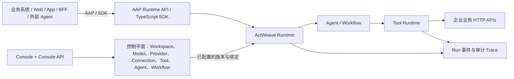

# ActWeave（织行）

[English](./README.md) · [快速开始](./docs/getting-started.zh-CN.md) · [文档导航](./docs/README.zh-CN.md) · [架构](./docs/architecture.zh-CN.md) · [AAP 接入](./docs/aap-integration-guide.zh-CN.md)

> **面向企业业务系统的 Agent 控制平面与运行接入平台。**

ActWeave 将已有 HTTP API 和 OpenAPI 服务治理为可测试、可版本化、可发布的 Tool；在此基础上配置 Agent 与 Workflow，并通过独立的运行接入面向 Web、App、BFF、业务系统及其他 Agent 开放能力。一次运行可沿 Conversation、Run、模型、委派、Workflow 与 Tool 调用追踪。

**项目状态：活跃开发中。** 当前仓库未见 Git tag 或 GitHub Release，因此本文不对生产就绪性或支持等级作承诺；请在上线前自行完成部署、安全与集成验证。

## ActWeave 是什么

ActWeave 不是单一的 Agent 管理后台，也不是替代 ERP、CRM、CMDB、DevOps 或 IoT 系统的业务系统。它位于这些系统与智能应用之间：将既有业务能力收敛为有契约和运行配置的 Tool，编排到 Agent 或 Workflow 中，再以受控的运行 API 提供给调用方。

控制台只是这个控制平面的一个交互入口。对外运行接入使用与控制台 `/api/v1` 分离的 AAP 路径 `/api/agent-access/v1`；第三方不需要也不应使用管理员的控制台会话来调用 Agent。

## 为什么需要 ActWeave

| 企业接入 Agent 时的问题 | 仓库中已有的应对方式 |
| --- | --- |
| 业务 API 分散，模型直接拼 HTTP 调用 | Provider、Connection 与带输入/输出 Schema 的 Tool；支持 OpenAPI 导入为 Tool 草稿 |
| 凭证、出站身份和环境配置散落在调用方 | Service Connection 保存运行连接与身份策略；Provider 可声明服务契约与允许的 scope |
| 改动 API 后难以知道什么会受影响 | Tool 具有草稿、测试、发布、禁用与版本记录；Agent/Workflow 绑定已发布能力 |
| 应用接入方式各自定义 | AAP 提供 OAuth Client、Grant、Conversation、Run、SSE 与 OpenAPI 契约；另有 TypeScript SDK |
| 一次执行跨模型、子 Agent、工作流和工具后难以排查 | Agent 审计中心按 Trace 展示运行步骤与嵌套委派；运行事件可通过 SSE 跟随和重放 |

## ActWeave 如何工作



典型闭环是：

1. 创建 Workspace，并注册模型 API、Provider 与 Service Connection。
2. 通过 OpenAPI 导入或手工创建 Tool，定义输入/输出契约、运行策略与连接；测试通过后发布。
3. 创建 Agent，绑定模型、提示词和已发布的 Tool 或 Workflow；需要时配置同 Workspace 的 Agent 委派或 A2A 暴露/远端。
4. 设计、校验、试跑并发布确定性的 Workflow；Smart DAG 可生成图草案，但不是绕过发布流程的自动上线功能。
5. 在控制台中试跑，或由外部应用通过 AAP 创建 Conversation 与 Run，并用 SSE 消费运行事件。
6. 在审计中心按 Trace 回看执行。可见内容依角色、数据保留和调试配置而定。

## 核心能力

### Tool Governance

Tool 是 Agent 可调用的结构化业务能力，而不是模型任意访问的 URL。当前实现提供：

- Provider、Service Connection 与出站身份配置；Connection 可使用 `REQUEST_PASSTHROUGH`，也可配置 Broker/OBO 路径。
- OpenAPI 文档发现/导入，将 endpoint 物化为 Tool 草稿，或手工创建 Tool。
- Tool 的输入/输出 Schema、HTTP action 配置、超时/重试等运行策略，以及 SSRF 防护、Secret 注入、响应上限和幂等约束的运行路径。
- 草稿、测试、发布、禁用和版本；正常发布要求最近一次测试通过。平台管理员的强制发布是受配置开关控制的例外，不应作为常规流程。
- Workspace RBAC 管理控制台操作；AAP 的 grant scope 管理谁可访问 Agent 运行面。当前 README 不将其表述为逐 Tool 的终端用户授权产品。
- Tool invocation 与相关运行步骤可进入审计/Trace 数据。

### Agent Control Plane

在 Workspace 内管理 Agent、Model API 配置、提示词修订、已发布的 Tool/Workflow 绑定和运行配置。Workflow 具有图草稿、编译、试跑与发布链路。Agent 还支持同 Workspace 的可调用委派绑定；A2A 入站暴露与出站远端配置也已存在。

### Runtime Access

AAP 是面向业务应用的运行接入协议：Client 凭证或私钥 JWT 换取访问令牌，按 workspace、agent、scope 与 grant 受限地创建 Conversation 和 Run，并使用 SSE 读取事件。仓库提供运行面 OpenAPI、协议 schema、TypeScript SDK 与一个 BFF 聊天演示。Console API 与 AAP 的认证模型和路径不同，详见[概念边界](./docs/concepts.zh-CN.md)。

### End-to-End Audit

控制台的 Agent 审计中心面向平台管理员，按 Trace 查询运行时间轴。实现中可关联发起方（用户或 Client）、Conversation/Run、模型 turn、Agent 委派、Workflow 执行步骤、Tool 调用、状态、错误和时间信息。请求/响应正文是否可读取取决于保存策略、权限和调试配置；不应把审计界面视为无条件保存或暴露所有敏感原文的承诺。

### Enterprise Integration

ActWeave 旨在把企业已拥有的 API 安全地组织进 Agent 运行链路，而不是取代上游业务系统。业务规则、数据主权和最终业务操作仍在 ERP、CRM、DevOps、CMDB、IoT 或其他上游服务中；ActWeave 管理的是 Agent 如何在已配置的连接与 Tool 契约下调用这些能力。

## 典型使用场景

- 将订单、库存、工单等已有 HTTP 服务经 Provider/Connection/OpenAPI 导入为可发布 Tool，再交给业务 Agent 使用。
- 为运维或 DevOps 场景把受控诊断、变更与查询 API 组合为 Workflow，并保留 Tool 与执行 Trace。
- 在同一 Workspace 里让 Agent 委派专业子 Agent；或按 A2A 暴露/调用外部 Agent，且配置允许的主机与身份方式。
- 将托管 Agent 嵌入已有 Web、移动端或 BFF，通过 AAP 的 Conversation、Run 和 SSE 维持应用侧会话与事件消费。
- 对会影响高风险业务 API 的 Tool 保留测试、发布和禁用状态，并通过运行审计调查调用过程。
- 用统一的 AAP 运行接入层服务多个调用方，而不是向每个 Web/App 分发控制台账号。

## 协议与概念边界

| 概念 | 在 ActWeave 中的职责与当前状态 |
| --- | --- |
| **OpenAPI** | 已支持：导入或描述既有 HTTP API，并将 endpoint 生成/维护为 Tool 草稿。 |
| **MCP** | 当前仓库未实现作为 MCP server 或 MCP client 的公开运行面；不要将其视为已支持能力。 |
| **A2A** | 已实现同 Workspace 委派，以及经 A2A gateway 的入站暴露、Agent Card、出站远端配置与持久任务路径。配置时仍需明确 allowlist、认证和上游兼容性。 |
| **AAP** | 已支持的 ActWeave Agent Runtime 接入面，供 Web、App、BFF 和第三方业务系统创建会话、运行和消费 SSE。 |
| **Console API** | `/api/v1` 管理面，用于管理 Workspace、Agent、Tool、Workflow、Client 和系统配置；使用控制台用户认证与 RBAC。 |
| **Tool** | Agent/Workflow 可调用的结构化业务能力，绑定 Schema、运行配置、Connection 与发布状态。 |
| **Workflow** | 已实现的确定性多步骤图执行，包含编译、试跑和发布。 |
| **Agent** | 以模型、提示词、已绑定能力和上下文进行动态决策的运行单元。 |

**为什么已有 A2A 仍需要 AAP？** A2A 面向 Agent 之间的发现、委派与任务协作；AAP 面向业务应用、BFF 与第三方平台调用托管在 ActWeave 中的 Agent Runtime。两者的调用主体、会话/任务生命周期、认证入口与权限边界不同。AAP 不是 A2A 的替代层，A2A 也不应替代应用侧的 AAP 接入契约。

完整说明见[概念与协议边界](./docs/concepts.zh-CN.md)和[系统架构](./docs/architecture.zh-CN.md)。

## 产品预览

截图来自虚构的 `Acme Commerce Demo` Workspace，使用商品、订单、库存和退款等 mock Tool；不包含真实租户数据。其余页面截图与说明位于[产品导览](./docs/product-tour.zh-CN.md)。

| 总览 | Tool 治理 |
| --- | --- |
|  |  |

| Agent 配置 | Workflow |
| --- | --- |
|  |  |


## 快速开始

前置条件：Docker 与 Docker Compose。克隆后从仓库根目录启动：

```bash
git clone https://github.com/chenow9/act-weave.git
cd act-weave
docker compose up --build
```

- 控制台：<http://127.0.0.1:5174>
- 后端健康检查：<http://127.0.0.1:8082/api/v1/health>
- 空数据卷会创建仅限本地开发的管理员：`admin` / `actweave-admin-dev-change-me`。

首次登录后应修改密码。生产环境必须替换仓库中的开发配置、数据库与对象存储凭证、JWT/加密密钥、AAP 签名密钥和 bootstrap 管理员凭证；完整要求见[部署说明](./docs/deployment.zh-CN.md)。

## 项目状态与当前限制

| 分类 | 现状 |
| --- | --- |
| 已实现 | Workspace/RBAC、Provider/Connection、OpenAPI 导入、Tool 治理、Agent、Workflow、Console 试跑、AAP、SSE、TypeScript SDK、审计，以及 A2A 委派/网关路径。 |
| 受开关限制 | AAP 文件上传默认关闭；端到端多模态输入还需单独开启 `runtimeMultimodal`。LLM 上下文压缩默认关闭。 |
| 当前限制 | 控制台以桌面布局为主；部分高级 Workflow 节点后端支持但编辑器未完全暴露；发布影响分析不会自动列出所有 Agent/Workflow 引用。 |
| 成熟度 | 未找到版本 tag、公开发布说明或生产 SLO/SLA。是否适合某个生产环境须由部署方基于威胁建模、容量、备份、监控和集成测试决定。 |

[Roadmap](./ROADMAP.md) 只记录方向，不承诺时间表。

## 文档导航

| 目标 | 文档 |
| --- | --- |
| 从本地启动 | [快速开始](./docs/getting-started.zh-CN.md) |
| 理解边界、AAP/A2A/MCP/OpenAPI | [概念](./docs/concepts.zh-CN.md) |
| 查看控制面、运行面与基础设施 | [架构](./docs/architecture.zh-CN.md) |
| 浏览控制台与全部截图 | [产品导览](./docs/product-tour.zh-CN.md) |
| 接入 Agent Runtime | [AAP 对接指南](./docs/aap-integration-guide.zh-CN.md) · [OpenAPI](./docs/openapi/agent-access-v1.yaml) · [TypeScript SDK](./sdk/typescript/) |
| 导入业务 API | [OpenAPI 到 Tool](./docs/integrations/openapi.md) |
| 部署、开发、安全 | [部署](./docs/deployment.zh-CN.md) · [开发](./docs/development.zh-CN.md) · [安全](./SECURITY.md) |
| 全部中英文文档 | [文档首页](./docs/README.zh-CN.md) |

## 技术概览

- Console：Vue 3、TypeScript、Vite。
- 后端与运行时：Go、Gin、Eino ADK/compose、AAP protocol schema。
- 数据与对象：PostgreSQL、Redis、MinIO；Compose 提供本地整栈依赖。

版本、命令和环境变量等实现细节放在[开发文档](./docs/development.zh-CN.md)与[部署文档](./docs/deployment.zh-CN.md)。

## 参与贡献

提交 Issue、Pull Request 或开发环境变更前，请阅读[贡献指南](./CONTRIBUTING.md)。变更 AAP 或协议 schema 时还应运行仓库中的兼容性检查。

## 安全

请不要在公开 Issue 中披露漏洞细节、密钥或真实业务数据。报告路径及当前限制见[安全策略](./SECURITY.md)。

## License

ActWeave 使用 [Apache License 2.0](./LICENSE) 开源。
