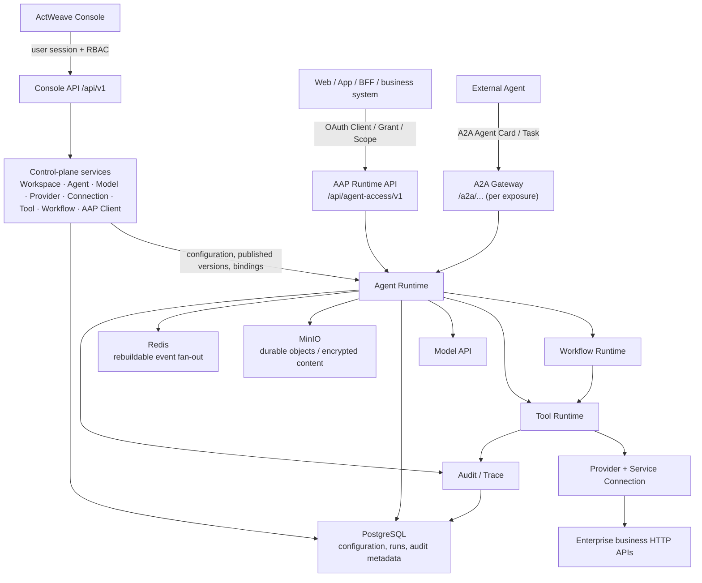

# ActWeave Architecture

[中文](./architecture.zh-CN.md) · [Documentation home](./README.md)

ActWeave separates control-plane and runtime-plane responsibilities. They are assembled in the same backend application, but use different HTTP paths, caller identities, and access boundaries.

## Management plane and runtime plane

Every component in the diagram exists in the current repository’s Compose, application assembly, or runtime modules. Redis is designed as a rebuildable fan-out layer, not a run source of truth; run events and `Last-Event-ID` replay are backed by PostgreSQL.

## Control plane

The control plane uses Console API `/api/v1` to manage configuration and governance objects:

- **Identity and Workspace:** users, sessions, platform roles, Workspace membership, and Workspace RBAC.
- **Models and Agents:** Model API configurations, Agents, prompt revisions, capability bindings, in-Workspace delegation, and A2A configuration.
- **Business capabilities:** Providers, Service Connections, OpenAPI imports, Tools, Tool versions, tests, and publishing.
- **Flows and governance:** Workflow drafts, compilation, revisions, trials/publishing, plus audit query and export.
- **Runtime-access management:** AAP Clients, credentials, grants, external subjects, and Client state. Managing these objects is not the same as calling an Agent through Console API.

## Runtime plane

The runtime plane has two distinct entry points:

| Entry point | Caller | Path and identity | Purpose |
| --- | --- | --- | --- |
| AAP | Web, App, BFF, third-party business system | `/api/agent-access/v1`; AAP access token | Conversations, Runs, SSE, cancellation, and Interaction decisions. [Detailed AAP contract](./aap-integration-guide.md) |
| A2A Gateway | External Agent | `/a2a/...`; A2A auth policy of the exposed Agent | Agent Cards, task invocation, and cancellation; open only for configured exposures. |

The Agent Runtime freezes/uses the relevant Agent, model, and capability configuration; Workflow Runtime executes compiled graphs; Tool Runtime calls upstream HTTP services through a Connection. The runtime can write Run, step, event, and audit data. Visibility depends on role, retention policy, and configuration.

## Data and infrastructure

| Component | Current responsibility |
| --- | --- |
| PostgreSQL | Source of truth for configuration, identity, versions, Runs, steps, protocol events, audit metadata, and migrations. |
| MinIO | Compose creates execution, audit, Tool-test, connection-verification, and AAP-file buckets; the backend manages durable objects. |
| Redis | Required at process start. Cross-replica SSE wakeup, AAP rate limits, SSE connection leases, cancel and security-change broadcasts. Not a durable fact store; Run events replay from PostgreSQL. |
| Model API | Model connection configuration used by Agents. |
| Provider/Connection | Service endpoint, auth contract, environment, and outbound identity for enterprise HTTP APIs. |

## Configuration boundary and limitations

- AAP file routes exist, but `agentAccess.files.enabled` is off by default. Model multimodal assembly also requires `runtimeMultimodal`. Assistant outbound attachments (`output_file`) additionally require the files allowlist, `runtimeOutboundAttachments`, Agent policy `enableOutboundAttachments`, and a `toolCalling` mode that supports tools (`function_calling` / `native_client_search`). See the [file-upload runbook](./runbooks/aap-file-upload.md).
- LLM context compaction has a separate gate and is disabled by default. See the [context-compaction runbook](./runbooks/agent-context-llm-compaction.md).
- Tool disclosure: `client_bounded` is the only native production mode. `platform_bounded` and `carry_all` are additional Agentic modes, gated by `runtime.toolDisclosure` (omitting the key stays disabled; the checked-in config enables it). Readiness accepts v1 or v2 three-tier capabilities.
- Compose is the local full-stack startup path, not an HA, backup, TLS, edge-proxy, or production-operations design. See [deployment](./deployment.md).

## Related documentation

- [Concept and protocol boundaries](./concepts.md)
- [AAP integration guide](./aap-integration-guide.md)
- [OpenAPI to Tool](./integrations/openapi.md)
- [Deployment](./deployment.md)
