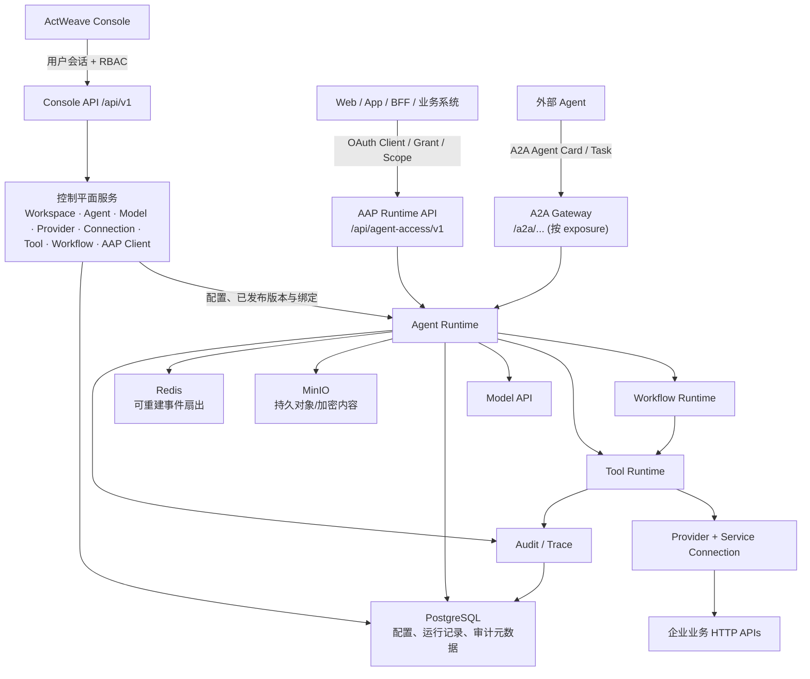

# ActWeave 系统架构

[English](./architecture.md) · [文档首页](./README.zh-CN.md)

ActWeave 的架构按职责分为控制面与运行面。它们在同一个后端应用中组装，但使用不同的 HTTP 路径、调用身份与访问边界。

## 管理面与运行面

图中组件均能在当前仓库的 Compose、应用组装或运行时模块中找到。Redis 被设计为可重建扇出层，不应被当作运行事实来源；运行事件与 `Last-Event-ID` 回放基于 PostgreSQL。

## 控制面

控制面通过 Console API `/api/v1` 管理配置和治理对象：

- **身份与 Workspace**：用户、会话、平台角色、Workspace 成员和 Workspace RBAC。
- **模型与 Agent**：Model API 配置、Agent、提示词修订、能力绑定、同 Workspace 委派和 A2A 配置。
- **业务能力**：Provider、Service Connection、OpenAPI 导入、Tool、Tool 版本、测试和发布。
- **流程与治理**：Workflow 草稿、编译、修订、试跑/发布，以及审计查询与导出。
- **运行接入的管理**：AAP Client、凭证、grant、外部 subject 与 client 状态。管理这些对象不等于用 Console API 调用 Agent。

## 运行面

运行面有两个不同的入口：

| 入口 | 调用方 | 路径与身份 | 用途 |
| --- | --- | --- | --- |
| AAP | Web、App、BFF、第三方业务系统 | `/api/agent-access/v1`；AAP access token | Conversation、Run、SSE、取消和 Interaction 决策。[AAP 详细契约](./aap-integration-guide.zh-CN.md) |
| A2A Gateway | 外部 Agent | `/a2a/...`；已暴露 Agent 的 A2A 认证策略 | Agent Card、任务调用与取消；仅对配置的 exposure 开放。 |

Agent Runtime 冻结/使用对应 Agent、模型和能力配置来执行；Workflow Runtime 执行已编译的图；Tool Runtime 经 Connection 调用上游 HTTP 服务。运行时可写入 Run、步骤、事件和审计数据。实际可见数据受角色、保留策略和配置影响。

## 关键数据与基础设施

| 组件 | 当前职责 |
| --- | --- |
| PostgreSQL | 配置、身份、版本、Run、步骤、协议事件、审计元数据和迁移事实来源。 |
| MinIO | Compose 创建执行、审计、Tool 测试、连接校验和 AAP 文件相关 bucket；持久对象由后端管理。 |
| Redis | 可重建的事件扇出；不应承担事实持久化。 |
| Model API | Agent 调用的模型接入配置。 |
| Provider/Connection | 到企业业务 HTTP API 的服务端点、认证契约、环境与出站身份。 |

## 配置边界与限制

- AAP 文件路由存在，但 `agentAccess.files.enabled` 默认关闭；即使打开，模型多模态组装还需 `runtimeMultimodal`。见[文件运行手册](./runbooks/aap-file-upload.md)。
- LLM 上下文压缩存在独立开关，默认关闭。见[上下文压缩运行手册](./runbooks/agent-context-llm-compaction.md)。
- Compose 是本地全栈启动方式，不构成高可用、备份、TLS、边缘代理或生产运维方案。见[部署](./deployment.zh-CN.md)。

## 相关文档

- [概念与协议边界](./concepts.zh-CN.md)
- [AAP 对接指南](./aap-integration-guide.zh-CN.md)
- [OpenAPI 到 Tool](./integrations/openapi.md)
- [部署说明](./deployment.zh-CN.md)
