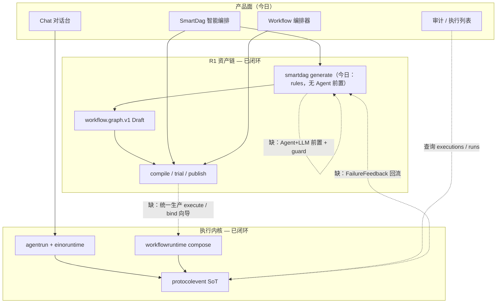
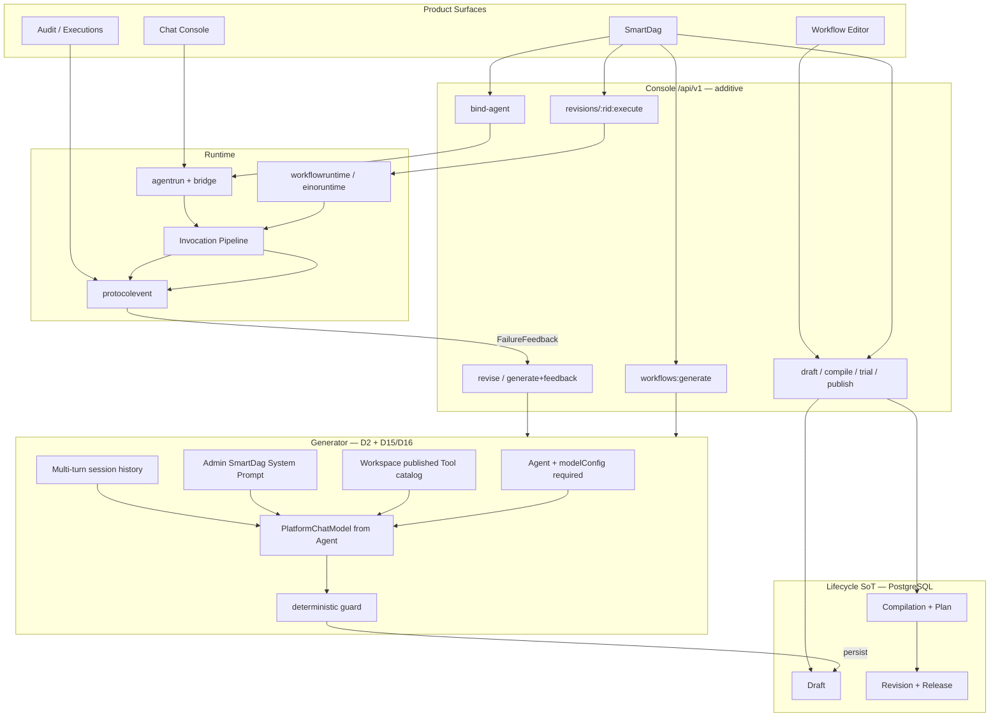

# 智能编排完整闭环：生成 → 发布 → 生产执行 → 反馈再修订

| 字段 | 值 |
|------|-----|
| **文档标题** | Intelligent Orchestration Closed Loop |
| **作者** | ACTWEAVE Platform |
| **日期** | 2026-07-23 |
| **状态** | **Accepted**（Rev 1.1 — Key Decisions **D1–D16** 锁定；含多轮自然语言生成澄清） |
| **相关** | [`eino-agent-runtime-base-checklist.md`](./eino-agent-runtime-base-checklist.md)、[`eino-no-reinvent-checklist.md`](./eino-no-reinvent-checklist.md)、[`protocol-event-unification-console-aap.md`](./protocol-event-unification-console-aap.md)、[`../runbooks/eino-agent-runtime-rollout.md`](../runbooks/eino-agent-runtime-rollout.md)、README「智能编排」说明 |
| **实施清单** | [`intelligent-orchestration-closed-loop-checklist.md`](./intelligent-orchestration-closed-loop-checklist.md)（开发任务单 + 验收勾选；顺序：清单 → 开发 → §9 验证） |
| **API 草案** | [`intelligent-orchestration-api-draft.md`](./intelligent-orchestration-api-draft.md)（Console session/turns/execute/bind + 错误码） |
| **单测策略** | [`intelligent-orchestration-test-strategy.md`](./intelligent-orchestration-test-strategy.md) |
| **分支建议** | `feature/intelligent-orchestration-closed-loop`（可与 eino / protocol 分支叠放；禁止改 AAP 外部公共面） |

---

## 1. Overview

ACTWEAVE 已具备两段**局部闭环**：

1. **资产生命周期（R1）**  
   智能编排 `POST .../workflows:generate` → 正式 `workflow.graph.v1` Draft → compile → trial → readiness → publish → activate。  
   前后端与验收测（`TestV1SmartDAGGeneratesFormalDraftAndUsesWorkflowLifecycle`）已打通。

2. **Agent 运行时（执行内核）**  
   Console / AAP → `agentrun` → `chatruntimebridge` → `einoruntime` → **protocolevent SSE**；HITL 确认/恢复已存在。  
   Workflow 生产默认 Eino compose；辅助 LLM 统一 `PlatformChatModel`。

但**产品级「智能业务闭环」尚未闭合**：

| 缺口 | 现象 |
|------|------|
| 智能生成偏规则 | `smartdag` 对已发布 Tool 做关键词打分 + 线性构图，非约束式 LLM 生成 |
| 自然语言意图仅单次 | SmartDag 今日/草案首版易落成「一次 goal → 一图」；产品需要 **多轮** 自然语言修订意图 |
| 发布后生产入口弱 | Trial 完善；对 **active revision 的统一生产执行** 与 UI 旅程不完整 |
| 入口割裂 | SmartDag / 编排器 / 对话台 / 审计未串成默认向导（bind Agent → Chat 验证） |
| 无运行反馈 | 编译/试跑/生产失败不能结构化回流到「修订 Draft / 再生成」 |
| 编辑器能力差 | 后端节点（HTTP / SubWorkflow / Parallel / ForEach 等）前端配置未对齐 |

**本方案目标一句话：**

> **在已配置 LLM 的 Agent 上下文中：多轮自然语言意图（+ 工作空间可用 Tool 目录 + Agent 信息 + 管理员固化的智能编排 System Prompt）→ 目录约束内生成/修订可编译 Workflow 并画布渲染 → 用户满意后走 compile/trial/publish → bind 该 Agent → 经 Console Chat / 直接 Execution / AAP 等多入口使用（Eino）→ 失败可回流修订；全程 PostgreSQL 事实 + 审计可关联。**

**产品前提（D2）：** 智能编排的产物是 Workflow 编排，编排**面向某个 Agent 使用/绑定**；因此 Generate / Revise **必须**指定 Workspace 内 Agent，且该 Agent **已配置可用 LLM（modelConfig）**，否则直接拒绝，**不**降级为无模型的规则假生成。

**产品前提（发布后才能给 Agent 用）：** 多轮生成满意得到的是 **Draft/编排资产**；须完成 **编译 → 试跑 → 发布 → bind** 后，Agent 才能正式调用该 Workflow（与既有 Workflow 生命周期一致）。

**产品前提（多入口）：** 发布并 bind 之后，**不限于 AAP**；Console 对话台、对 revision 的生产 `:execute`、以及 AAP 均可接入使用（见 D4）。

---

## 2. Background & Motivation

### 2.1 五环模型（完整闭环定义）

| 环 | 含义 | 当前状态 |
|----|------|----------|
| **R1 资产生命周期** | 目标 → Draft → 编译 → 试跑 → 发布/激活 | **基本闭环** |
| **R2 生产执行** | 已发布物被真正执行，结果可观测 | **半闭环** |
| **R3 智能生成** | 模型 + 目录约束生成可编译图 | **未闭环**（规则生成） |
| **R4 运行反馈** | 失败/HITL/缺口回流改图或补能力 | **未闭环** |
| **R5 产品一体** | SmartDag / 编排器 / Chat / 审计同一旅程 | **半闭环** |

**可对外宣称「完整闭环」的最小集合：** R1 + R2 + R3 + R4 + 必要的 R5（bind + Chat 验证）。  
触发器自治、全自动 re-publish、评测平台属 **P2**，不阻塞 MVP。

### 2.2 现状拓扑



### 2.3 必须复用的边界（禁止平行实现）

与 [`eino-no-reinvent-checklist.md`](./eino-no-reinvent-checklist.md) 一致：

| Eino / 已有平台能力 | 本方案只做 |
|---------------------|------------|
| Agent loop / stream / interrupt | 不自研 tool loop |
| Workflow DAG / checkpoint / resume | 只产 graph → compile plan → 现有 runner |
| `PlatformChatModel` | 生成器唯一模型入口 |
| Invocation Pipeline（SSRF / Secret / confirm / idempotency） | 生产 execute 必须走 Pipeline |
| protocolevent / Console vs AAP 双入口 | **不改 AAP 外部公共面**；Console additive API |
| 正式 Draft / Compilation / Revision | 禁止前端本地假草稿；禁止绕过 compile 生产跑 |

### 2.4 已知代码锚点

| 区域 | 路径 |
|------|------|
| Smart DAG 生成 | `backend/internal/smartdag/` |
| Generate HTTP | `backend/internal/transport/http/workflow.go`（`:generate`） |
| FE SmartDag | `frontend/src/stores/smartdag.ts`、`frontend/src/views/SmartDagView.vue` |
| Workflow 生命周期 | `backend/internal/workflow/*`、`frontend/src/stores/workflow.ts` |
| 辅助 LLM | `backend/internal/modelapi/platform_chat_model.go`、`application` prompt generator |
| Agent ↔ Capability bind | `backend/internal/capability/binding_repository.go`（含 `WORKFLOW`） |
| 执行查询 | `GET .../executions`（`chat_execution.go`） |
| Console SSE | `frontend/src/services/run-event-stream.ts`、`stores/chat.ts` |
| 协议统一 | [`protocol-event-unification-console-aap.md`](./protocol-event-unification-console-aap.md) |

---

## 3. Goals & Non-Goals

### 3.1 Goals

1. **R3：** 约束式 LLM **多轮**生成/修订 `workflow.graph.v1`（**必选 Agent + modelConfig**；每轮注入 Workspace 可用 Tool 目录 + Agent 信息；**管理员固化**的智能编排 System Prompt；catalog 白名单 + 确定性 guard；画布随轮次刷新）。
2. **R2：** 对已发布 active revision 提供统一 **生产执行** API 与 Console UI；Trial 与 Production 语义分离。
3. **R5：** Publish 后默认向导：**绑定生成时选定的 Agent**；使用入口含 Console Chat、`:execute`、**AAP**（多入口，非 AAP-only）。
4. **R4：** 编译/试跑/生产失败可沉淀 `FailureFeedback`，一键修订出**新 Draft 版本**（不自动 publish）；亦可回到生成会话继续自然语言多轮。
5. **可观测与审计：** `generationId` / `sessionId` / `traceId` / compilation / execution / run 可串联。
6. **工程护栏：** 幻觉 Tool 必拒；不写假草稿；AAP 外部契约零破坏。

### 3.2 Non-Goals

- 重写 Eino、PlanRunner 扩节点、第三套模型 HTTP 客户端。
- 合并 Console 与 AAP 产品模型或破坏 AAP OpenAPI / SDK。
- 一期引入 MCP / Connector / Shell executor（仍仅 HTTP Tool + 既有 Pipeline）。
- 无人值守自动 publish / 自动 activate。
- Generate 阶段把 **未发布 Draft** 写成 Agent 的正式 capability binding（bind 仍仅 publish 后；但 generate **必须**携带目标 `agentId` 作为产品上下文）。
- 无 Agent / Agent 无 LLM 时仍允许 Console 智能编排 generate（**明确禁止**，见 D2）。
- 以「workspace 级默认模型、不绑 Agent」作为智能编排主路径。
- 把智能编排多轮会话与 **Agent 生产 ChatSession / AAP Conversation** 合并为同一产品对象（生成会话独立，见 D15）。
- 由终端用户在 UI 里随意改写智能编排 **System Prompt**（System Prompt 由管理员为场景固化，见 D16）。
- MVP 要求 LLM 输出 HTTP / Parallel / ForEach / SubWorkflow（可列入后续；MVP 节点集合见 §4 D8）。
- 完整调度平台（cron / webhook）— **P2**。
- 全自动「失败即改图并再上线」— **P2**（MVP 为人在环一键出 Draft）。
- **仅** AAP 作为发布后使用入口（多入口见 D4）。

---

## 4. Key Decisions

| # | 决策 | 理由 | 状态 |
|---|------|------|------|
| **D1** | 完整闭环 = R1–R5；MVP = R1 + R2 + R3 + R4 + bind/Chat | 可验收、可宣称，避免无界自治 | **已锁定** |
| **D2** | **智能编排从属于 Agent。** Generate / Revise **必填**同 Workspace 的 `agentId`；该 Agent **必须已配置可用 LLM（`modelConfigId` 可解析且可用）**，否则 **4xx 拒绝**，**不**降级 rules、**不**用 workspace 裸默认模型绕过 Agent。模型只取自 **该 Agent 的 modelConfig**（经 `PlatformChatModel`）。 | 产物是编排，编排绑定并服务 Agent；无 LLM 的 Agent 无法构成智能编排闭环 | **已锁定** |
| **D3** | LLM **仅** `PlatformChatModel`；输出 JSON 必须过 **deterministic guard** 才落库 | 防幻觉 / 越权 toolId / 图爆炸 | **已锁定** |
| **D4** | 生产执行采用 **方案 A**：独立 Workflow Execution + 与 protocol 对齐的事件投影；**不**强制「一切皆 ChatSession」。Console 可对 active revision 直接 `:execute`；Chat 经 capability bind **间接**调用，不作为唯一生产入口 | 复用 `executions` 查询与 audit；运维/API 与对话入口分离且事件语义统一 | **已锁定** |
| **D5** | 失败回流 **只创建新 Draft**（版本递增）；**永不**自动 publish；产品默认 **一键出 Draft**（非仅文案建议、非 auto_draft 无人值守） | 安全默认；revision 可回滚 | **已锁定** |
| **D6** | 产品路径 `generatedBy=smart-dag.v2`（Agent+LLM 管线）。现网关键词 rules（`smart-dag.v1`）**不作为 Console 智能编排主路径**；仅可保留为单测/迁移夹具或显式内部开关（默认关闭），避免与 D2 产品语义冲突 | 产品语义统一为「Agent 驱动的智能编排」 | **已锁定** |
| **D7** | Console API **additive**；AAP 外部公共面本 goal **冻结** | 与协议统一文档 D3 一致 | **已锁定** |
| **D8** | MVP 允许 LLM 节点类型：`Start` / `Tool` / `Transform` / `Condition` / `Approval` / `End` | 与 SmartDag/主编辑器可配置能力对齐；高级节点 Phase 5 | **已锁定** |
| **D9** | MVP **不**让 generate 引用 SubWorkflow（已发布 Workflow）；仅 Tool catalog | 降低嵌套与权限复杂度 | **已锁定** |
| **D10** | 关联 ID：`generationId` 必填于 generate/revise；**`agentId` 写入 Draft ui / 审计**；执行侧带 `traceId` | 闭环可排障，并固定「为谁生成」 | **已锁定** |
| **D11** | Trial ≠ Production：UI 与 API 路径分离；Production 走 side-effect / confirm 策略 | 防误跑 | **已锁定** |
| **D12** | Generate 成功后 Draft 记录 **目标 `agentId`**（意图绑定）；**正式 `agent_capability_bindings` 仍仅在 publish 之后**（向导默认绑回该 Agent）。更换 Agent 须显式操作且目标 Agent 同样满足 D2 | 区分「生成上下文」与「发布后 binding」 | **已锁定** |
| **D13** | 生产 Execution 实时通道采用 **E1**：`GET .../executions/{eid}/events`，帧语义对齐 protocolevent；**不**以复用 `agent-runs/:id/events` 为唯一生产路径（E2 非默认） | 与 D4 独立 Execution 模型一致，避免强制一切挂 Chat Run | **已锁定** |
| **D14** | 失败修订 API：**优先扩展** 生成会话 turn / `seed`+`feedback` 路径；**可选**再提供 `:revise-from-failure` 薄封装，语义相同 | 与多轮生成统一；少表面 | **已锁定** |
| **D15** | **智能编排自然语言意图支持多轮。** 用户在选定 Workspace + Agent 后，可多次发送自然语言；每轮模型输入 = **管理员 System Prompt（D16）** + **Agent 信息** + **该 Workspace 可用已发布 Tool 目录** + **当前图（若有）** + **历史用户/助手轮次** + **本轮用户消息**。每轮成功经 guard 后更新 Draft 并刷新画布。会话对象为 **SmartGenerateSession**（Console 生成专用），**不是** Agent 生产 `ChatSession` / AAP Conversation。用户满意后退出生成态，进入既有 compile → trial → publish → bind。 | 今日单次 goal 不够；多轮是产品主路径 | **已锁定（产品澄清）** |
| **D16** | 智能编排 **System Prompt 由平台/工作空间管理员为「智能编排」场景固化**（版本化、可审计 `promptHash`），**非**终端用户在生成 UI 填写。用户只提供自然语言意图（多轮 user messages）。模型仍用该 Agent 的 `modelConfig`（D2）。 | 场景约束与安全策略需可控；避免每人一套提示词漂移 | **已锁定（产品澄清）** |

---

### 4.1 产品旅程与决策对齐（评审澄清 2026-07-23）

| 用户预期 | 设计结论 |
|----------|----------|
| 多轮自然语言改意图/改图 | **D15：要做**；从单次 `goal` 升级为 Generate Session + turns |
| System Prompt | **D16：管理员场景固化**，用户不填 |
| 生成完立刻给 Agent 用 | **否**；须 **publish + bind**（D12）——与产品澄清一致 |
| 发布后只有 AAP | **否**；Console Chat、`:execute`、AAP **均可**（D4） |

---

## 5. Target Architecture



### 5.1 产品状态机（Workflow 智能编排视角）

```text
GoalSubmitted
  → Generating | GenerationFailed
  → DraftReady
  → Compiling | CompileFailed
  → TrialPending | TrialSucceeded | TrialFailed
  → PublishReady
  → Published                    // active revision
  → BoundToAgent?                // optional but MVP 向导默认走
  → ProductionRun*               // 0..n
  → NeedsRevision                // from compile/trial/production/agent failure
  → Regenerating | DraftReady    // 新 draftVersion；旧 revision 保留
```

说明：

- 状态可为 **readiness + UI 派生**，不必新增巨型状态表；但 API/审计事件名应对齐上表语义。
- `Published` 后仍可改 Draft；改 Draft **使编译失效**，不自动动 active revision（保持现网语义）。

### 5.2 关联 ID

| 字段 | 产生点 | 用途 |
|------|--------|------|
| `generationSessionId` | 创建生成会话 | 多轮自然语言会话（D15）；≠ ChatSession |
| `generationId` / `turnId` | 每轮成功落图 | 单次 turn 或会话级关联；审计可按 session 聚合 |
| `agentId` | generate session（必填） | 生成上下文与意图绑定目标；Agent 须含可用 LLM |
| `workflowId` | 首轮成功 create 或会话绑定 | 资产 |
| `draftVersion` | draft 写 | 乐观并发 |
| `compilationId` / `planHash` | compile | 冻结编译物 |
| `trialExecutionId` | trial | 试跑 |
| `revisionId` / `releaseId` | publish | 生产物 |
| `executionId` | production execute | 工作流生产运行 |
| `runId` | agent 路径 | 对话/工具调用运行 |
| `traceId` | 请求入口 | 跨域审计 |

---

## 6. Work Packages

### WP0 — 契约与文档锚点

**范围：** 本设计合入；OpenAPI/内部 DTO 草案；checklist 骨架。

**交付：**

- 本文档（Rev 评审通过后状态 → Accepted）
- `docs/design/intelligent-orchestration-closed-loop-checklist.md` 开发任务单 + Phase 勾选
- Console API 书面契约：[`intelligent-orchestration-api-draft.md`](./intelligent-orchestration-api-draft.md)
- 单测策略：[`intelligent-orchestration-test-strategy.md`](./intelligent-orchestration-test-strategy.md)
- 迁移草案：`backend/internal/database/migrations/000059_workflow_generate_sessions.*`
- Mock 路径约定：`examples/mock-aftersales/`（默认端口 18080；全量 M1–M10 见 T-Mock）
- 内部错误码与 `FailureFeedback` 类型落在 `domain` 或 `smartdag` 包注释（实现期）

**验收：** §4 D1–D16 已全部锁定；§14 决议记录完整（本 Accepted 已满足决策门禁）。

---

### WP1 — R3 约束式 LLM **多轮** Generate（`smart-dag.v2`，D15/D16）

#### 6.1.1 概念：生成会话 vs 生产会话

| 对象 | 用途 | 模型 |
|------|------|------|
| **SmartGenerateSession** | 智能编排多轮自然语言构图 | Console 专用；绑定 `agentId` + 可选 `workflowId`；消息历史仅服务生成 |
| **ChatSession / AAP Conversation** | Agent **生产执行**对话 | 发布+bind 之后；走 agentrun / Eino |

二者 **不合并**（Non-Goals）。

#### 6.1.2 API（相对今日 **breaking 收紧 + 多轮**）

> 今日 `:generate` 仅需单次 `goal`。闭环落地后：**必填 `agentId`（D2）** + **多轮 turn（D15）**。Console 内部行为；**不**影响 AAP 外部面。

**A. 创建生成会话**

```http
POST /api/v1/workspaces/{wid}/workflow-generate-sessions
{
  "agentId": "uuid",                 // 必填（D2）
  "workflowId": "uuid?",             // 可选：在已有 Draft 上继续多轮
  "constraints": { /* 同前，可选 */ }
}
→ 201 {
  "sessionId": "uuid",
  "agentId": "uuid",
  "modelConfigId": "uuid",
  "workflowId": "uuid?",
  "status": "OPEN"
}
```

创建时校验 Agent 有可用 LLM；否则 **422 `AGENT_MODEL_REQUIRED`**，不建会话。

**B. 发送一轮自然语言意图（主路径）**

```http
POST /api/v1/workspaces/{wid}/workflow-generate-sessions/{sid}/turns
{
  "message": "string, 1..2000 runes",   // 用户本轮意图
  "feedback": { /* 可选 FailureFeedback，编译/试跑失败回流 */ }
}
→ 200/201 {
  "sessionId": "uuid",
  "turnId": "uuid",
  "generationId": "uuid",
  "workflow": { /* 首轮成功时创建；之后为同一 workflow */ },
  "draft": { /* 更新后的 workflow.graph.v1 Draft */ },
  "assistantMessage": "string?",       // 面向用户的简短说明（非 system prompt）
  "reasoningSteps": [ ... ],
  "missingCapabilities": [ ... ],
  "nodeExplanations": [ ... ],
  "availableToolIds": [ ... ],
  "selectedToolIds": [ ... ],
  "confidence": 0,
  "guardReport": { ... }?
}
```

说明：

- **不**接受独立 `modelConfigId` 绕过 Agent。
- **不**提供产品路径 rules 降级（D2/D6）。
- 兼容层（可选，过渡）：`POST .../workflows:generate` 可实现为「隐式建 session + 单 turn」，但 **FE 主路径必须多轮 UI**。
- Draft `ui` 至少：`generatedBy=smart-dag.v2`、`sessionId`、`agentId`、`modelConfigId`、`promptHash`（D16）、`businessGoal`（可由首轮或最近轮摘要）。

**C. 读会话 / 结束会话（建议）**

```http
GET  .../workflow-generate-sessions/{sid}          // 历史 turns + 当前 draft 摘要
POST .../workflow-generate-sessions/{sid}:close    // 用户满意，进入编译发布；session 只读
```

**失败（turn）：**

| 条件 | HTTP | 说明 |
|------|------|------|
| message 非法 | 400 | |
| session 不存在/已 close | 404 / 409 | |
| Agent 模型中途失效 | 422 | `AGENT_MODEL_REQUIRED`；不写本轮 Draft |
| LLM 上游错误 | 502/504 或 422 | **不**用本轮结果覆盖 Draft |
| Guard 拒绝 | 422 | `guardReport`；**保留上一轮合法 Draft**（不回滚会话历史中的用户消息策略：可记 failed turn） |
| 授权失败 | 403 | |

**禁止：** 失败时前端本地假草稿；无 LLM 时静默 rules 201。

#### 6.1.3 每轮 LLM 输入构成（D15/D16）

```text
messages = [
  { role: system,  content: AdminSmartOrchestrationSystemPrompt (D16, versioned) },
  { role: system,  content: structuredContext },  // 或并入同一 system
  ... prior user/assistant turns in session ...,
  { role: user,    content: current message (+ optional failure feedback) }
]

structuredContext（每轮刷新，非用户填写）:
  - Agent: id, name, description, modelConfig 摘要（无密钥）
  - Tool catalog: Workspace 内 ACTIVE + active release 的 Tool 列表
      (id, name, slug, description, inputSchema 摘要, riskLevel, sideEffectLevel)
  - Current graph: 当前 Draft graph（若已有）或空
  - Constraints: maxNodes, allowedNodeTypes (D8), …
  - Output contract: 必须输出 workflow.graph.v1 JSON（+ 可选简短 assistant 说明）
```

**System Prompt（D16）：**

- 由 **平台或 Workspace 管理员** 为「智能编排」场景配置/发布，版本化存储。
- 终端用户 **不可**在 SmartDag 生成 UI 编辑。
- 内容应固定：只使用 catalog 内 toolId、输出 schema、禁止幻觉、中文/业务风格等。
- 调用时写入 audit：`promptId` + `promptHash`（全文可 MinIO/受控存储，日志默认不打全文）。

#### 6.1.4 单轮流水线

```text
1. Authorize + load session（OPEN）+ Agent（modelConfig 可用）
2. Snapshot catalog + Agent 信息 + 当前 Draft graph
3. Load Admin System Prompt (D16 active version)
4. Build chat messages（历史 + 本轮 message）
5. PlatformChatModel.Generate（Agent 的 modelConfig）
6. Parse structured graph from model output
7. Deterministic guard（同前：toolId∈catalog、节点类型、Start/End、规模…）
8. 首轮成功：workflow.Create；后续：UpdateDraft（draftVersion 递增）
9. Append turn 记录（user message, assistant summary, generationId, guard ok/fail）
10. Return draft + canvas payload + ETag
```

用户满意后：

```text
close session → validate/compile → trial → publish → bind agentId → 多入口使用
```

#### 6.1.5 后端落点

| 组件 | 建议 |
|------|------|
| `smartdag` | Session + Turn 服务；LLMGenerator；Guard；与 workflow.Create/UpdateDraft 集成 |
| 新表/存储 | `workflow_generate_sessions` / `workflow_generate_turns`（或等价 JSON 事件表） |
| `modelapi.PlatformChatModel` | 唯一 LLM |
| System Prompt 配置 | 管理 API 或配置面（平台 admin / workspace admin 权限）；默认内置版本可 bootstrap |
| 测试 | 多轮 fake model：第 1 轮构图、第 2 轮按「加审批」改图；无 LLM 拒绝；guard 保留旧 Draft |

#### 6.1.6 前端（SmartDag）

- **先选 Workspace + Agent**；无模型禁用发送。
- **多轮对话面板**（生成专用）：用户连续输入自然语言；展示 turn 历史。
- 每轮成功：**画布渲染/刷新** 最新 Draft graph（可高亮变更节点）。
- 仍允许画布 **手改** 后「以当前图为上下文继续说」或「保存 Draft」。
- 用户点「完成生成 / 去编译发布」→ close session → 既有 lifecycle UI。
- 缺口卡片、guard 错误、missing capabilities 展示同前。
- **不**提供用户编辑 System Prompt 的入口（D16）。

#### 6.1.7 验收

- 无 `agentId` / Agent 无 modelConfig → 不能建会话或 turn 422
- **≥2 轮** turn：第二轮意图改变图结构且 guard 通过；画布与 draftVersion 更新
- 一轮 guard 失败：上一轮合法 Draft 仍在；session 可继续
- Fake LLM 多轮 → compile VALID → trial → publish → bind → Chat **或** execute **或**（契约）AAP 路径可调用
- audit 含 `sessionId`、`promptHash`、`agentId`
- 单测：catalog、历史截断策略、跨 workspace 拒绝

---

### WP2 — R2 生产执行入口

#### 6.2.1 API（新，additive）

```http
POST /api/v1/workspaces/{wid}/workflows/{id}/revisions/{rid}:execute
Idempotency-Key: optional
Content-Type: application/json

{
  "input": { },
  "trigger": "console" | "api"
}

→ 202 Accepted
{
  "executionId": "uuid",
  "workflowId": "uuid",
  "revisionId": "uuid",
  "status": "PENDING" | "RUNNING",
  "traceId": "..."
}
```

**约束：**

- `rid` 必须为该 workflow 下 **可执行的已发布 revision**（建议：active 或明确允许的历史 revision 策略；MVP 可限制 **仅 active**）。
- 必须走 **CompiledExecutionPlan** + `workflowruntime`（Eino compose 默认），**禁止**运行未编译 graph。
- 副作用 / 确认：与 Tool/Approval 策略一致，走 Invocation Pipeline 与现有 confirmation 体系。
- Trial 仍使用既有 `compilations/:cid:trial`，**不**与本 API 合并。

#### 6.2.2 事件与查询

| 能力 | 方案 |
|------|------|
| 列表/详情 | 已有 `GET .../executions`、`GET .../executions/:id` 扩展字段（revisionId、trigger、traceId、generationId?） |
| 实时 | **优先**：execution 级 SSE，帧语义 **对齐 protocolevent**（类型集合可子集）；或文档化「订阅关联 runId」若执行内部映射到 run |
| 禁止 | 为 Console 再造第二套非 protocol 的 SoT 事件方言 |

具体 SSE 路径（**D13 已锁定 E1**；验收以「无需刷新可见终态/步骤」为准）：

- **E1（默认/锁定）：** `GET .../executions/{eid}/events`（protocol 形状）
- **E2（非默认）：** 不作为本方案生产路径；若实现期发现硬阻塞须另开变更评审，不得静默改回「一切皆 agent-run events」

#### 6.2.3 前端

- SmartDag / WorkflowView：`Published` 后 **生产运行** 与 **模拟试运行** 分按钮、分文案
- 运行中面板：protocol 投影或复用 `run-event-stream` 原语
- 终态深链审计

#### 6.2.4 验收

- publish → execute → SUCCEEDED/FAILED/WAITING 可观测
- 高风险节点触发 confirmation 可恢复
- Idempotency-Key 重复提交不双跑
- AAP 契约测无破坏

---

### WP3 — R5 绑定 Agent 与对话验证

#### 6.3.1 API

优先 **复用** 现有 agent capability binding API；若缺失产品化命令则 additive：

```http
POST /api/v1/workspaces/{wid}/workflows/{id}/revisions/{rid}:bind-agent
{
  "agentId": "uuid",
  "versionPolicy": "PINNED" | "LATEST_ACTIVE",
  "enabled": true
}
```

- 仅 **已发布** revision 可 bind（Draft 不可）。
- 底层写入 `agent_capability_bindings`，`kind=WORKFLOW`。

#### 6.3.2 产品向导（SmartDag 默认）

```text
① 选 Agent（须已配置 LLM）
→ ② 多轮自然语言生成（D15；画布随轮刷新）直到用户满意
→ ③ 编译/试跑 → ④ 发布
→ ⑤ 正式 bind 到同一 Agent（D12）
→ ⑥ 使用（多入口）：Console 对话台 / revision:execute / AAP
```

Chat：

- 展示该 Agent 已绑定 Workflow 列表（只读芯片即可）
- 用户自然语言触发 tool/workflow 调用 → 既有 SSE 路径

#### 6.3.3 验收

- API 链：generate(agentId+LLM) → compile → trial → publish → bind(同 agentId) → chat message → workflow 被调用 → 终态
- 未 publish 调用 bind → 4xx
- generate 时 Agent 无 LLM → 不得进入后续步骤

---

### WP4 — R4 FailureFeedback 与修订

#### 6.4.1 模型

```ts
// 逻辑形状；实现可用 Go struct + JSON
type FailureFeedback = {
  source: "compile" | "trial" | "production" | "agent_run";
  workflowId: string;
  compilationId?: string;
  executionId?: string;
  runId?: string;
  issues: Array<{
    code: string; // TOOL_NOT_FOUND | MAPPING_INVALID | TIMEOUT | APPROVAL_REJECTED | GUARD_REJECTED | ...
    nodeId?: string;
    message: string;
    suggestedAction?:
      | "edit_mapping"
      | "replace_tool"
      | "add_approval"
      | "import_tool"
      | "regenerate";
  }>;
  missingCapabilities?: Array<{
    id: string;
    name: string;
    reason: string;
    suggestedProtocol: string;
  }>;
  rawSummary?: string; // 截断；禁止 secret / 永久原文
};
```

#### 6.4.2 API

**推荐（少表面）：** 扩展 `:generate` 的 `seedWorkflowId` + `feedback`。

**可选显式命令：**

```http
POST /api/v1/workspaces/{wid}/workflows/{id}:revise-from-failure
{
  "agentId": "uuid",                 // 必填（D2）；须与 Draft 意图 agent 一致或显式更换且新 Agent 亦有 LLM
  "feedback": FailureFeedback
}
→ 200/201 新 draftVersion（lock 递增）
```

行为：

- 与 generate 相同：**Agent 必须有可用 LLM**，否则 422
- 产出 **新 Draft**，`generationId` 新值；`ui.revisedFrom` 指向源 execution/compilation；保留/更新 `ui.agentId`
- **不**自动 compile/trial/publish
- 审计事件：`workflow.revised_from_failure`（名称可微调，需稳定）

#### 6.4.3 UI CTA

| 来源 | CTA |
|------|-----|
| Compile 失败 | 「按问题修订草稿」 |
| Trial 失败 | 同上 + 展示失败 step |
| Production 失败 | 执行详情 → 修订 |
| missing capability | 深链导入 Tool → 「重新生成」 |

#### 6.4.4 验收

- 人为 mapping 错误 → feedback revise → 新 draftVersion → 再 compile 通过
- 旧 revision/release 不变；可 activate 回滚
- audit 可按 `generationId` / `executionId` 关联

---

### WP5 — 前端高级节点对齐（P1）

| 阶段 | 节点 |
|------|------|
| P1a | Condition / Approval / Transform / Tool 配置完整 |
| P1b | Parallel / ForEach / SubWorkflow / HTTP |

约束：

- LLM `allowedNodeTypes` ⊆ 前端可编辑集合（随 P1a/P1b 放大）
- 与 `workflowcompiler` 字段对齐；往返保存不丢 config

验收：compiler 单测用图可在 UI 打开、编辑、再编译。

---

### WP6 — 契约、CI、可观测（持续）

| 项 | 方案 |
|----|------|
| 类型 | graph / generate / feedback JSON Schema → 生成或校验 FE types |
| CI | `go test` 关键包 + `npm test` + schema drift |
| Metrics | generate 延迟、mode 分布、guard 拒绝率、compile 通过率、trial 成功率、生产失败 top `code` |
| Audit | 强制关联字段（§5.2） |

---

### WP7 — P2 自治与触发（另立项）

- `autoRevise`: `off | suggest | auto_draft`（默认 off/suggest）
- `autoPublish`: **始终 off**（早期）
- Golden goals 评测集（可编译率、幻觉率、试跑成功率）
- webhook / cron → `:execute`
- 成功执行脱敏模板回流（可选）

---

## 7. 安全、隐私与合规

1. **Catalog 隔离：** 仅当前 workspace；禁止跨租户 toolId。
2. **Guard 白名单：** 幻觉能力不得落库。
3. **Secret：** generate/revise 的 prompt 与 feedback **不得**包含 Secret 明文或永久业务原文；错误摘要截断。
4. **Production：** Pipeline + confirmation + idempotency；Trial 不得被 UI 标成「生产成功」。
5. **鉴权：** 全部 Console 路由走既有 Workspace RBAC；bind-agent 需 Agent 与 Workflow 写权限边界（实现时对照 authz Action）。
6. **AAP：** 本 goal 不放宽 CORS/token；外部执行若未来暴露须另开 AAP 设计。

---

## 8. 滚动与兼容

| 项 | 策略 |
|----|------|
| `smart-dag.v1` rules | **退出 Console 产品主路径**（D6）；测试/迁移可暂留代码，默认不可被无 Agent LLM 的请求命中 |
| Generate 请求收紧 | **breaking（Console）**：必填 `agentId` + Agent LLM + **多轮 session/turns**；旧单次 `goal` 客户端需升级 |
| System Prompt | 新增管理员场景配置；用户 UI 无编辑口 |
| Generate 响应扩展 | `sessionId` / `turnId` / `agentId` / `modelConfigId` / `promptHash` 等 |
| Execute / bind | 新路由；无则 404，旧客户端不受影响 |
| protocol SSE | 遵守协议统一文档；禁止 protocol + legacy 双 SoT |
| `wrapper` 引擎 | 仅紧急回滚；新功能按 eino 验收 |

---

## 9. 测试与验收

### 9.1 端到端剧本（Definition of Done — 完整闭环 MVP）

1. Workspace 内 ≥2 个已发布 Tool；存在 **已配置 modelConfig** 的 Agent A；管理员智能编排 System Prompt 已就绪（D16）。  
2. 不传 `agentId` 或 Agent 无 LLM → **不能**进入有效生成。  
3. 创建 generate session（agentId=A）→ **turn1** 出图 → **turn2** 自然语言修改 → Draft 更新且 `generatedBy=smart-dag.v2`，`ui.agentId=A`。  
4. 用户结束生成 → compile **VALID**；trial **SUCCEEDED**。  
5. publish → active revision。  
6. bind 到 **同一** Agent A（此时 Agent 才正式可用该编排）。  
7. **多入口抽样：** Console Chat 调用成功；`:execute` 成功；AAP 契约回归不破（外部可按既有方式调 Agent）。  
8. 破坏 mapping → trial 失败 → 回到 session 或 feedback turn → 再 compile/trial 成功。  
9. audit 可串联 `sessionId`、`promptHash`、`agentId` 与 `executionId`/`runId`。  
10. protocolschema / SDK 相关回归仍绿。

### 9.2 测试分层

| 层 | 内容 |
|----|------|
| Unit | guard、Agent/model 校验、feedback 归一化、无 LLM 拒绝 |
| API acceptance | generate→lifecycle；execute；bind；revise |
| FE | smartdag store、向导 CTA、trial vs production 文案 |
| Golden | LLM fake 输出夹具；幻觉 tool 夹具 |
| Contract | OpenAPI additive；AAP freeze 抽检 |

---

## 10. PR / Phase 计划

| Phase | 主题 | 对应 WP | 预估 | 依赖 |
|-------|------|---------|------|------|
| **P0** | 设计 Accepted + checklist | WP0 | 3–5 天 | 评审 |
| **P1** | Agent+LLM **多轮** Generate Session + Guard + 管理 System Prompt | WP1 | ~2.5–3 周 | P0、PlatformChatModel、Agent.modelConfig |
| **P2** | Production execute + 事件 + UI | WP2 | ~2 周 | P0；可与 P1 后期并行 |
| **P3** | bind-agent 产品化 + Chat 向导 | WP3 | ~1 周 | P2 或 publish 已有 |
| **P4** | FailureFeedback + revise | WP4 | ~1.5 周 | P1 |
| **P5** | 高级节点 FE | WP5 | ~2 周 | 可并行 |
| **P6** | 契约 / CI / metrics | WP6 | 持续 | P1 起 |
| **P7** | 自治 / 触发 / 评测平台 | WP7 | 另立项 | MVP DoD |

**最早可宣称完整闭环：** P1–P4 完成且 §9.1 剧本通过。

### 10.1 建议 PR 切片（实现期）

| PR | 内容 | 风险 |
|----|------|------|
| PR-CL0 | 文档 + 类型草稿 + 错误码 | 低 |
| PR-CL1a | Guard + catalog + Agent/model 校验 + System Prompt 配置骨架（D16） | 中 |
| PR-CL1b | Generate Session + multi-turn + 画布刷新 + fake 多轮 acceptance | 中高 |
| PR-CL2a | execute API + 持久化 + Pipeline | 中高 |
| PR-CL2b | execution events + FE 生产运行 | 中 |
| PR-CL3 | bind 向导 + Chat 入口 | 低 |
| PR-CL4 | FailureFeedback + revise + CTA | 中 |
| PR-CL5* | 节点表单 P1a/P1b | 中（可拆） |
| PR-CL6* | schema/CI/metrics | 低 |

---

## 11. 可观测性（建议指标）

| 指标 | 说明 |
|------|------|
| `smartdag_generate_total{result}` | 成功 / `agent_model_required` / guard / 上游失败 |
| `smartdag_guard_reject_total{reason}` | 幻觉 tool、节点超限等 |
| `smartdag_generate_latency_seconds` | 生成耗时 |
| `workflow_trial_total{result}` | 已有可对齐 |
| `workflow_production_execute_total{result}` | 新 |
| `workflow_revise_from_failure_total` | 新 |
| `console_sse_*` | 复用协议统一建议，避免重复造数 |

日志字段：`generationId`, `workflowId`, `agentId`, `modelConfigId`, `traceId`；禁止 prompt 全量进 info 日志（可 debug 开关 + 截断）。

---

## 12. 风险与对策

| 风险 | 级别 | 对策 |
|------|------|------|
| LLM 幻觉 tool / 破图 | 高 | Guard 硬拒绝；compile 门禁；评测夹具 |
| 生成延迟与成本 | 中 | 超时、maxTokens、缓存 catalog；失败明确 4xx/5xx，不降级 rules |
| 用户未先配 Agent 模型 | 中 | FE 前置禁用 + 422 `AGENT_MODEL_REQUIRED` + 深链 Agent 配置 |
| 多轮上下文过长 | 中 | 历史轮次上限 / 摘要；图始终用最新 Draft 全量或压缩 IR |
| System Prompt 未配置 | 低 | 内置默认场景 prompt bootstrap；管理员可覆盖 |
| 生产误跑副作用 | 高 | Trial/Production 分离；confirm；idempotency |
| 自动修订引入回归 | 中 | 只出 Draft；禁止 auto-publish；version 回滚 |
| 范围膨胀 | 中 | MVP = P1–P4；P7 另立 |
| 与 Eino 边界冲突 | 中 | 生成只产 graph；执行只跑 plan |
| Execution SSE 与 Agent run 双模型 | 中 | **D13 锁定 E1**；单测锁路径；禁静默改 E2 |
| FE 节点落后限制 LLM 能力 | 低 | D8 收紧 allowedNodeTypes |

---

## 13. 文档与代码影响面（检查表）

实现期需同步（非本 Draft 一次改完）：

- [ ] README「智能编排」段落：Agent+LLM 前置、`smart-dag.v2`、闭环旅程
- [ ] `docs/guides`（若有 Console 工作流指南）增加 generate/execute/revise
- [ ] OpenAPI：仅 **Console** 内部文档或 codegen；**不动** `agent-access-v1` 破坏性变更
- [ ] Runbook：生产 execute 权限、误跑处理、回滚 revision
- [ ] `eino-no-reinvent`：确认无新增平行运行时

---

## 14. 评审决议记录

**Key Decisions 已锁定。** 实现以 §4 为准。

| # | 问题 | 决议 | 对应决策 |
|---|------|------|----------|
| Q1 | Generate 与 Agent/LLM 关系？ | **必须 Agent+LLM**，无则拒绝 | D2 |
| Q2 | 生产执行模型？ | **方案 A** 独立 Execution | D4 |
| Q3 | Execution 实时通道？ | **E1** `executions/{eid}/events` | D13 |
| Q4 | 失败回流默认？ | **一键出 Draft**；不自动 publish | D5 |
| Q5 | MVP 是否必须含 Chat bind？ | **是**，默认绑 generate 的 `agentId` | D1、D12 |
| Q6 | MVP 允许节点集合？ | **D8 集合** | D8 |
| Q7 | generate 是否可挂 SubWorkflow？ | **MVP 否** | D9 |
| Q8 | revise API 形态？ | 与生成会话 turn / seed+feedback 统一；独立命令可选 | D14 |
| Q9 | 自然语言是否多轮？ | **是**；Generate Session + turns；非单次 goal | **D15** |
| Q10 | System Prompt 谁写？ | **管理员场景固化**；用户只发意图 | **D16** |
| Q11 | 生成完是否立刻给 Agent？ | **否**；须 publish + bind | D12 |
| Q12 | 发布后是否仅 AAP？ | **否**；Chat / execute / AAP 多入口 | D4 |

下一步：按 [`intelligent-orchestration-closed-loop-checklist.md`](./intelligent-orchestration-closed-loop-checklist.md) 执行 **PR-CL0+ 开发**，MVP 门禁通过后再跑清单 **§9** Chrome/Console/AAP 实操验收。

---

## 15. 参考

- README：智能编排与 Workflow 主线说明  
- [`eino-agent-runtime-base-checklist.md`](./eino-agent-runtime-base-checklist.md)  
- [`eino-no-reinvent-checklist.md`](./eino-no-reinvent-checklist.md)  
- [`protocol-event-unification-console-aap.md`](./protocol-event-unification-console-aap.md)  
- [`protocol-event-unification-console-aap-checklist.md`](./protocol-event-unification-console-aap-checklist.md)  
- [`../runbooks/protocol-event-console-vs-aap-entrypoints.md`](../runbooks/protocol-event-console-vs-aap-entrypoints.md)  
- 代码：`backend/internal/smartdag`、`workflow`、`workflowruntime`、`einoruntime`、`modelapi`、`capability`、`frontend/src/stores/smartdag.ts`、`workflow.ts`、`chat.ts`

---

## 16. Revision History

| Rev | 日期 | 说明 |
|-----|------|------|
| 0 | 2026-07-23 | 初稿：五环模型、决策草案、WP0–WP7、API 形状、MVP DoD、待评审问题 |
| 0.1 | 2026-07-23 | **D2 收紧**：智能编排从属 Agent；Generate/Revise 必填 `agentId` 且 Agent 必须已配置可用 LLM，禁止无模型 rules 降级；同步 D6/D10/D12、WP1/WP3/WP4、DoD 与兼容说明 |
| 0.2 | 2026-07-23 | **D4 锁定方案 A**：独立 Workflow Execution + protocol 事件投影；Chat bind 为间接入口；§14 Q2 已决议 |
| 1.0 | 2026-07-23 | **Key Decisions 全部锁定**（D1–D14）；文档状态 → Accepted；Q3–Q8 按文档建议拍板；E1/一键出 Draft/revise 形态写入 D13–D14 |
| 1.1 | 2026-07-23 | **产品澄清：** D15 多轮自然语言生成会话；D16 管理员智能编排 System Prompt；明确 publish+bind 后 Agent 可用；多入口（Chat/execute/AAP）；WP1 API/DoD/旅程同步 |