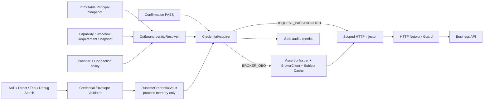
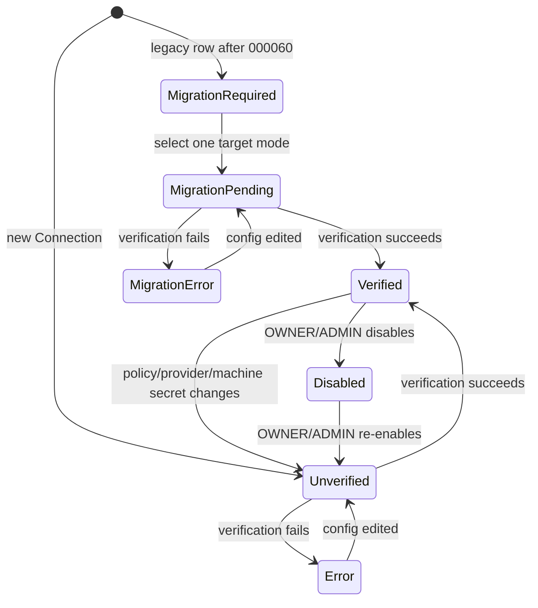

# 出站用户态鉴权重构：技术方案

| 字段 | 内容 |
| --- | --- |
| Issue | ZKL-51「出站架构设计调整」 |
| 文档版本 | v0.2 |
| 日期 | 2026-07-24 |
| 状态 | Approved / Frozen |
| 唯一产品基线 | `outbound-user-auth-product-design.md` v0.3、AC1～AC21 |
| 产品批准 | 评论 `eb38577f-5fc8-4a3f-96b3-5cace02dc7e7`（“批准 v0.3”） |
| UI 输入 | `outbound-user-auth-ui-design.md` UI v0.1（Canvas 评论 `615ebb70-5c4f-4e22-9905-31020c0134fb`） |
| 技术批准 | 评论 `88c772df-2710-4b79-b753-d4a0a5718445`：T1=A、T2=A、T3=A、T5=A，并批准 v0.2；T4 采用已确认的直接物理删除 |
| 适用范围 | HTTP Tool 出站；Provider、ServiceConnection、AAP Run、direct Tool invoke、Workflow trial / production、运行调试台 |

> 本文 v0.2 已由负责人明确批准并冻结。实施必须遵循 `outbound-user-auth-implementation-checklist.md`；若实现需要改变本文的范围、架构、API、数据、权限、安全、迁移或验收决策，立即停止并回到负责人确认，不得由 Forge 临场选择。

### 修订记录

| 版本 | 变更 | 依据 |
| --- | --- | --- |
| v0.1 | 首轮技术方案与 T1～T5 待确认项 | 产品 v0.3、AC1～AC21、§19.4 |
| v0.2 | 固化 T4“旧 Secret 直接移除”为硬切事务内物理删除；补充共享引用阻断、不可逆回滚边界；纳入 Canvas UI v0.1；T1 / T2 / T3 / T5 采用 A 并获全文批准 | 负责人评论 `2f85ac96-91b5-4a87-8448-b149dc52dcbd`、`88c772df-2710-4b79-b753-d4a0a5718445`；Canvas UI v0.1 |

## 0. 结论摘要与审批边界

已批准方案新增 `outboundidentity` 边界，负责版本化配置、运行期凭据隔离、Broker 交换、Subject Assertion、短期缓存和稳定错误。HTTP Tool 不再调用现有共享身份 `HTTPSecretInjector`；它只接受以下两种固定 Connection 策略：

- `BROKER_OBO`：以 Broker 机器信任和当前不可变 Principal Snapshot 签发短期 Subject Assertion，交换当前 Subject 的业务 Token。
- `REQUEST_PASSTHROUGH`：从顶层执行请求的专用 `outboundCredentials` envelope 接收一次性 Token，存入非持久运行期 Vault。

两条路径在高风险确认通过后才取 Token，并在同一个受保护 HTTP callback 内注入；Token、Assertion、Broker body、运行期句柄均不得进入 PostgreSQL、MinIO、Redis、队列、checkpoint、事件、审计 payload、日志、聊天消息、模型上下文或 Tool / Workflow input/output。

本版关键选择是：

1. **T1 已批准（A）**：Broker 机器认证采用 `private_key_jwt`，Subject Assertion 使用独立平台签名密钥。
2. **T2 已批准（A）**：透传凭据 Vault 仅在进程内存中，并以执行实例亲和保证同一 Run 可继续；含透传绑定的执行在实例丢失或重启后失败关闭，纯 Broker 执行可在新实例重新 exchange。
3. **T3 已批准（A）**：透传 Token 的 `expiresAt` 必填。
4. **T4 已批准（B）**：`000060` 硬切事务在禁用旧 Connection、清零全部合法引用并写入审计后，直接物理删除旧业务 Secret 的全部版本密文及 Secret 主记录；迁移成功后只允许向前修复。
5. **T5 已批准（A）**：Connection 验证只验证配置、网络、机器信任，不伪造最终用户做 Broker exchange。

这些选择分别见 T1～T5，全部不再开放实现期变体。任何偏离都必须先更新本文并重新请求负责人批准，不能在实现中临时决定。

## 1. 现状证据

### 1.1 已有可复用能力

| 能力 | 实现证据 | 本方案用法 |
| --- | --- | --- |
| Actor / Subject 分离 | `backend/internal/principal/models.go` 已有 `USER`、`SERVICE_PRINCIPAL`、`EXTERNAL_SUBJECT`、`SYSTEM` | 以认证结果产生的 Subject 为唯一用户绑定，不接受请求覆盖 |
| 不可变执行主体 | `backend/internal/principal/execution_snapshot.go` 的 `execution.principal.v1`；快照已复制到 AgentRun、WorkflowExecution、ToolInvocation | Vault、Broker Assertion、缓存和审计均引用该快照 |
| AAP 幂等 Run | `backend/internal/aap/run.go` 已按调用范围、Principal、Idempotency-Key 产生确定 Run，并持久化输入摘要 | 扩展为只哈希凭据描述，不哈希 Token |
| 高风险确认 | `backend/internal/execution/invocation_pipeline.go` 在凭据注入前完成 confirmation 校验 | 保持顺序，确认前禁止取 Token 或调用 Broker |
| HTTP 出站保护 | `backend/internal/execution/http_network_guard.go` 已限制 host、port、CIDR、redirect，并移除跨源敏感头 | Broker endpoint 与业务 endpoint 都复用；Broker 禁止 redirect |
| Workflow 主体传播 | `backend/internal/workflowruntime` 和 `backend/internal/application/adapters.go` 已把 PrincipalSnapshot、AgentRunID、WorkflowExecutionID 传给 Tool Invocation | 嵌套 Workflow 继承顶层 Run 凭据范围，不新增 Token 字段 |
| 执行恢复与 claim | `backend/internal/database/migrations/000057_runtime_continuation_claims.*` 及运行时恢复 worker 已有数据库 claim | 扩展为运行期实例亲和元数据，不持久化凭据句柄 |
| 发布 / 恢复基线 | `docs/runbooks/eino-agent-runtime-rollout.md` 以 drain / previous binary 作为一般运行时回滚；README 要求 PostgreSQL + MinIO 一致备份，Redis 非事实源 | 本次维护窗口复用 drain，但 T4 的 Secret 物理删除是明确例外：迁移提交后不得用旧工件或备份恢复 legacy 身份路径，只能向前修复 |

### 1.2 必须替换或扩展的现状

| 现状 | 证据 | 问题 |
| --- | --- | --- |
| Provider 鉴权仅有 `service-auth.v1` | `backend/internal/serviceauth/contract.go` 正式支持 `NONE`、`OAUTH2_CLIENT`，并保留 legacy 解析 | 与冻结后的严格双模式冲突 |
| Connection 保存长期业务凭据 | `backend/internal/database/migrations/000009_connections.up.sql` 含 `auth_mode`、`auth_config`、`credential_secret_id` | 现有 API Key、Bearer、业务 OAuth client credentials 必须硬切 |
| OAuth Token 缓存不感知 Subject | `backend/internal/execution/secret_injection.go` 的缓存键以 Workspace、Connection、Secret / 配置为主 | 同一 Connection 会共享服务账号 Token，不能用于用户隔离 |
| WORKFLOW executor 用合成 `NONE` | `backend/internal/tool/invocation_resolver.go` 为非 HTTP Workflow 调用构造 `NONE` credential | 必须改为“非 HTTP 不经过出站身份注入”，不能保留第三种模式 |
| 顶层 API 没有凭据 envelope | `aap_create_run.go`、`tool_openapi.go`、`workflow.go`、`chat_execution.go` 的 request DTO 均无独立字段 | Token 若塞入 input / metadata 将进入永久数据和模型 |
| Workflow 发布物未固化身份要求 | compiler / readiness / publish 当前只固化 Tool、Release、Connection 等执行信息 | Connection 策略漂移时无法确定地失败关闭 |
| OpenAPI loader 仍读取 Connection Secret | `backend/internal/openapiimport/http_loader.go` 查询 `credential_secret_id` 并用共享凭据拉取文档 | 后台同步没有最终用户 Subject，硬切后不能继续借用业务身份 |
| 管理权限过宽 | Provider / Connection 现有写路径主要使用 Workspace `EDIT`；删除使用通用 `DELETE` | 不符合 OWNER / ADMIN 配策略和 Secret、EDITOR 仅改元数据 |
| 前端仍展示旧模型 | `frontend/src/types/domain.ts`、`provider-auth.ts`、Provider / Connection 页面仍使用 `service-auth.v1`；导航仍为“对话式执行控制台” | 需要双模式、迁移态和调试凭据专用交互 |

### 1.3 事实优先级

本方案以真实代码和数据库为迁移起点，以已批准产品 v0.3 为目标契约。现有 legacy 兼容行为不是目标态兼容承诺；产品尚未上线，因此不保留 dual-read、dual-write、Workspace 灰度或旧执行器回退。

## 2. 目标、非目标与不可变约束

### 2.1 目标

1. 为 HTTP Tool 建立统一、可版本化、严格双模式的出站身份边界。
2. 让 Broker 与透传 Token 都绑定 Workspace、Subject、Connection、执行根范围和策略版本。
3. 保证 Agent、Workflow、HITL resume、重试与并发调用不扩大 Token 可见范围。
4. 对 Provider / Connection、编译发布、所有入口、执行和迁移提供同一套失败关闭语义。
5. 以自动化测试证明 Token 无法到达任何持久或模型可见通道。

### 2.2 非目标

- 不建设最终用户 OAuth consent、refresh token、长期凭据库或 Token introspection 平台。
- 不把 AAP 入站 Access Token 转发为业务 Token。
- 不扩展到 HTTP Tool 以外的 executor。
- 不允许 Tool input、模型或单次 Run 选择 Connection 的策略。
- 不保留共享账号、`NONE`、公开 API、SYSTEM 或定时任务例外。
- 不为原 Run 提供 Token 恢复、刷新或重新绑定。
- 不改变 Workflow Draft、Compilation、Plan、Revision、trial、publish 和 production 的产品语义。

### 2.3 不可变安全约束

- 请求不能提交 `subject`、`workspaceId`、`runId`、`mode`、注入头或目标原点来覆盖服务端策略。
- Token 只由专用 transport DTO 的自定义反序列化器接触，禁止转为通用 `map[string]any`、`json.RawMessage`、metadata 或 context value。
- Token 不参与持久幂等哈希，也不生成指纹、摘要、JWT claims 副本或可关联稳定标识。
- 所有取 Token / Broker exchange 都发生在 confirmation 之后。
- 业务敏感头仅可注入 Provider 契约允许的单一头；跨源 redirect 不携带，目标不匹配时失败。
- 配置状态与单个用户 401/403 分离，用户失败不得把 Connection 全局标为 `ERROR`。

## 3. 已批准架构与模块边界



### 3.1 新边界 `backend/internal/outboundidentity`

| 子模块 | 职责 | 明确不负责 |
| --- | --- | --- |
| `contract` | 解析 / 验证 Provider `outbound-identity.v1`、Connection `outbound-connection.v1` | 不读取 Secret，不发 HTTP |
| `requirements` | 从 Capability / Workflow Plan 生成允许的 Connection、策略、版本要求 | 不包含 Token 或运行期句柄 |
| `binding` | 校验顶层 `outbound-credentials.v1` envelope，将认证主体和执行根绑定到 Vault | 不把 envelope 转交执行输入 |
| `vault` | 进程内临时 Secret、TTL、一次性 debug attachment、清理、内存配额 | 不实现 Redis / DB 存储 |
| `assertion` | 以不可变 Principal Snapshot 生成短期、带 audience 的 Subject Assertion | 不接收调用方传入 Subject claims |
| `broker` | 机器认证、Token exchange、响应 allowlist 解析、安全分类 | 不存 Broker body，不跟随 redirect |
| `cache` | 同一执行根内按 Subject + Connection + Scope + 策略版本短期缓存、singleflight | 不跨 Run、Subject 或策略版本共享 |
| `injector` | 在最小 callback 内向允许头注入并清除明文 | 不序列化 Connection 的敏感副本 |
| `errors` | 稳定内部错误与 AAP / 管理 API 映射 | 不透传上游原文 |

### 3.2 现有模块改造边界

- `serviceauth`：目标态不再供 HTTP Tool 执行；迁移完成后删除 legacy resolver。若模型服务或其他非本范围模块另有依赖，必须迁到其自身边界，不能把旧业务身份通道留在 HTTP Tool。
- `execution.InvocationPipeline`：新增 `OutboundIdentityInjector` 接口；confirmation 之前不调用。
- `tool.InvocationResolver`：HTTP 返回版本化出站身份快照；WORKFLOW executor 直接走非 HTTP 分支，不再合成 `NONE`。
- `aap` / management transport：只负责认证、专用 envelope 解析、执行根 ID 分配和 Vault attach；业务 request object 不携带 Token。
- `workflowcompiler` / `workflowruntime`：发布物只保存要求快照，运行时只传执行根 ID 和 Principal Snapshot。
- `runtime.workflow.engine=wrapper` 只可作为现有图执行引擎回滚阀；Eino 与 wrapper 必须汇入同一 Tool Invocation 出站身份边界。若旧 wrapper 尚未接入，它只能对含 HTTP 出站要求的执行失败关闭，不能恢复 legacy Secret。
- `provider` / `connection`：保存无最终用户 Token 的契约和机器 Secret 引用；DTO 只返回 `machineCredentialConfigured`。
- `openapiimport`：删除通过 Connection legacy Secret 拉取受保护文档的路径。首期后台 sync 没有 Subject，不接受用户态 Token；受保护文档需使用现有手工 / 上传输入或等待另行批准的身份化 import 入口。
- `application`：组装 Vault、Broker client、Assertion signer、claim / cleanup hooks；禁止把 Vault 实例暴露给模型或通用工具注册表。

## 4. 版本化配置与持久数据契约

### 4.1 Provider 契约：`outbound-identity.v1`

以下为已批准的规范化形状；字段 `additionalProperties=false`，枚举未知值一律拒绝：

```json
{
  "outboundIdentity": {
    "schemaVersion": "outbound-identity.v1",
    "supportedModes": ["BROKER_OBO", "REQUEST_PASSTHROUGH"],
    "supportedSubjectTypes": ["EXTERNAL_SUBJECT", "USER"],
    "brokerObo": {
      "tokenEndpoint": "https://broker.example/token",
      "audience": "urn:broker:tenant",
      "grantType": "urn:ietf:params:oauth:grant-type:token-exchange",
      "subjectTokenType": "urn:ietf:params:oauth:token-type:jwt",
      "requestedTokenType": "urn:ietf:params:oauth:token-type:access_token",
      "machineAuthMethod": "PRIVATE_KEY_JWT",
      "allowedScopes": ["orders.read"],
      "response": {
        "accessTokenPath": "access_token",
        "tokenTypePath": "token_type",
        "expiresInPath": "expires_in",
        "expectedTokenType": "Bearer"
      },
      "businessInjection": {
        "headerName": "Authorization",
        "prefix": "Bearer"
      }
    },
    "requestPassthrough": {
      "credentialTypes": ["ACCESS_TOKEN"],
      "businessInjection": {
        "headerName": "Authorization",
        "prefix": "Bearer"
      }
    }
  }
}
```

约束：

- `supportedModes` 必须是非空子集，且只能包含两种冻结模式。
- 仅声明 `BROKER_OBO` 时才允许 `brokerObo`；仅声明透传时才允许 `requestPassthrough`。
- `supportedSubjectTypes` 只能包含 `EXTERNAL_SUBJECT`、`USER`；禁止 `SYSTEM`。AAP production 使用内部 `EXTERNAL_SUBJECT` UUID；内部 direct / trial / 调试台只能使用当前 `USER` UUID，不能模拟外部用户。
- Token endpoint、response path、业务注入头和允许 Scope 属于 Provider 无 Secret 契约；最终用户 Token 永不进入 Provider。
- 业务 Token 的允许 origin 不由请求或模型填写，而是取已解析 `ConnectionSnapshot.BaseURL` 的规范化 `scheme + host + effective port`，并同时满足 Connection egress policy。
- `Authorization` 等敏感头必须同时进入现有 `SensitiveHeaderNames` 保护；自定义注入头必须通过 header allowlist 和 CR/LF 校验。

### 4.2 Connection 契约：`outbound-connection.v1`

```json
{
  "outboundIdentity": {
    "schemaVersion": "outbound-connection.v1",
    "mode": "BROKER_OBO",
    "policyVersion": 3,
    "brokerObo": {
      "clientId": "actweave-connection-123",
      "scopes": ["orders.read"],
      "maxTokenTtlSeconds": 300
    }
  },
  "machineCredentialConfigured": true,
  "status": "VERIFIED",
  "migrationState": "NONE"
}
```

透传模式用：

```json
{
  "outboundIdentity": {
    "schemaVersion": "outbound-connection.v1",
    "mode": "REQUEST_PASSTHROUGH",
    "policyVersion": 2,
    "requestPassthrough": {
      "maxResidenceSeconds": 600
    }
  },
  "machineCredentialConfigured": false,
  "status": "VERIFIED",
  "migrationState": "NONE"
}
```

约束：

- `mode` 必须在 Provider `supportedModes` 中，创建时必填，不能由 Run 覆盖。
- API DTO 中的 `policyVersion` 为 read-only，由 `service_connections.outbound_identity_policy_version` 派生；持久 JSON 不重复保存该值。它在 Connection 执行相关字段或机器 Secret 版本变化时由服务端单调递增，客户端不能写；Provider 合同变化只递增独立的 Provider policy version，运行时同时比较两者。
- Broker Scope 必须是 Provider allowlist 的子集；运行时请求 Scope 只能来自已发布 Tool / Plan 要求，不接受模型生成。
- `maxTokenTtlSeconds` 默认 300、允许 30～900；`maxResidenceSeconds` 默认 600、允许 30～3600。实际 TTL 还要取 Token / request expiry 与 root execution deadline 的更小值。
- `BROKER_OBO` 必须有 active machine Secret；`REQUEST_PASSTHROUGH` 必须没有业务 Secret 或机器 Secret 引用。
- `status` 与 `migrationState` 正交：只有 `VERIFIED + NONE` 可执行。

### 4.3 数据库迁移

新增 `000060_outbound_identity_hard_cutover`，已批准字段：

| 表 / 字段 | 类型 | 语义 |
| --- | --- | --- |
| `capability_providers.driver_config.outboundIdentity` | 现有 JSONB 内字段 | 规范化 `outbound-identity.v1`，替换其中 legacy `authentication` |
| `capability_providers.outbound_identity_policy_version` | BIGINT | 仅 Provider 出站执行相关字段变化时递增 |
| `service_connections.outbound_identity` | JSONB nullable | 规范化 `outbound-connection.v1` |
| `service_connections.outbound_identity_policy_version` | BIGINT NOT NULL | Connection 策略修订 |
| `service_connections.migration_state` | TEXT | `MIGRATION_REQUIRED` / `NONE` |
| `service_connections.machine_credential_secret_id` | UUID nullable | 只供 Broker 机器认证 |
| `outbound_runtime_instances` | 新表 | T2=A 时保存 instance / boot、临时 routing public key、受控内部地址、heartbeat、draining；无 Secret |
| `outbound_runtime_affinities` | 新表 | T2=A 时保存 Workspace、root scope type / ID、owner instance / boot、root deadline；无 Vault locator |

迁移规则：

1. 两个 policy version 列为 `NOT NULL DEFAULT 1 CHECK (>0)`；`migration_state` 为 `NOT NULL DEFAULT 'NONE'` 且只接受两枚举；JSON 字段必须为 object；machine Secret 使用现有 Workspace 复合外键。
2. 所有归属 HTTP Tool / `HTTP_OPENAPI` Provider 的当前 active Connection，无论 `NONE`、API key、Bearer 还是 OAuth client credentials，统一写为 `status='DISABLED'`、`migration_state='MIGRATION_REQUIRED'`；其他 executor 的数据不在本迁移中改写，也不能借用本模块形成第三种 HTTP 出站模式。
3. 不从旧 `auth_mode` / `auth_config` 自动推断新模式，不复制旧 Secret 到透传策略。
4. `auth_mode` / `auth_config` 在第一阶段保留为只读清理证据；目标 Connection 的 `credential_secret_id` 则必须在同一硬切事务内清空。所有新 API、compiler、verification 和 executor 禁止读取 legacy 字段，字段不再出现在正常 DTO。
5. OWNER / ADMIN 显式选择目标模式并保存后，仍保持 `MIGRATION_REQUIRED` 且不可执行；配置验证成功时才原子改为 `VERIFIED + NONE`。
6. T4 已确认采用“直接移除”。`000060` 必须在维护窗口、legacy HTTP 执行与写入均停止、旧运行实例全部 drain / 终止后，按下述“全成或全不成”协议物理删除旧业务 Secret；不得调用现有 `secret.Repository.Revoke` 代替，因为该路径会保留 `secrets` 行和历史 `secret_versions` 密文。
7. 后续清理迁移才删除 `auth_mode`、`auth_config`、已清空的 `credential_secret_id` 列和 legacy contract 代码；该清理不能成为恢复 Secret 的渠道。

`000060` 的 Secret 删除协议：

1. **确定候选集**：在清空引用前，把所有归属 HTTP Tool / `HTTP_OPENAPI` Provider 的 legacy Connection（包括 soft-deleted 行）所引用的非空 `credential_secret_id` 去重为候选集。未被这些 Connection 引用的通用 / orphan Secret 不凭名称、kind 或内容猜测用途。
2. **锁定与前置校验**：锁住候选 `secrets`、其 `secret_versions` 及全部 `service_connections` / `model_configs` 引用。若任一候选同时被模型配置或非目标 Connection 引用，整笔迁移必须在任何状态变更前失败，并报告仅含 Workspace 与计数的安全诊断；操作者需先把范围外消费者换到独立 Secret。模型服务凭据不得被删除。
3. **先切断执行与引用**：所有 active 目标 Connection 写为 `DISABLED + MIGRATION_REQUIRED`；所有目标 Connection（含 soft-deleted）清空 `credential_secret_id`。事务内重新查询后，候选集的所有 FK 引用数必须严格为零，否则失败回滚。
4. **审计与物理删除**：以 `SYSTEM` actor 在同一事务插入 `outbound.identity.legacy_secret.deleted`，每 Workspace 只记录 Connection 数、Secret 数和 Secret version 数，不记录 Secret ID、名称、指纹或密文；随后依次把候选 `secrets.active_version_id` 置空、删除全部候选 `secret_versions`（含 revoked 历史版本的 ciphertext / nonce / key reference）、再删除候选 `secrets` 主记录。
5. **提交后证明**：迁移必须断言实际删除的 Secret / version 数与锁定清单一致，且候选 ID 在三处引用表、`secret_versions` 和 `secrets` 中均为零；任一审计、删除或计数断言失败都回滚整个 `000060`。迁移日志只输出按 Workspace 聚合的计数。

维护窗口终止旧实例就是 legacy 进程内缓存失效屏障；新版本不得包含 legacy cache read path。此方案不生成可回填旧 Secret 的迁移备份、导出或 dormant 副本。基础设施已有备份受既有保留策略管理，但不得作为本次应用回滚来源；如灾难恢复被迫恢复到删除前快照，必须在隔离状态重放 `000060` 并验证删除证明后才能重新开放服务。

数据库只保存策略、版本、机器 Secret 引用和非敏感执行要求。绝不新增最终用户 Token、Token 密文、Token hash、Token claims、Vault key 或 debug attachment ID 字段。

`outbound_runtime_instances` 与 `outbound_runtime_affinities` 是调度元数据，不是凭据存储：

- instance 以部署配置的稳定 `instance_id` + 每次启动随机 `boot_id` 区分，并为 opaque locator 生成只驻内存的临时签名私钥、登记 public key；heartbeat / drain 只供内部 router 与 worker 使用；
- affinity 只在 root scope 含透传 binding 时创建，deadline 取执行 / 最大驻留上限，不保存实际 Token expiry；
- 两表不出现在管理 API、审计 payload 或 Trace attribute；终态后删除，TTL cleanup 只作兜底；
- 不能用 affinity row 的存在推断 Token 仍有效，实际 lookup 仍以本进程 Vault 为准。

### 4.4 发布物中的要求快照

Agent capability snapshot 与 Workflow CompiledExecutionPlan / Revision 增加：

```json
{
  "schemaVersion": "outbound-requirements.v1",
  "connections": [
    {
      "connectionId": "uuid",
      "providerId": "uuid",
      "mode": "REQUEST_PASSTHROUGH",
      "providerContractVersion": 4,
      "connectionPolicyVersion": 2,
      "requiredScopes": ["orders.read"],
      "credentialRequired": true
    }
  ]
}
```

- 快照是 descriptor，不包含 Token、Secret、Vault key 或 Assertion。
- 编译必须拒绝缺失策略、Provider 不支持、`MIGRATION_REQUIRED` 或非 HTTP executor 绑定。
- publish 校验契约完整、Connection 可执行和 revision 一致；不要求提供最终用户 Token。
- production 若实际 Provider / Connection 版本与快照不同，返回 `OUTBOUND_IDENTITY_POLICY_CHANGED` 并要求重新编译 / 发布，不静默采用新策略。
- capability snapshot 对 AAP caller 暴露允许绑定的 Connection ID、模式和是否必须提供透传 Token，使 caller 无需猜测；这属于 additive schema version。

## 5. 顶层凭据 API

### 5.1 统一 envelope：`outbound-credentials.v1`

适用于 AAP create Run、direct Tool invoke、Tool test、Workflow trial：

```json
{
  "outboundCredentials": {
    "schemaVersion": "outbound-credentials.v1",
    "bindings": [
      {
        "connectionId": "4d938c85-4fc6-41fd-a0dd-c909c22581e8",
        "credentialType": "ACCESS_TOKEN",
        "value": "opaque-secret-value",
        "expiresAt": "2026-07-24T10:05:00Z"
      }
    ]
  }
}
```

契约：

- `value` 是 write-only Secret；OpenAPI 标记 `writeOnly: true`，任何 response schema 不含该字段。
- `subject`、执行根 ID、Workspace、策略、header、prefix 和 origin 均由认证上下文与已发布配置导出，禁止出现在 binding。
- 每个 Connection 只能出现一次；重复返回 400，不做最后值覆盖。
- 只允许当前 Agent / Tool / Plan requirements allowlist 中、且模式为 `REQUEST_PASSTHROUGH` 的 Connection。给 Broker Connection 绑定 Token 返回 422。
- 首期只接受 `ACCESS_TOKEN`；未知类型失败，不自动判断 JWT / API key。
- 每请求最多 32 个 binding、单 Token 最大 16 KiB、Secret envelope 总计最大 128 KiB，并在通用 request-body logging 之前关闭这些路由的 body capture。
- `expiresAt` 按已批准 T3=A 必填，且最终 residence deadline 不得超过其值、执行 deadline 和 Connection `maxResidenceSeconds`。
- 验证失败时，已暂存的所有 plaintext 必须整体清理；不允许部分 attach 后继续创建 Run。

### 5.2 各入口的 additive 变化

| 入口 | 变化 | 执行根范围 |
| --- | --- | --- |
| AAP `POST .../runs` | `CreateRunRequest` 增加可选 `outboundCredentials` | 确定的 AgentRun ID |
| direct Tool invoke | request 增加同一字段；服务端先分配 DirectInvocation scope ID | DirectInvocation ID |
| Tool test | request 增加同一字段 | ToolTest execution ID |
| Workflow trial | request 增加同一字段 | WorkflowExecution / Trial ID |
| production Workflow | 不增加独立 Token 输入；从顶层 AgentRun scope 继承 | 顶层 AgentRun ID |
| Chat message | 文本 DTO 不增加 Token | 通过独立 debug attach 后转移到新 AgentRun |

没有出站要求时可省略 envelope。若 requirements 中存在透传 Connection 而 binding 缺失，不在入口伪造默认值；最迟在相关 Invocation 前返回 `OUTBOUND_CREDENTIAL_REQUIRED`。为了减少无效 Run，入口在静态已知为必需时应尽早校验缺失，但仍不得读取 Token。

### 5.3 运行调试台独立绑定命令

采用两步命令，避免 Token 进入 Chat message：

```text
POST /api/v1/workspaces/{workspaceId}/chat/sessions/{sessionId}/outbound-credentials
  body: outbound-credentials.v1
  response: 201 { attachmentId, expiresAt, connectionIds }

POST /api/v1/workspaces/{workspaceId}/chat/sessions/{sessionId}/messages
  body: { content, outboundCredentialAttachmentId }
```

- `attachmentId` 为至少 128-bit 随机、单次消费、最长 60 秒的内存 locator；它不是凭据，仍禁止持久化、日志和事件。
- attachment 绑定 Workspace、Session、当前 USER actor / subject 和运行实例；不能跨 Session / 用户使用。
- message 创建成功时，以原子 move 将 attachment 绑定转入新 AgentRun scope；失败则 attachment 保持短 TTL 或立即销毁，不能复制。
- 已归档 Session 不接受 attach；页面离开、取消、超时或消费后销毁。
- 调试台不接受 External Subject 模拟；Broker 调试只能使用当前内部 `USER`，且 Provider 必须声明支持该 Subject 类型。

### 5.4 危险配置变更确认

策略切换、注入头 / 目标 origin / Broker audience 变化、机器凭据更换 / 撤销、禁用、删除和 legacy 迁移必须由服务端强制二次确认，而不只依赖前端弹窗：

```text
POST /api/v1/workspaces/{workspaceId}/service-connections/{connectionId}:impact
  body: {
    changeKind,
    nonSecretChangeDescriptor,
    machineCredentialWillChange,
    expectedLockVersion
  }
  response: {
    affectedPublishedTools,
    affectedAgentBindings,
    affectedWorkflowRevisions,
    impactConfirmationProof,
    expiresAt
  }
```

- preview body 不接收新 Secret 明文；只描述非敏感目标和“机器凭据将变化”。
- `impactConfirmationProof` 是短期签名的非 Secret proof，绑定 Workspace、actor、Connection、change descriptor hash、lock / policy version、影响集版本和 5 分钟 expiry；它不能脱离当前已认证 actor 使用，也禁止持久化或记录。
- 实际 mutation 只提交一次新 Secret，并携带 proof；服务端在同一事务重算 descriptor 与引用影响。lock、权限或影响集漂移时返回 stale，要求重新预览，不能靠客户端确认文本绕过。
- 删除 / 禁用必须在提交事务内再次检查引用；确认不代表忽略引用完整性。
- preview 与 mutation 都写非敏感审计，任何 response 不返回 Secret ID / 名称。

## 6. 运行期 Vault、绑定与清理

### 6.1 Key 与对象模型

逻辑 key：

```text
VaultKey =
  runtimeBootId
  + workspaceId
  + subjectType + subjectId
  + rootScopeType + rootScopeId
  + connectionId
  + connectionPolicyVersion
```

值仅在内存中：

```text
RuntimeSecret {
  mutableBytes
  credentialType
  residenceDeadline
  consumed/active state
  inUse reference count
}
```

- `rootScopeId` 对嵌套 Agent → Workflow → Tool 保持顶层执行根；Invocation 仍记录自己的 ID 用于审计。
- lookup 必须同时比较 Principal Snapshot 和 requirements；仅知道 Connection / Run ID 不足以读取。
- API 和持久对象不返回 / 保存序列化 VaultKey。内部组件传递结构化 root scope 与 Principal，不传 opaque Secret handle。
- 进程内尽力覆盖 byte slice，并承认 Go GC 不能提供绝对内存擦除保证；因此同时依赖短 TTL、最小复制、禁用 dump、受控容器权限和内存上限。

### 6.2 生命周期

| 事件 | Vault 行为 |
| --- | --- |
| 顶层请求通过完整校验 | 原子 attach 所有 binding |
| Invocation 等待 HITL | 保留至 residence deadline，但不读取 |
| confirmation PASS | 单次借用当前 Connection plaintext |
| 单次 HTTP callback 结束 | 清理局部 header / string 副本，归还引用 |
| Run / trial / direct 终态或取消 | 清理 root scope 全部 binding 与 Broker cache |
| Token deadline 到期 | 拒绝新借用；无 in-flight 引用后覆盖删除 |
| Connection disable / policy version change / machine Secret revoke | 本实例广播失效并拒绝旧 policy key |
| 含透传 binding 的进程重启、实例失联或跨实例 resume | Vault 无法恢复；返回 `OUTBOUND_CREDENTIAL_EXPIRED` |

cleanup 必须幂等。终态 hook、TTL sweeper 和 instance shutdown 三条路径竞争时，只允许第一次改变状态；借用中的 callback 完成后再覆盖底层 bytes。

### 6.3 容量与拒绝策略

- 配置 per-Workspace / per-process binding 数与总 bytes 上限；超限返回 `OUTBOUND_CREDENTIAL_CAPACITY_EXCEEDED`，不驱逐其他 Subject 的 active Token。
- TTL sweeper 只做兜底，正常终态必须同步触发清理。
- 禁止把 Vault 放入 Redis；当前部署 Redis 可持久化，且产品明确规定重启后透传 Token 不可恢复。
- 禁止 crash dump / heap profile 默认开启；诊断接口只能由平台受控开关临时启用，并在启用前拒绝有 active Vault entry 的实例。

## 7. Broker/OBO 交换

### 7.1 Subject Assertion

已批准 JWT header：

```json
{
  "alg": "EdDSA",
  "kid": "platform-signing-key-id",
  "typ": "actweave-subject-assertion+jwt"
}
```

已批准 claims：

```json
{
  "iss": "https://actweave.example/outbound",
  "sub": "internal-subject-uuid",
  "aud": "urn:broker:tenant",
  "actweave_workspace_id": "uuid",
  "actweave_connection_id": "uuid",
  "actweave_root_scope_id": "uuid",
  "actweave_actor_type": "SERVICE_PRINCIPAL",
  "actweave_actor_id": "uuid",
  "actweave_subject_type": "EXTERNAL_SUBJECT",
  "scope": ["orders.read"],
  "iat": 1784887200,
  "nbf": 1784887195,
  "exp": 1784887260,
  "jti": "random-uuid"
}
```

约束：

- `sub` 只取 Principal Snapshot 内部 UUID；AAP 场景不含原始第三方 `sub`、入站 subject token 或 AAP access token。
- 内部 direct / trial / 调试台使用当前 `USER` 内部 UUID并显式标记 type；SYSTEM 或无 Subject 在签名前失败。
- `exp - iat <= 60s`，`nbf` 仅允许小幅时钟偏差，`aud` 固定来自 Provider / Connection。
- 每次 exchange 新 `jti`；Assertion 不缓存、不记录，不加入 audit payload。
- Assertion signer 与 Broker machine credential 分权；签名密钥不作为业务 API credential。

现有 `agentAccess.signingKeys` 已提供 EdDSA active / verification key 和 JWKS 能力，但它属于 AAP 入站 token 信任域。本方案新增独立 `outboundIdentity.signingKeys` 配置和只发布公钥的 outbound JWKS endpoint，不复用 AAP 私钥：

- active private key 从受控文件或后续 KMS signer 读取，不进入 Workspace Secret、数据库或 API；
- 公钥端点固定为 `GET /api/outbound-identity/v1/.well-known/jwks.json`；Provider 管理 API 只读返回规范化 issuer、JWKS URI 和算法，便于 Broker 预注册；
- JWKS 同时发布 active 与轮换期 verification keys；
- previous key 的保留时间至少覆盖 Assertion 60 秒最大 TTL、时钟偏差和 Broker JWKS cache 上限；
- Broker machine credential 仍按 Connection 管理，与平台 Assertion signer 分开轮换和审计。

### 7.2 Exchange wire contract

已批准 exchange：

```text
POST <broker tokenEndpoint>
Content-Type: application/x-www-form-urlencoded

grant_type=urn:ietf:params:oauth:grant-type:token-exchange
subject_token_type=urn:ietf:params:oauth:token-type:jwt
subject_token=<signed assertion>
requested_token_type=urn:ietf:params:oauth:token-type:access_token
audience=urn:broker:tenant
scope=orders.read
```

机器认证按已批准 T1=A 使用每 Connection `private_key_jwt`；client assertion 必须绑定 token endpoint audience、短 TTL、单次 `jti` 和 active machine Secret version。除此之外：

- endpoint 必须为 HTTPS；禁止 userinfo、动态 scheme、跨源 redirect 和私网绕过。
- 复用 HTTPNetworkGuard，并限制 DNS rebinding、端口、CIDR、响应大小 64 KiB 和请求超时 10 秒。
- 响应只读取契约声明的 access token、token type、expiry；不保存完整 body。
- access token 缺失、含控制字符、token type 与 `expectedTokenType` 不符、expiry 非法或超出 Connection 上限时失败并销毁 body buffer；业务 header prefix 只取已批准 Provider 契约，不信任 Broker 返回值动态决定。
- 只对明确的网络超时 / 429 / 5xx 做最多一次、有 jitter、受 invocation deadline 约束的安全重试；401 / 403 不重试。
- 业务请求的 credential-bearing URL 必须与 `ConnectionSnapshot.BaseURL` 同 origin；任何跨源 redirect 都中止请求并返回 `OUTBOUND_TARGET_REJECTED`，不是移除 Token 后继续。

### 7.3 Broker Token cache

```text
BrokerCacheKey =
  runtimeBootId
  + workspaceId
  + subjectType + subjectId
  + rootScopeId
  + connectionId
  + normalizedScopes
  + providerContractVersion
  + connectionPolicyVersion
  + machineSecretVersion
```

- TTL = `min(Broker token expiry - safetySkew, root execution deadline, connection maxTokenTtl)`。
- 仅同一 Subject、同一执行根、同一 Connection / Scope / 策略版本可命中；不跨 Run 复用。
- 相同 key 并发 exchange 使用 singleflight；等待者受自己的 context deadline 约束。
- Connection disable、策略 / Secret 版本变化、Run 终态立即失效。
- 业务 API 401 / 403 只驱逐当前 key 并返回当前 Subject 授权失败；不把 Connection 标记为 `ERROR`，也不自动 exchange + 重放可能有副作用的业务请求。

## 8. Invocation 顺序、并发与幂等

### 8.1 固定顺序

```text
认证与 Workspace RBAC
  → 解析不可变 Principal / requirements / Connection
  → 校验 input schema 与静态 policy
  → 高风险 confirmation
  → invocation 幂等与限流
  → 创建非敏感 Invocation record
  → 取透传 Token 或执行 Broker exchange
  → 在受保护 callback 内注入并调用 HTTP
  → 分类结果、清理、审计
```

禁止把 credential acquisition 移到 confirmation、Connection allowlist 或 target validation 之前。

### 8.2 AAP create Run 幂等

持久请求 hash 增加以下 descriptor：

```json
{
  "outboundCredentials": {
    "schemaVersion": "outbound-credentials.v1",
    "bindings": [
      {
        "connectionId": "uuid",
        "credentialType": "ACCESS_TOKEN",
        "provided": true
      }
    ]
  }
}
```

明确排除 `value`、Token hash / fingerprint / claims、`expiresAt` 和 Vault locator。

处理流程：

1. 认证、requirements 和完整 envelope 校验。
2. 依据现有幂等域确定 Run ID，并在 Run ID 粒度串行化“幂等记录 + Vault attach”判定。
3. 若同一 Idempotency-Key 已存在：
   - Principal、输入 hash、Connection descriptor、策略版本一致，且原 Run 的 Vault binding 仍有效：丢弃本次明文，返回现有 Run；
   - 原 Vault binding 已失效：丢弃本次明文并返回 `OUTBOUND_CREDENTIAL_EXPIRED`；
   - descriptor / Principal / 策略不一致：返回 idempotency conflict。
4. 若 Run 不存在，以 compare-and-swap 创建本 Run 的 Vault entries，再执行 Run 创建事务；竞争失败者进入第 3 步，不能覆盖先到 Token。
5. DB 创建失败或返回非幂等业务错误时，只清理本请求成功 attach 的 entries；cleanup 与事务失败路径都必须幂等。

幂等重放绝不把新 Token 重新绑定到原 Run，符合“原 Run 不恢复、不重绑”的冻结产品规则。

### 8.3 并发与取消

- 同一 root scope + Connection 的透传 binding 可被多个并发 Invocation 只读借用；每次生成独立 header 副本并在 callback 后清理。
- cleanup 设置 closing 状态后拒绝新借用；等待 active references 归零再覆盖。
- Broker cache singleflight 不跨 Subject；leader 取消不应永久取消其他有效 waiter，但所有 exchange 受 root deadline 限制。
- Connection policy change 使用版本键使新调用立即 miss / fail；本实例收到 invalidate 事件后清除旧 cache。即使广播丢失，版本比较仍失败关闭。
- HTTP request 一旦发出，取消只能停止本地等待，不能保证上游未产生副作用；因此不自动重放 401 / timeout 请求。

### 8.4 多实例与恢复

按已批准 T2=A：

- 每个 backend boot 在 `outbound_runtime_instances` 注册受控内部地址并短周期 heartbeat；地址来自部署配置，不接受请求输入，实例间调用必须使用 mTLS / workload identity。
- 仅当 root execution 含 `REQUEST_PASSTHROUGH` binding 时，以 root ID 做 CAS 写入 `outbound_runtime_affinities`，再 attach Vault；事务或 attach 失败时幂等清理两者。它们是路由元数据，不是 Secret handle。
- 对这类 execution，worker claim / continuation 仅由同一 live boot 接受；dispatcher 根据 affinity 定向发送，普通 replica 不得 reclaim 已过期 owner 的凭据执行。
- owner live 但繁忙时等待 / 续租；owner 丢失、重启或 claim 过期时，不把 execution 抢到其他实例继续，而是以 `OUTBOUND_CREDENTIAL_EXPIRED` 终止。
- 独立 stale-affinity reconciler 只负责把失去 owner 的 root execution 和待恢复 checkpoint 收敛到失败终态并清理 affinity，不取得 Tool side-effect claim、不尝试恢复 Token。
- 纯 `BROKER_OBO` execution 不需要 Vault 亲和。Broker cache 在实例丢失后自然 miss；新实例可根据持久的 Principal Snapshot、已通过的 confirmation 和当前策略重新签发 Assertion / exchange，仍不得自动重放已发出的业务 HTTP 请求。
- 没有透传 binding 的非 HTTP 或纯 Broker execution 保持现有跨实例恢复能力；混合 Broker + 透传 execution 因透传部分而保持亲和。

调试台 attach 发生在 Run 创建前，不能写持久映射。其 `attachmentId` 是签名的版本化 opaque locator，payload 仅含 owner boot、随机 256-bit nonce 和短 expiry；客户端不能修改，服务端禁止记录。若后续 message 命中其他 replica，`RuntimeRouter` 只把不含 Token 的 message + locator 通过受认证内部通道转给 live owner；owner 不存在时销毁语义上等价于过期并返回 `OUTBOUND_CREDENTIAL_EXPIRED`。事件读取仍从 PostgreSQL 进行，不要求路由到 owner。

## 9. 状态机与编译 / 就绪校验

### 9.1 Connection 状态机



持久表示：

- `MigrationRequired` = `migration_state=MIGRATION_REQUIRED, status=DISABLED`
- `MigrationPending` = `migration_state=MIGRATION_REQUIRED, status=UNVERIFIED`
- `MigrationError` = `migration_state=MIGRATION_REQUIRED, status=ERROR`
- `Unverified` = `migration_state=NONE, status=UNVERIFIED`
- `Verified` = `migration_state=NONE, status=VERIFIED`
- `Error` = `migration_state=NONE, status=ERROR`
- `Disabled` = `migration_state=NONE, status=DISABLED`

只有 `Verified` 可被新编译、测试或执行。单个 Subject 的 Broker / business API 401 / 403 不触发该状态机。

### 9.2 验证深度

按已批准 T5=A 做配置级验证：

- schema、Provider / Connection mode、Scope、Subject type、header / origin 约束；
- Broker DNS / TLS / egress policy；
- machine credential active 且格式符合所选认证方式；
- 可选的 Broker metadata / health endpoint（仅当 Provider 契约明确声明）。

不生成虚假用户 Subject，不调用真实业务 API，不把任意管理员身份当作最终用户。真实 Subject 映射与授权在运行时 exchange 验证；其失败只影响 Invocation。

OpenAPI discovery / polling 不属于冻结的凭据入口，后台任务也没有最终用户 Subject，因此不得在验证或同步时复用 Broker machine Secret 直接访问业务 / 文档 API。若文档 URL 需要用户授权，首期明确失败关闭；新增带身份的 import 命令属于后续产品范围。

### 9.3 Workflow

- Draft 保存 Connection 引用和策略要求，不接受 Token 字段。
- Compilation 读取 Provider / Connection 版本并生成 `outbound-requirements.v1`；缺失、legacy、`NONE`、非 HTTP 或不支持模式时失败。
- Trial 从本次 request binding 取透传 Token；Broker 使用 trial 操作者当前 USER Subject。
- Publish 要求最近 trial 成功沿用现有规则，同时重新检查 requirements / policy version；不要求永久 Token。
- Revision / Plan 只保存 descriptor。
- Production Workflow 从顶层 AAP / AgentRun root scope 继承；checkpoint / HITL snapshot 不保存 Vault locator。
- 含透传 binding 的 resume 若 owner boot 或 binding 不存在，失败 `OUTBOUND_CREDENTIAL_EXPIRED`，不得对原 Run attach 新 Token；纯 Broker resume 可重新 exchange。

## 10. 稳定错误、HTTP 映射与兼容

| 稳定码 | HTTP | 可重试 | 条件 |
| --- | --- | --- | --- |
| `OUTBOUND_IDENTITY_POLICY_INVALID` | 422 | 否 | Provider / Connection 契约不合法 |
| `OUTBOUND_IDENTITY_MODE_UNSUPPORTED` | 422 | 否 | 非双模式、Provider 不支持所选 mode |
| `OUTBOUND_IDENTITY_MIGRATION_REQUIRED` | 409 | 否 | 旧 Connection 尚未显式迁移 |
| `OUTBOUND_IDENTITY_CONNECTION_NOT_READY` | 409 | 否 | Connection 未验证、禁用、机器凭据不可用 |
| `OUTBOUND_IDENTITY_POLICY_CHANGED` | 409 | 否 | Plan / Revision 与当前策略版本不一致 |
| `OUTBOUND_IDENTITY_SCOPE_NOT_ALLOWED` | 422 | 否 | 请求 / Plan Scope 不在 Provider / Connection allowlist |
| `OUTBOUND_IDENTITY_CHANGE_CONFIRMATION_REQUIRED` | 409 | 否 | 危险配置 mutation 未携带有效 impact proof |
| `OUTBOUND_IDENTITY_CHANGE_CONFIRMATION_STALE` | 409 | 否 | lock、权限、策略或影响集在 preview 后变化 |
| `OUTBOUND_IDENTITY_EXECUTOR_UNSUPPORTED` | 422 | 否 | 非 HTTP executor 试图使用用户态策略 |
| `OUTBOUND_SUBJECT_REQUIRED` | 422 | 否 | SYSTEM / 无 Subject / Subject type 不支持 |
| `OUTBOUND_CREDENTIAL_REQUIRED` | 422 | 否 | 透传 binding 缺失 |
| `OUTBOUND_CREDENTIAL_INVALID` | 400 | 否 | envelope、重复 Connection、控制字符、过期格式非法 |
| `OUTBOUND_CREDENTIAL_TARGET_MISMATCH` | 422 | 否 | binding 不在 requirements allowlist 或 Connection 不匹配 |
| `OUTBOUND_CREDENTIAL_EXPIRED` | 409 | 是，新 Run | TTL、重启、实例丢失或原 Run replay 时 binding 不可用 |
| `OUTBOUND_CREDENTIAL_CAPACITY_EXCEEDED` | 429 | 是 | Vault 容量保护 |
| `OUTBOUND_BROKER_DENIED` | 403 | 否 | Broker 401 / 403 或 Subject 未授权 |
| `OUTBOUND_BROKER_UNAVAILABLE` | 503 | 是 | 安全重试后 timeout / 429 / 5xx |
| `OUTBOUND_BUSINESS_AUTHORIZATION_DENIED` | 403 | 取决于调用方 | 业务 API 401 / 403；不改 Connection |
| `OUTBOUND_TARGET_REJECTED` | 422 | 否 | origin、redirect、host / port / CIDR 不允许 |

错误 response 仅返回稳定码、公开安全文案、`traceId` 和必要的 `retryable`。不得返回 Secret 名、Broker body、Token endpoint 凭据细节、Assertion、业务响应原文或 Vault 状态。

兼容规则：

- AAP / management DTO 的 `outboundCredentials` 是 additive optional 字段；旧 caller 只有在执行不需要透传 Token 时继续成功。
- 新建 / 编辑 / 验证 / 执行不接受 legacy mode；不提供 header 或 feature flag 回退。
- OpenAPI、TypeScript SDK 与前端类型同步版本化；SDK 不缓存、日志或重试复用 Token。
- 历史只读数据可以显示“需迁移”，但任何执行路径不 dual-read legacy。

## 11. 权限、安全与审计

### 11.1 权限实现

| 操作 | 授权 |
| --- | --- |
| 查看脱敏 Provider / Connection | 现有 Workspace view |
| 修改 Provider 出站合同、Connection mode / policy、机器 Secret | OWNER / ADMIN 专用 policy guard |
| 编辑 name、alias、environment 等非敏感元数据 | OWNER / ADMIN / EDITOR；DTO 字段级拒绝身份字段 |
| 配置级验证 | OWNER / ADMIN / EDITOR / OPERATOR |
| 执行与提交临时 Token | OWNER / ADMIN / EDITOR / OPERATOR + 现有 execute/test 权限 |
| 禁用、删除、迁移、撤销机器 Secret | OWNER / ADMIN 专用 policy guard |

不能简单复用当前通用 `ActionEdit` / `ActionDelete`。新增业务级 action 或显式 role guard，并让 transport、service 和 repository 三层至少前两层校验。任何角色都没有读取 active Token 的 API；平台管理员不自动跨 Workspace 获得读取能力。

### 11.2 审计 allowlist

事件：

- `outbound.identity.policy.created|updated|disabled`
- `outbound.credential.attached|expired|discarded`
- `outbound.broker.exchange.succeeded|failed`
- `outbound.business_api.authorization_denied`
- `outbound.identity.migration.started|completed`
- `outbound.identity.legacy_secret.deleted`

允许字段仅限 Workspace、Provider、Connection、root Run / Invocation、内部 Subject ref、Actor ref、mode、Scope 名、policy version、结果码、耗时、Trace、操作者和影响对象数量。禁止 Token、Token expiry、Token type 原始值以外的内容、Assertion / jti、Broker body、业务 response body、Secret ID / 名称、Vault locator。

权限拒绝、危险配置变更、禁用 / 删除、迁移和机器 Secret 撤销都写审计。T4 硬切删除使用 `SYSTEM` actor，`actor_id` 为空、`actor_display` 为固定迁移标识，并与删除处于同一数据库事务；只允许按 Workspace 记录 Connection / Secret / version 计数。单纯成功读取 Token 不产生日志；只记录“credential attached / used outcome”的非敏感分类。

### 11.3 安全控制

- 针对所有接收 envelope 的 route 关闭 access log body、APM body capture、error echo 和 request dump。
- redactor 添加 `outboundCredentials`、`value`、`subject_token`、`client_assertion`、自定义 credential header；但 redaction 仅是兜底，主要控制是数据不可达。
- Broker 与业务 HTTP client 不启用代理环境变量，不自动 redirect，不记录 headers/body。
- Assertion signing key、Broker machine Secret 及模型服务 Secret 分用途、分引用、分审计。
- 在测试和生产关闭 core dump / 未授权 pprof；异常报告不得包含 heap。
- 禁止把 Token 写入 OpenTelemetry attribute、metric label、span event；Trace 只记录稳定结果码。

## 12. 可观测性

### 12.1 指标

- `outbound_identity_invocations_total{mode,result_code}`
- `outbound_broker_exchange_total{result_code}`
- `outbound_broker_exchange_duration_seconds`
- `outbound_broker_cache_requests_total{result=hit|miss|evicted}`
- `outbound_runtime_vault_entries`
- `outbound_runtime_vault_bytes`
- `outbound_runtime_vault_cleanup_total{reason}`
- `outbound_identity_policy_mismatch_total`

指标 label 禁止 Subject、Run、Connection、Workspace、endpoint 和 Scope 明细，避免敏感与高基数。内部 ID 仅存在受权限审计或 Trace 关联字段。

### 12.2 告警

- Broker availability / latency 持续越阈；
- Vault entries / bytes 接近上限或 cleanup backlog；
- `POLICY_CHANGED` / `MIGRATION_REQUIRED` 在发布后异常增长；
- runtime owner loss 导致 `CREDENTIAL_EXPIRED` 激增；
- redaction canary 或持久化泄漏测试失败。

Runbook 需覆盖：Broker 故障、机器 Secret 撤销、policy version mismatch、runtime instance 丢失、硬切迁移失败与安全泄漏响应。

## 13. 前端影响与 UI 输入

### 13.1 固定技术要求

- Provider 表单展示支持模式、Broker endpoint / audience / Scope / Subject types / injection 摘要；不出现最终用户 Token 输入。
- ServiceConnection 创建第一步固定选择 `BROKER_OBO` 或 `REQUEST_PASSTHROUGH`，策略变化触发危险操作确认和 policy version 更新。
- 危险操作弹窗使用服务端 impact preview，展示受影响的已发布 Tool、Agent binding、Workflow Revision 数量；引用 / lock 漂移后必须重新确认。
- 列表同时展示策略、配置状态与迁移状态；`DISABLED + MIGRATION_REQUIRED` 是两个维度，不合并成通用 Error。
- 旧 Connection 只允许 OWNER / ADMIN 进入迁移向导；测试、trial、publish、production action 禁用并展示稳定错误码。
- Tool test、Workflow trial 的 Token 输入是一次性 password 控件，不回显、不进入 form persistence、Pinia localStorage、浏览器日志或请求重试缓存。
- 导航与页面统一改名“运行调试台”，显著标注内部调试；保留会话、流、HITL、取消和 Trace。
- 调试凭据通过独立 attach command；发送 message 只携带一次性 attachment ID。
- 页面展示当前 Subject type；不提供 External Subject 模拟或 SYSTEM 例外。

### 13.2 已纳入的 Canvas UI v0.1

本版已校对 `docs/design/outbound-user-auth-ui-design.md` UI v0.1。该输入没有新增模式、权限例外或凭据生命周期，按以下接口边界纳入实施范围：

- ServiceConnection 创建第一步使用两张互斥策略卡，只映射 `BROKER_OBO` / `REQUEST_PASSTHROUGH`；策略切换复用服务端 impact preview / proof，proof 过期或 lock 漂移必须重新预览。
- 列表把“策略 / 配置状态 / 迁移状态”分列；`MIGRATION_REQUIRED` 使用琥珀阻断态，与灰色 `DISABLED` 同时呈现，不映射为验证 `ERROR`。迁移向导严格执行“旧摘要只读 → 选两模式之一 → 配置 → impact 确认 → 验证”，验证成功前不可执行。
- 原 `/chat` 路由保持兼容，侧栏、标题、面包屑和 document title 统一改名“运行调试台”；页面持续显示内部非生产说明和当前认证 Subject，不提供身份模拟。
- 调试凭据使用独立面板调用 attach command。前端仅可在当前组件内存暂存一次性 `attachmentId`、expiry 与 Connection 描述，不进入 Pinia 持久 store、localStorage、会话记录、DOM 回填或 Trace；发送 message 只携带 attachment ID，消费或失败后立即丢弃，禁止带 Token 自动重试。
- Tool test / Workflow trial 的透传输入沿用一次性 password 控件与专用 envelope；Broker-only 场景只展示只读出站要求，不渲染 Token 输入。

UI v0.1 中的 Forge 文件标注和 Chrome / Sentinel 验收路径已纳入 `outbound-user-auth-implementation-checklist.md`。若后续 UI 需要改变 API、权限、凭据生命周期、固定双模式或迁移语义，必须先修订技术方案并重新取得负责人批准。

## 14. 测试与独立验证策略

### 14.1 测试层次

| 层次 | 必测内容 |
| --- | --- |
| Contract unit | 双模式枚举、unknown field、Scope / subject type、header CRLF、Provider / Connection 交叉验证 |
| Vault unit + race | Subject / Run / Connection / policy 隔离、TTL、atomic move、借用与 cleanup 竞争、容量、zeroing best effort |
| Broker unit | Assertion claims / TTL / audience、机器认证、singleflight、expiry、响应大小、redirect / SSRF、错误分类 |
| Pipeline | confirmation 前零取 Token；target 校验；401 / 403 不污染 Connection；不自动重放 |
| API | AAP / direct / test / trial 同一 envelope；Chat 独立 attach；OpenAPI writeOnly；响应与幂等不含 Secret；impact proof / lock 漂移 |
| Workflow | compile / plan / revision descriptor；trial；AAP production 继承；HITL checkpoint / resume 丢失失败 |
| Migration | 全旧行硬切、无自动转换、legacy 执行全拒绝、显式迁移；候选 Secret / 全版本物理删除；目标内共享成功；模型配置 / 非目标 Connection 共享时零变更失败；审计与删除原子；计数证明与不可逆 rollback 边界 |
| RBAC | OWNER / ADMIN、EDITOR 元数据-only、OPERATOR test / execute、VIEWER 拒绝、跨 Workspace |
| Multi-instance | 透传 owner affinity / loss / boot change / claim race；纯 Broker 在新实例重新 exchange；无 credential execution 保持恢复 |
| Frontend | password/autocomplete、无 store persistence、状态矩阵、attach 单次消费、导航改名 |
| Security E2E | canary Token 全链扫描 PostgreSQL、MinIO、Redis、事件、审计、日志、Trace、Chat、模型输入、Tool / Workflow I/O |

### 14.2 AC1～AC21 映射

| 验收 | 技术验证 |
| --- | --- |
| AC1～AC2、AC21 | Provider / Connection contract + API / UI enum / migration tests |
| AC3～AC5 | Assertion、machine auth、Broker exchange、无 Subject short-circuit |
| AC6～AC10 | Envelope / Vault 维度隔离、origin / redirect、安全注入 |
| AC11 | pipeline call-order spy：confirmation 前 Broker / Vault 读取次数为 0 |
| AC12 | 用户 403 integration test：Invocation failed，Connection 仍 VERIFIED |
| AC13 | 全角色 API matrix + 审计 |
| AC14 | compiler / Plan / Revision golden + trial / production inheritance |
| AC15 | `000060` migration 与所有执行入口 fail-closed |
| AC16 | 运行调试台 route / nav / attach / HITL / cancel / Trace E2E |
| AC17 | 敏感 canary negative scans + fuzzed upstream error |
| AC18～AC19 | policy / 机器 Secret revoke invalidation、cache key / TTL / terminal cleanup；legacy Secret 物理删除后无读取路径 |
| AC20 | SYSTEM / nil Subject：Broker 和业务 server 收到请求数均为 0 |

### 14.3 发布门禁

- Go unit / integration / race tests、frontend typecheck / unit / E2E、OpenAPI lint / SDK contract 全部通过。
- migration up / down（down 仅验证可逆 schema，明确不恢复 T4 已删除数据）和 representative legacy fixture 的 hard-cut 测试通过；fixture 至少覆盖无 Secret、单引用、多个目标 Connection 共享、soft-deleted 目标引用、模型凭据共享、非目标 Connection 共享与审计插入失败。
- 安全 canary 扫描零命中；任何命中均阻断发布，不能用 redaction allowlist 豁免。
- 双 Subject 并发、双 Workspace、HITL 跨 TTL、透传进程重启 / owner loss，以及纯 Broker 跨实例重新 exchange 场景必须通过。
- 安全评审批准 Assertion、机器认证、Vault 与日志不可达证明。

## 15. 发布、回滚与运维

### 15.1 发布顺序

1. 在 staging 用 representative legacy fixture 完整演练 `000060`，输出不含 Secret ID / 名称的 Workspace 聚合计数，并验证所有共享引用阻断用例均为零变更失败。
2. production 进入维护窗口，停止 Provider / Connection / publish 写入和 HTTP Tool 新执行；drain 至 active Invocation 为零，随后终止全部旧运行实例，建立 legacy cache 失效屏障。
3. 运行只读 preflight：确认候选集、目标 / 非目标引用分类、预计删除的 Secret / version 聚合计数和数据库 schema 与部署工件版本。出现模型配置或非目标 Connection 共享引用时退出维护窗口前先处理阻断，不执行迁移。
4. 在业务流量仍关闭时准备严格双模式应用 / frontend 工件；旧工件只可在 `000060` 提交前恢复。
5. 执行 `000060` 单事务：加锁并重复 preflight、写入 `DISABLED + MIGRATION_REQUIRED`、清空目标引用、写 SYSTEM 审计、物理删除全部候选 versions / Secrets、校验计数后提交。
6. 从 `000060` 成功提交这一刻起进入 roll-forward only。部署严格双模式 API / compiler / executor / frontend；应用启动必须验证 schema version，旧二进制不得连接已切换数据库。
7. 在流量仍关闭时验证：不存在 legacy read path；全部目标 active Connection 为双阻断态；候选 Secret / version / FK 引用为零；审计聚合计数匹配；模型服务凭据保持不变。
8. 健康与安全门禁通过后开放新 API。OWNER / ADMIN 显式重配 Provider / Connection、验证并重新编译 / 发布受影响对象。
9. 观察 migration-required、Broker、Vault、泄漏和授权错误指标；稳定后另行执行只删除已废弃 schema / 代码的清理迁移。

没有逐 Workspace 灰度或“旧模式临时开关”。可先在 staging 验证部署工件，但 production 语义从启用起即硬切。

### 15.2 回滚

- 生产可逆窗口只到 `000060` 事务提交之前：preflight 或迁移失败必须整笔回滚，确认数据库未变更后才可恢复旧工件并退出维护窗口。
- `000060` 一旦提交，旧 Secret 主记录与所有历史版本密文已物理删除。不得运行 production down migration、恢复旧二进制或以数据库快照回填这些 Secret；应用部署失败时保持流量关闭，只允许修复严格双模式工件并向前发布。
- down migration 只用于 schema 测试，必须明确无法重建 `credential_secret_id` 原值、Secret 主记录或 versions。强制灾难恢复若回到删除前基础设施快照，恢复环境必须隔离，先重放 `000060` 并通过删除证明，才能对外开放。
- 任何 rollback 都不能把已接收的临时 Token 持久化或转移实例。
- Broker / Vault 故障的运维动作是失败关闭、停止新执行和修复依赖，不是启用 legacy 模式。

## 16. 备选方案与取舍

| 方案 | 优点 | 缺点 | 结论 |
| --- | --- | --- | --- |
| 扩展现有 `HTTPSecretInjector` | 改动看似较小 | 继续混合长期 Secret、用户 Token、Broker 和 legacy cache，边界难证明 | 不推荐 |
| Token 加密后放 PostgreSQL / Redis | 跨实例恢复简单 | 形成长期 / 可恢复用户凭据库，违反产品与重启丢失约束 | 排除 |
| Token 放 Run metadata / checkpoint | 传递简单 | 会进入数据库、事件、模型或恢复快照 | 排除 |
| 每次 Invocation 由 caller 再提供 Token | 无 Vault | 改变顶层 Run / HITL / Workflow 语义，允许原 Run 重绑 | 排除 |
| 专用进程内 Vault + 实例亲和 | 数据不可持久化、失败边界明确 | 多实例路由和实例丢失失败率需运维接受 | 已批准（T2=A） |
| Broker Token 跨 Run 全局缓存 | exchange 少 | 违反 Run TTL / 隔离要求，撤销范围扩大 | 排除 |

## 17. 风险与缓解

| 风险 | 影响 | 缓解 |
| --- | --- | --- |
| Go 字符串 / GC 留下 Token 副本 | 内存取证泄漏 | 以 `[]byte` 为主、最小转换、短 TTL、禁用 dump、实例隔离；记录语言限制 |
| ingress / APM 在应用前记录 body | Token 泄漏 | route 级关闭 body capture，部署验证 canary |
| 含透传绑定的多实例 owner 丢失 | 运行失败 | 明确稳定码、亲和监控、容量规划；不以持久化换可用性 |
| HITL 超过 Token TTL | resume 失败 | UI 提示 TTL、确认后才取 Token；透传不续期、不重绑 |
| policy invalidation 广播丢失 | 使用旧 Token | lookup 强制版本比较，广播仅加速清理 |
| Broker 不支持 `private_key_jwt` | 无法集成 | 已批准 T1=A；Provider 契约不做 `client_secret_basic` / mTLS 隐式 fallback，集成前置验证 Broker 能力 |
| legacy Secret 物理删除不可逆 | 旧工件与旧数据均无法恢复执行 | 维护期 dry-run、单事务锁 / 计数证明、提交点前可退出、提交后强制 roll-forward；不制作可回填副本 |
| 候选 Secret 被模型或范围外 Connection 共享 | 误删模型凭据或扩大产品范围 | 任何 mutation 前锁定并阻断；范围外消费者先迁往独立 Secret，禁止迁移脚本猜测归属 |
| UI retry 重发 Token | 扩大暴露 / 幂等混乱 | SDK / frontend 禁止自动 body replay；服务端幂等不重绑 |
| 业务 401 自动重试产生副作用 | 重复业务操作 | 只驱逐 cache，不自动重放 HTTP request |
| UI 实现偏离 Canvas / 技术边界 | Token 进入持久 store 或迁移态被误呈现 | v0.2 已纳入 UI v0.1；以独立 attach、状态三维、固定双模式和 UI 安全验收共同门禁 |

## 18. 已批准技术决策

T4 由负责人在评论 `2f85ac96-91b5-4a87-8448-b149dc52dcbd` 明确选择；T1 / T2 / T3 / T5 由负责人在评论 `88c772df-2710-4b79-b753-d4a0a5718445` 选择 A 并批准全文 v0.2。以下选项表保留为决策记录，不表示 Forge 可选择备选项。

### T1 Broker 机器认证与 Assertion 签名

**事实**：产品只冻结“机器信任 + 短期 Subject Assertion”，未冻结机器认证方法。现有 HTTP OAuth 只支持 `client_secret`，不满足用户隔离但可作为机器信任基础。

| 选项 | 方案 | 影响 |
| --- | --- | --- |
| **A（已批准）** | Broker client 使用每 Connection `private_key_jwt`；Subject Assertion 使用独立平台签名密钥 | 无对称 Secret 传输、用途隔离最好；需 Broker 支持、密钥轮换和 JWKS |
| B | Broker client 使用 mTLS；Subject Assertion 使用独立平台签名密钥 | 强机器绑定；证书签发、sidecar / TLS 运维复杂 |
| C | Broker client 使用 `client_secret_basic`；Subject Assertion 使用独立平台签名密钥 | 最易兼容；长期对称 Secret 风险和轮换压力更高 |

### T2 运行期 Vault 与多实例

**事实**：产品禁止持久化 Token，并明确进程重启后透传 Token 不可恢复；现有 Redis 可能持久化，不能直接使用。

| 选项 | 方案 | 影响 |
| --- | --- | --- |
| **A（已批准）** | 单进程内存 Vault + root execution 实例 / boot 亲和；丢实例即 `OUTBOUND_CREDENTIAL_EXPIRED` | 最符合冻结安全语义；需路由、claim、容量和故障监控 |
| B | 独立、严格无持久卷的内存 Secret 服务，按 execution lease 管理 | 可跨 worker；新增高敏网络面、服务认证与运维复杂度 |
| C | 独立 no-AOF/no-RDB Redis 集群并做应用层加密 | 可用性较高；仍扩大可读面，配置漂移可能持久化，最难证明重启语义 |

### T3 透传 Token 过期字段

**事实**：ACTWEAVE 不能依赖解析 JWT claims，opaque Token 也可能没有可查询过期时间；但 Vault 必须有服务端 residence deadline。

| 选项 | 方案 | 影响 |
| --- | --- | --- |
| **A（已批准）** | `expiresAt` 必填，且必须晚于当前时间、早于执行 / Connection 上限 | 最明确、最早失败关闭；caller / 调试者必须知道或选择有效期限 |
| B | `expiresAt` 可选；缺失时使用 Connection 最大驻留时间 | 集成更容易；无法在上游真实过期前主动发现，可能到业务 401 才失败 |
| C | 只接受 JWT 并读取 `exp` | 服务端可推导；排除 opaque Token，新增 claims 信任风险，与首期 `ACCESS_TOKEN` 通用契约不符 |

### T4 已确认：旧 Secret 直接物理移除

**事实**：产品 v0.3 要求旧 Connection 立即不可执行，并要求旧持久 Secret 在引用为零、缓存失效、审计完成后删除。当前 `secret.Repository.Revoke` 只会清空 active version 并保留 `secrets` 与历史 `secret_versions` 密文，不等于“移除”；同一通用 Secret 还可能被 `model_configs` 或范围外 Connection 引用。

**负责人选择 B**：“旧的 Secret 直接移除”。本文将“移除”落实为 §4.3 / §15 的物理删除协议：

- 在 `000060` 单事务内先停止执行、锁定候选、验证仅有目标引用，写双阻断态并清空引用；
- SYSTEM 审计成功后删除全部历史 `secret_versions` 密文，再删除 `secrets` 主记录；
- 任一模型配置 / 非目标 Connection 共享引用使迁移在 mutation 前整体失败，绝不顺带删除范围外凭据；
- 开发 / 测试数据同样删除，不保留 dormant、revoke-only 或可回填迁移副本；
- 事务提交后没有旧身份回滚路径，只允许向前修复。

这项决策已关闭，不交给 Forge 选择实现变体。若要改回延迟删除、仅 revoke、保留副本或允许从备份恢复 legacy 路径，必须重新获得负责人对技术方案的明确批准。

### T5 Connection 配置验证深度

**事实**：配置验证与最终用户授权必须分离；管理员不应伪装第三方用户，Broker 未必提供标准 health / metadata endpoint。

| 选项 | 方案 | 影响 |
| --- | --- | --- |
| **A（已批准）** | 只验证 schema、DNS/TLS/egress、机器凭据格式 / active 状态；真实 exchange 在实际 Subject Invocation | 不伪造用户，通用；映射错误只能在运行时发现 |
| B | Provider 可声明无用户的 machine-auth validation endpoint，验证时调用 | 更早发现机器信任故障；Broker 需新增并标准化 endpoint |

“用 synthetic Subject 做完整 exchange”已排除，因为会新增测试身份 / 授权例外并越过冻结边界。

## 19. 批准记录与变更控制

- 产品基线：v0.3，批准评论 `eb38577f-5fc8-4a3f-96b3-5cace02dc7e7`。
- T4：旧 Secret 直接物理移除，确认评论 `2f85ac96-91b5-4a87-8448-b149dc52dcbd`。
- T1=A、T2=A、T3=A、T5=A；技术方案 v0.2 全文批准评论 `88c772df-2710-4b79-b753-d4a0a5718445`。
- 实施入口：`docs/design/outbound-user-auth-implementation-checklist.md`。

Forge 可在不改变本方案的前提下按 checklist 顺序连续实施。若 checklist 缺失、冲突、不可执行，或实现需要改变范围、架构、API、数据、权限、安全、迁移、部署或验收决策，必须暂停并回到 Knower；技术变更仍需负责人明确批准修订后的当前版本。
