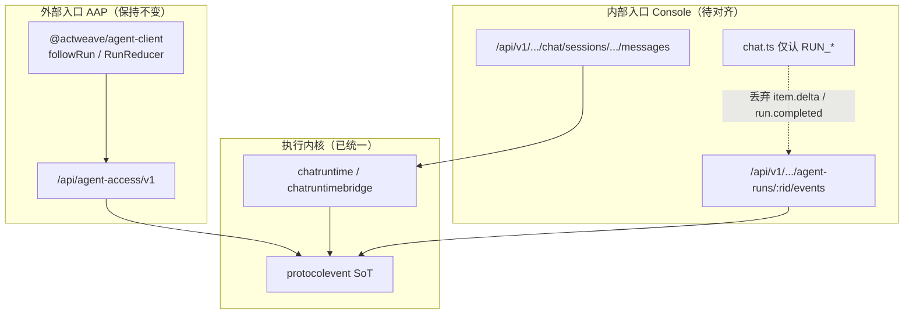
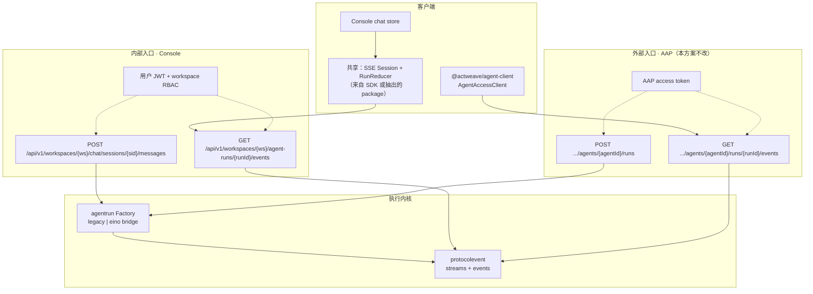

# 协议事件统一：Console 内部入口与 AAP 外部入口分层

| 字段 | 值 |
|------|-----|
| **文档标题** | Protocol Event 单一语义；Console / AAP 双入口 |
| **作者** | ACTWEAVE Platform |
| **日期** | 2026-07-23 |
| **状态** | Draft（Rev 1 — 用户决策：协议必须统一；入口区分内外部；**外部 AAP 不改**） |
| **相关** | [`eino-agent-runtime-base-checklist.md`](./eino-agent-runtime-base-checklist.md)、`sdk/typescript`（`@actweave/agent-client`）、`frontend/src/stores/chat.ts` |
| **分支建议** | `refactor/protocol-event-unification-console`（可与 eino 分支并行/叠在其后） |

---

## 1. Overview

ACTWEAVE 已具备：

- **单一执行内核**（legacy `chatruntime` / eino `chatruntimebridge` + `protocolevent` 投影）
- **外部数据面** Agent Access Protocol（AAP）+ TypeScript SDK（protocol SSE + `RunReducer` 已对齐）
- **内部控制台** Console Chat（用户 JWT + `/api/v1/.../chat` + `agent-runs/:id/events`）

但 **Console 实时消费层仍停留在旧 `RUN_*` 事件白名单**，而 SSE 实际下发的是 **protocol 事件**（`run.*` / `item.delta`）。结果是：

1. 发送消息后首包 `events` 易 404（stream 创建竞态）
2. 即使后续 200，前端丢弃 protocol 帧 → **必须刷新**才能从 DB 看到助手消息
3. 与外部 SDK 双份语义，Eino 真流式价值在 Console 上「看不见」

**本方案决策（已定）：**

| # | 决策 |
|---|------|
| D1 | **协议必须统一**：唯一权威事件语义 = `protocolevent` / AAP schema（`item.delta`、`run.completed` 等） |
| D2 | **入口区分内外部**：Console 内部 API 与 AAP 外部 API **长期并存**，不合并产品面 |
| D3 | **外部不改**：AAP 路由、鉴权、SDK 公共 API、事件帧语义 **冻结**；本改造不对外部集成方要求升级 |
| D4 | Console **对齐**外部已采用的协议消费模型（可复用 SDK 原语），而不是让外部回退到旧 `RUN_*` |

---

## 2. Background & Motivation

### 2.1 现状拓扑



### 2.2 已验证的问题（2026-07-23）

| 问题 | 根因 | 影响面 |
|------|------|--------|
| 首包 `events` 404 | `POST messages` 202 时 `agent_runs` 已存在，但 `protocol_event_streams` 在异步 `Execute` 里才 `Ensure`；`HighWatermark` → `ErrRunScopeNotFound` | Console only |
| UI 不刷新看不到回复 | SSE 帧类型为 `item.delta` / `run.completed`；`parseSSEBlock` 白名单只有 `RUN_*`，帧被丢弃 | Console only |
| 刷新可见 | `loadSession` 读 `chat_messages`（`RecordAssistantResult` 已落库） | 掩盖实时层失败 |
| Eino 流式 Index bug | 已修（`TextDelta.Index` 固定 content-part 0）；与本方案正交但相关 | 执行层 |

### 2.3 外部为何「不必改」

- AAP SSE 编码器本就输出 **protocol 点分类型**（`sse.Encoder`）
- SDK `followRun` / `RunReducer` 已按 **同一套类型** 实现重连、`Last-Event-ID`、delta 累加
- 外部集成方契约（OpenAPI / golden / SDK semver）**稳定即成功**

因此改造焦点是：**内部 Console 消费与（可选）stream 就绪语义对齐已存在的协议**，不是重做 AAP。

---

## 3. Goals & Non-Goals

### Goals

1. **单一事件语义**：Console 与 AAP 对同一 Run 的 SSE 帧，类型与 payload 形状一致（protocol schema）。
2. **双入口清晰**：
   - **内部**：用户 JWT + Workspace RBAC + Chat Session 产品模型
   - **外部**：AAP Client Token + Grant + Conversation/Run 模型
3. **Console 实时体验**：发送后无需刷新即可看到流式 `item.delta` 与终态。
4. **复用 SDK 原语**（parser / session / reducer），避免在 `chat.ts` 再发明一套投影。
5. **兼容窗口**：旧 `RUN_*` 可在过渡期作为 *可选* 兼容层（默认关闭或只读日志），不以双写回 SoT。

### Non-Goals

- 取消 AAP 或要求外部改 baseUrl / 事件类型（**D3**）
- 把 Console 用户会话改造成 AAP Conversation（产品模型不合并）
- 把 AAP 外部集成改成必须走 Chat Session API
- 替换 PostgreSQL 事件源或改变 Eino HITL 契约
- 一次 PR 删除所有 legacy `run_events` 历史表（可后续清理）

---

## 4. Key Decisions

| # | 决策 | 理由 |
|---|------|------|
| D1 | Protocol event = **唯一**实时权威语义 | 与 Eino 投影、AAP golden、SDK 一致 |
| D2 | 入口分层：Internal Console API vs External AAP API | 鉴权主体、产品能力、审计不同 |
| D3 | **外部 AAP + SDK 公共面零破坏** | 用户明确；外部已正确 |
| D4 | Console 适配协议，不反向改协议迁就 Console | 避免污染外部 |
| D5 | 共享库：`@actweave/agent-client` 中 **transport-agnostic** 部分（SSE 解析、Session、RunReducer）；Console 自带 JWT + 内部 events URL | 复用而不绑死 AAP base path |
| D6 | Stream 就绪：优先 **后端消除 404 窗口**；前端 404 短退避作兜底 | 体验 + 防御 |
| D7 | 不在生产对同一 Run **双写** legacy `RUN_*` + protocol 两套 SoT | 避免顺序/双发；过渡仅前端映射 |

---

## 5. Architecture

### 5.1 目标拓扑



### 5.2 入口对照表（长期保留）

Operator runbook（短表）: [`docs/runbooks/protocol-event-console-vs-aap-entrypoints.md`](../runbooks/protocol-event-console-vs-aap-entrypoints.md)

| 维度 | 内部 Console | 外部 AAP |
|------|----------------|----------|
| Base | `/api/v1` | `/api/agent-access/v1` |
| 鉴权 | Session JWT / cookie + `AuthorizeWorkspace` | Bearer AAP token（client/grant/subject） |
| 对话载体 | `chat_sessions` + `chat_messages` | AAP `conversations` |
| 发起执行 | `POST .../chat/sessions/:sid/messages` → 202 + `runId` | `createRun` 等 AAP 命令 |
| 事件订阅 | `GET .../agent-runs/:rid/events` | `GET .../agents/:aid/runs/:rid/events` |
| 确认 | Console confirmation + resumeToken 存储 | AAP interaction decision |
| 客户端 | Vue `chat` store + 共享原语 | `@actweave/agent-client` |
| **本方案改动** | **是（消费层 + 可选 stream 就绪）** | **否（D3）** |

### 5.3 协议层（统一内容）

**权威定义：**

- Schema：`protocolschema` / OpenAPI AAP 事件章节
- 存储：`protocol_event_streams` + `protocol_events`
- 编码：`backend/internal/transport/sse.Encoder`（`id: <sequence>\nevent: <type>\ndata: <payload>`）

**Console 必须消费的类型（与 SDK 一致，最小集）：**

| `event` 类型 | Console UI 动作 |
|--------------|-----------------|
| `run.accepted` / `run.started` | `runStatus → RUNNING`（或 pending→running） |
| `item.started`（assistant message） | 创建/占位助手气泡 |
| `item.delta`（text） | 累加气泡文本（真流式） |
| `item.completed` | 固化助手 item / 对齐 content |
| `run.waiting` | 等待确认 UI |
| `run.resumed` | 恢复 running |
| `run.completed` | `SUCCEEDED`，可 `loadSession` 校准 |
| `run.failed` / `run.cancelled` | 终态 + 错误展示 |
| 未知类型 | **忽略并不中断流**（与 reducer 策略对齐） |

**禁止：**

- 以旧 `RUN_COMPLETED` 等作为 Console 唯一合法类型
- 为 Console 再引入第二套「控制台专用 SSE schema」作为 SoT

---

## 6. Internal Console Design（改动主体）

### 6.1 发送路径（保持产品 API）

```text
用户发送
  → POST /api/v1/workspaces/{ws}/chat/sessions/{sid}/messages
  → 202 { session, message, runId }
  → 前端 subscribe(runId) 使用 protocol 消费栈
```

**不改变：** HTTP 路径、202 语义、Chat Session 模型、用户 JWT。

### 6.2 事件订阅路径

```text
GET /api/v1/workspaces/{ws}/agent-runs/{runId}/events
  Headers:
    Accept: text/event-stream
    Authorization: Bearer <user JWT>
    Last-Event-ID: <optional sequence>
  Query（若已有）: follow=true|false
```

**响应帧：** 与 AAP 相同的 protocol SSE（`event: item.delta` 等）。  
**本方案不要求** 为 Console 再发 `event: RUN_COMPLETED` 双帧。

### 6.3 前端架构

```text
frontend/
  stores/chat.ts              # 编排：session/message/确认；调用 adapter
  services/run-event-stream.ts  # 新建：封装订阅
  （依赖）@actweave/agent-client 中：
    - SSEFrameParser / openAAPSEStream / AAPSESession（若可挂自定义 URL）
    - RunReducer
    - types
```

若 SDK 当前写死 AAP path，则二选一（实现阶段定，**不改外部行为**）：

| 选项 | 做法 | 对外部影响 |
|------|------|------------|
| **A（推荐）** | SDK 抽出 `createEventStream({ url, getToken, ... })` 无路径假设；`AgentAccessClient.streamRunEvents` 内部调用它 | 仅 additive API，外部可选 |
| **B** | Console 复制 parser/session 最小集到 `frontend/src/protocol/`，逻辑与 SDK 单测对齐 | 零触碰 SDK 包 |

**D3 约束下：** 即使选 A，也只能 **additive**；不得 break 现有 `followRun` 签名与默认 baseUrl 行为。

### 6.4 投影到对话框状态

```text
for await (msg of stream):
  if protocol_event:
    reducer.apply(event)
    snap = reducer.snapshot()
    // items: assistant message 的 text 累加 → messages[]
    // run.status → runStatus
  if terminal:
    close stream
    optional loadSession() 校准 chat_messages
```

**映射规则：**

- Protocol `items[]` 中 `type=message` + `role=assistant` → UI 助手气泡
- `item.delta` 过程中：本地 upsert 同一 `item.id` 的 content 文本
- 用户消息仍以 Chat API 返回的 `message` 为准（已存在）
- 确认流：`run.waiting` / interaction 事件 → 复用现有 pending confirmation 状态机（字段映射在实现 PR 中表驱动）

### 6.5 404 / 流未就绪

**后端（优先，P1）：** 见 §7。

**前端兜底（P0 必做）：**

| HTTP | 策略 |
|------|------|
| 404 + run scope not found | 短退避重试：200ms → 500ms → 1s，最多 ~15 次；**不**当作用户级失败 toast |
| 401 | 走现有 auth refresh，再订 |
| 5xx / 网络错误 | 指数退避，上限 8 次（对齐 SDK） |
| 200 后断连且 run 非终态 | `Last-Event-ID` 重连 |

---

## 7. Backend Changes（仅内部体验；外部契约不变）

### 7.1 Stream 就绪窗口（修 404）

**问题：** `chat.Service.SendMessage` 提交 `agent_runs` 后返回；`protocol_event_streams` 在异步 `Execute` → `RecordStarted` / `ProtocolRecordRunStarted` 才创建。

**方案（择一，推荐 B）：**

| 方案 | 描述 | 外部影响 |
|------|------|----------|
| **A** | `SendMessage` 事务内或 commit 后同步 `EnsureRunEventStream` + 可选先写 `run.accepted` | 无 |
| **B（推荐）** | `getAgentRunEvents`：若 run 存在且 stream 不存在 → **202/200 挂起等待**（短超时如 5–10s）或 **409 + Retry-After** 明确「未就绪」；**避免用 404 表示未就绪** | 无（AAP 路径本就在 createRun 时建流） |
| **C** | 仅前端重试 | 不改后端，体验较差 |

**推荐落地：** A + 前端兜底。在 `SendMessage` 成功路径（与 run 创建同一请求内）确保 stream 行存在，使 Console 首订即 200。  
实现时注意与 `AcceptAndStartAgentRun` / `RecordStartedAgentRun` 的幂等 `Ensure` 一致，避免双 stream。

### 7.2 明确 404 语义（文档 + 实现）

| 条件 | HTTP | 含义 |
|------|------|------|
| run 不存在 / 无权限 | 404 / 403 | 真的没有 |
| run 存在、stream 暂未建 | **不应再是模糊 404**（P1 修掉） | 未就绪 |
| AAP createRun 后 stream | 已就绪 | 外部无此窗口 |

### 7.3 外部 AAP（明确不改 — 可勾选冻结表）

> 与 checklist **F1–F7** 对齐；后续 U1–U4 每 PR 合入前按表抽检。  
> **禁止**破坏性变更；**允许** additive（例如导出 URL 无关 `openEventStream(url)`，且 `followRun` / 默认 baseUrl 行为不变）。

| ID | 冻结面 | 路径 / API 锚点 | 抽检 |
|----|--------|-----------------|------|
| F1 | AAP 路由 | Base **`/api/agent-access/v1`**；`backend/internal/transport/http` 中 `AgentAccessV1RouteRegistrar` / AAP routes | path/method 无删改语义；`aap_openapi_contract_test.go` |
| F2 | OpenAPI | `docs/openapi/agent-access-v1.yaml`、`docs/openapi/generated/` | 无 breaking 契约 diff |
| F3 | 鉴权 / token / CORS | `backend/internal/agentaccessauth/`、`backend/internal/agentaccess/`；AAP 中间件挂载 | 策略不放宽 |
| F4 | SSE 帧语义 | `backend/internal/transport/sse/encoder.go`；`backend/internal/protocolschema/schemas/aap/v1/` | `event:` 仍为 protocol 点分类型（`run.*` / `item.*`） |
| F5 | SDK 公共 API | `@actweave/agent-client`：`sdk/typescript/src/client.ts`（`AgentAccessClient`、`followRun`、`streamRunEvents`）、`index.ts` 导出面 | SDK 单测绿；签名与默认 baseUrl **零 break** |
| F6 | protocolschema / golden | `backend/internal/protocolschema/`（schemas + `testdata/aap/v1` + baseline） | `go test ./internal/protocolschema/...` |
| F7 | AAP 数据面 | `backend/internal/aap/`；acceptance AAP 用例 | createRun → events 回归不变 |

**明确不在冻结「禁止改动」内的内部面（本方案可改）：** Console `/api/v1/.../chat`、`.../agent-runs/:id/events` 消费与 stream 就绪；`frontend` chat store；可选 SDK **additive** 抽取。

---

## 8. SDK 复用边界

### 8.1 应复用

| 模块 | 用途 |
|------|------|
| `sse-parser` / `sse-reader` | 帧解析 |
| `AAPSESession` | 游标与重连状态 |
| `RunReducer` | item.delta 累加、终态 |
| 生成类型 / enum | 与后端 schema 对齐 |

### 8.2 不应直接整包替代 Console

| 模块 | 原因 |
|------|------|
| `AgentAccessClient` 默认 baseUrl | 指向 AAP，不是 `/api/v1` |
| `TokenProvider` 默认模型 | AAP client token ≠ 用户 JWT |
| `createRun` / conversation CRUD | 产品模型不同 |

### 8.3 Console 适配器伪代码

```ts
// services/console-run-events.ts
import { RunReducer, AAPSESession /* + stream open helpers */ } from "@actweave/agent-client";

export async function* followConsoleRun(opts: {
  workspaceId: string;
  runId: string;
  getAccessToken: () => string | undefined;
  signal?: AbortSignal;
}) {
  const url = `/api/v1/workspaces/${opts.workspaceId}/agent-runs/${opts.runId}/events`;
  const session = new AAPSESession();
  const reducer = new RunReducer();
  // open SSE with user JWT; on 404-not-ready retry;
  // for each protocol event: reducer.apply(event); yield { event, snapshot: reducer.snapshot() }
}
```

`chat.ts` 只负责：`sendMessage` → `followConsoleRun` → 更新 `messages` / `runStatus`。

---

## 9. Data Flow（端到端）

### 9.1 Console 发送（目标）

```text
1. UI sendMessage(content)
2. POST messages → 202 { runId, message, session }
3. 【P1】stream 已 Ensure
4. followConsoleRun(runId)
5. SSE: run.accepted → run.started → item.started → item.delta* → item.completed → run.completed
6. RunReducer 投影助手文本；UI 实时渲染
7. 终态后 close；可选 loadSession 校准
```

### 9.2 外部 AAP（不变）

```text
1. SDK createRun / ...
2. followRun(workspaceId, agentId, runId)
3. 同一 protocolevent SoT
4. RunReducer 投影
```

### 9.3 执行内核（不变）

Eino / legacy 仍只向 `protocolevent` 投影；**禁止**为 Console 再写一套并行 SoT。

---

## 10. Compatibility & Migration

### 10.1 前端

| 阶段 | 行为 |
|------|------|
| 改造前 | 只认 `RUN_*`，protocol 帧丢弃 |
| 改造后 | 只认 / 主路径 protocol；`RUN_*` 可忽略或兼容映射一期 |
| 测试 | 更新 `chat.test.ts`：mock `item.delta` + `run.completed` |

### 10.2 后端

| 阶段 | 行为 |
|------|------|
| P0 | 可不改后端，仅前端协议消费 + 404 重试 |
| P1 | Stream 就绪，消除假 404 |
| 外部 | 零变更 |

### 10.3 废弃

| 项 | 时机 |
|----|------|
| Console 依赖旧 `RUN_*` 为唯一类型 | 本方案 P0 完成后 |
| `run_events_cutover` 中仅服务旧 UI 的特殊分支 | 确认无调用后删除（非本方案阻塞） |

---

## 11. Security

| 入口 | 要求 |
|------|------|
| Console events | 维持现有：run 可见性（USER 触发仅本人等）、workspace RBAC |
| Token | **禁止**把 AAP client secret 放进浏览器；Console 继续用户 JWT |
| SSE URL | **禁止** query 带 token（与 SDK 一致） |
| CORS | Console 同源；AAP 外部 CORS 策略不变 |

---

## 12. Observability

新增 / 复用指标（Console）：

| 指标 | 含义 |
|------|------|
| `console_sse_subscribe_total{result=ok\|not_ready\|not_found\|error}` | 首订结果 |
| `console_sse_not_ready_retries` | 404/未就绪重试次数 |
| `console_sse_protocol_events_applied{type=...}` | 成功应用的 protocol 类型 |
| `console_sse_frames_dropped{reason=unknown_type}` | 应趋近 0 |

日志：订阅时带 `run_id`、`cursor`、`retry`。

---

## 13. Testing Strategy

### 13.1 单元

- `RunReducer` 已有 SDK 测；Console adapter：连续 `item.delta` → 文本拼接
- `parse`：接受 `event: item.delta`，拒绝不应再丢
- 404 未就绪重试计数与上限

### 13.2 集成

- `POST messages` 后 **立即** `GET events` → 200（P1 后）
- SSE 收到 ≥1 `item.delta` 且最终 `run.completed` 时 UI store 有助手消息
- 与 Eino 开 flag 路径联调（真流式）

### 13.3 回归（外部不破）

- `sdk/typescript` 现有单测 + e2e
- AAP protocolschema / golden
- AAP SSE recovery 验收

### 13.4 手动 / E2E

- 浏览器：发送 → **不刷新**见流式与完成
- Network：首包 events 不再持续红 404（或仅极短重试）

---

## 14. PR Plan

> 外部 AAP **无 PR**。下列均属内部对齐。

### PR-U0 — 文档与契约冻结

- 合并本文档；checklist 勾选项
- 明确 D1–D7；外部不改清单

### PR-U1 — Console 协议 SSE 消费（前端 P0）

- **影响：** `frontend` chat store / 新 `run-event-stream` 服务；依赖 SDK 原语或抽出共享
- **DoD：**
  - 消费 `item.delta` / `run.completed` 等
  - 不刷新可见助手全文与终态
  - 404 未就绪短退避
  - 单测更新
- **非目标：** 改 AAP SDK 破坏性 API

### PR-U2 — Stream 就绪（后端 P1）

- **影响：** `chat.Service.SendMessage` 或 `getAgentRunEvents` 未就绪语义
- **DoD：** 202 后立即 events 可 200；AAP 路径行为不变的回归绿
- **依赖：** 无强依赖 U1，可并行；建议 U1 后减少噪音

### PR-U3 — SDK additive 抽取（可选）

- **影响：** `@actweave/agent-client` 导出 URL 无关 stream helper
- **DoD：** 现有 `followRun` 测全绿；Console 改用 helper
- **约束：** 仅 additive

### PR-U4 — 清理

- 删除 Console 死代码 `RUN_*` 白名单主路径
- 文档 / runbook：内外部入口说明

---

## 15. Risks

| 风险 | 等级 | 缓解 |
|------|------|------|
| 前端映射遗漏 interaction 事件 | 中 | 表驱动 + HITL 用例 |
| 404 重试掩盖真 404 | 低 | 仅 run 存在时重试；真 missing 快速失败 |
| SDK 抽取引发外部 semver 恐慌 | 低 | additive only；D3 |
| 与 Eino 未稳定叠加 | 中 | 协议对齐不依赖 PR15；Eino flag off 时同样适用 |
| 双写诱惑 | 高 | 文档明确禁止 protocol+legacy 双 SoT |

---

## 16. Open Questions（可后续关闭）

| # | 问题 | 倾向 |
|---|------|------|
| Q1 | SDK 抽出 helper（U3）还是 Console 内嵌对齐实现？ | 优先 U3 additive，工期紧则 U1 内嵌 |
| Q2 | `item.delta` 是否在 Console 做 batching 显示？ | 先直出；体验再对齐 `TextDeltaBatcher` |
| Q3 | waiting/confirmation 是否 100% 走 protocol interaction 事件？ | 与现确认 API 并存，映射表补齐 |

---

## 17. Success Metrics

| 指标 | 目标 |
|------|------|
| Console 发送后无需刷新看到助手回复 | 100% 本地验收用例 |
| 首包 events 404 率 | P1 后 ≈ 0（或仅重试层可见） |
| 外部 SDK / AAP golden | 零回归 |
| 协议类型单一 | Console 与 AAP SSE `event:` 字段同一集合 |

---

## 18. Summary

| 原则 | 落地 |
|------|------|
| **协议统一** | `protocolevent` + protocol SSE 类型为唯一实时权威 |
| **入口区分** | 内部 Chat API + 用户 JWT；外部 AAP + client token |
| **外部不改** | AAP 路由/SDK 行为/帧语义冻结；仅允许 additive |
| **内部改造** | Console 用协议消费 + 可选 stream 就绪；复用 SDK 原语而非整包替换 |

**一句话：**  
外部已经走在正确协议上；本方案把 **Console 拉回同一协议**，并保持 **内外入口产品分层**，从而在不破坏外部集成的前提下修好对话框实时体验。

---

## Appendix A — 现状问题与对策映射

| 用户可见现象 | 根因 | 对策 PR |
|--------------|------|---------|
| 第一个 events 404 | stream 未建 | U2 + U1 重试 |
| 一直转圈要刷新 | 前端丢 protocol 帧 | U1 |
| 刷新才有字 | 读 DB 消息成功 | U1 实时投影后不再依赖刷新 |
| 模型 curl 正常 UI 仍挂 | 曾是 Index bug + 本协议问题 | 已修 Index + 本文 U1 |

## Appendix B — 相关代码锚点

| 区域 | 路径 |
|------|------|
| Console 发送 | `frontend/src/stores/chat.ts` `sendMessage` / `subscribeRunStream` |
| Console 事件主路径 | `frontend/src/services/run-event-stream.ts` `PROTOCOL_STREAM_EVENT_TYPES`（`RUN_*` 仅为 thin secondary compat） |
| Console events 路由 | `backend/internal/transport/http/chat_execution.go` `getAgentRunEvents` |
| Stream 404 | `backend/internal/protocolevent/reader.go` `HighWatermark` |
| 消息落库早于 stream | `backend/internal/chat/service.go` `SendMessage` + `chatruntime.Messenger.Enqueue` |
| SSE 编码 | `backend/internal/transport/sse/encoder.go` |
| SDK 消费 | `sdk/typescript/src/client.ts` `followRun` / `streamRunEvents` |
| SDK 投影 | `sdk/typescript/src/reducer.ts` `RunReducer` |

## Appendix C — 修订历史

| Rev | 说明 |
|-----|------|
| 1 | 初稿：协议统一、双入口、外部不改、Console 对齐 SDK 原语、PR-U0–U4 |
| 1.1 | U0：§7.3 外部冻结表 F1–F7 锚定路径/API，与 checklist 对齐 |
