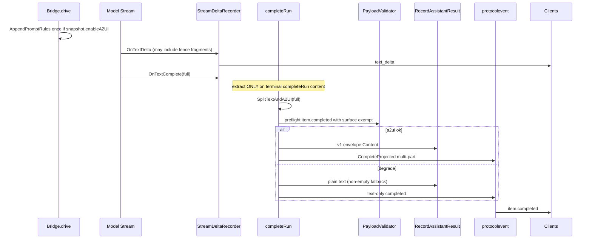

# ActWeave A2UI 一等支持设计文档

| 字段 | 值 |
|------|-----|
| **Title** | A2UI Additive Capability for ActWeave (AAP + Console) |
| **Author** | TBD |
| **Date** | 2026-08-11 |
| **Status** | Draft (Rev 3 — product locks approved 2026-08-11) |
| **Worktree** | `/Users/chen/Documents/act-weave-chat` |
| **Branch** | `feat/a2ui-additive-capability` (from `main`; do not develop on `main`) |
| **Checklist** | [a2ui-additive-capability-checklist.md](./a2ui-additive-capability-checklist.md) |
| **Related** | AAP `/api/agent-access/v1`, `session-context-policy.v2` `aap.*`, Protocol `2026-07-20` |

---

## Overview

ActWeave 当前是**纯文本优先**的 Agent Runtime：Console 与第三方 Web 应用通过 AAP（Agent Access Protocol）消费 SSE 协议事件，assistant 消息以 `text` content part + `text_delta` 流式交付。仓库内**零** A2UI 引用；交互仅支持 `interaction.kind = approval`。

本设计引入 **Google A2UI（Agent-to-UI）** 作为**可选的、附加的（additive）**能力：

- **Text 永远是一等公民。** 简单回复可以只有文本。
- 当需要结构化交互 UI 时，assistant 可在**同一条消息 / 同一 turn** 上附带 A2UI 声明式 JSON（与文本并存，而非互斥模式）。
- Agent 级配置 **默认关闭**；开启后仅表示 agent **可以**在有用时发出 A2UI，**不**要求每条回复都是 A2UI。
- 第三方集成路径保持 AAP；不发明与现有协议冲突的 API。

A2UI 本身是声明式 UI 协议：agent 发送描述 UI 意图的 JSON；客户端用本地组件目录（catalog）原生渲染，**不是**可执行 HTML/JS。参见 [A2UI 介绍](https://developers.googleblog.com/introducing-a2ui-an-open-project-for-agent-driven-interfaces/) 与 [a2ui.org](https://a2ui.org/)。

**MVP 边界（本设计锁定）：** 能力开关 + 文本照常流式 + A2UI 仅在 `item.completed` 附着（不做 A2UI 流式）+ 组件动作（actions）延后且 **MVP 明确非功能**。

---

## Background & Motivation

### 当前状态（已验证）

| 区域 | 现状 | 关键路径 |
|------|------|----------|
| Agent 配置 | `agents.context_policy` 原始 JSON；`sessioncontext.PolicyDocument` 严格 allowlist | `backend/internal/agent/models.go`, `backend/internal/sessioncontext/policy.go` |
| AAP 披露 | `aap.includeCompactionSummary`（默认 false，agent-only，v2） | `AAPPolicy` / `AAPSnapshot` |
| Run 冻结 | 创建时写入 `agent_runs.context_policy_snapshot` | `sessioncontext.Resolve` → `ResolvedSnapshot` |
| Snapshot v2 | **仅当** `CompactionGateEnabled` 时 `Resolve` 写 v2 + `compaction` + `aap`；`ParseResolvedSnapshot` **要求**完整 `compaction` 块 | `snapshot.go` |
| Content parts | `text` / `input_file` + unknown arm | `content-part.schema.json`, `protocolevent.DecodeContentPart` |
| Public payload | `PayloadValidator` / `ScanPublicJSON` **递归扫描全部 JSON 键名**，拒绝 `token`/`password`/`secret`/…（allowlist 仅 usage 类） | `protocolevent/payload_policy.go`；`item.completed` 经 `marshalProjectionItem` |
| Deltas | `text_delta`（index = content part 下标）等 | `delta.schema.json`, `StreamDeltaRecorder.OnTextDelta` 固定 `Index: 0` |
| Interaction | **仅** `kind: approval`，decide ∈ approve/decline/cancel | `interaction.schema.json` |
| Agent Profile | `supportedContent` **仅**看 files gate：`parts=["text"]` 或 `["text","input_file"]`（**不**读 ContextPolicy；扩展为新工作） | `aap_agent_profile.go` `aapSupportedContentForFiles` |
| createRun 入站 | 仅 `text` + `input_file` | `aap_create_run.go` `validateCreateRunRequest` |
| 持久化 | User：`aap.message-content.v1`；Assistant：**纯文本** | `chat.ParseMessageContentParts`, `bridge.buildMessages` 注释 ~L755 |
| Console history | `messageDTO` 返回 **raw durable `content` 字符串** | `chat_execution.go` `messageDTO` |
| 投影管线 | einoruntime `ProtocolProjector` → `StreamDeltaRecorder` → `ProtocolMessageTextSink` → protocolevent → SSE | `einoruntime/callbacks_protocol.go`, `chatruntimebridge/` |
| Drive 指令 | `drive()` 设 `snapRT.SystemPrompt` → `BuildChatModelAgent.Instruction` **且** 同一 `instruction` 传入 `buildInitialMessages` | `bridge.go` `drive` ~L469–529 |
| Console stream | 仅累积 `text_delta` 为 markdown；`item.completed` 用 `extractMessageText` 覆盖 | `frontend/src/services/run-event-stream.ts` |
| SDK | `RunReducer` 仅应用 `text_delta`；`item.completed` **替换**整 item | `sdk/typescript/src/reducer.ts` |
| 协议版本 | `ProtocolVersion = "2026-07-20"` 硬编码于 **两处**：`protocolschema/registry.go` 与 `cmd/protocolgen/main.go` | + `make generate` / `protocol-compat-check` / `protocol-baseline-accept` |
| Frontend aap | `aap` 实质为 **单 flag**（`includeCompactionSummary`）；setter 常只写该键 | `session-context-config.ts`, `agents-page-model.ts` |

### 痛点

1. 第三方 Web 应用（AAP）只能展示流式文本；表单、卡片、选择器等必须自建轮询/二次 API，体验割裂。
2. 若把 A2UI 塞进 markdown/代码围栏，客户端解析脆弱，且与“未知 part 可忽略”的协议演进策略不一致。
3. 若做成“文本模式 vs A2UI 模式”互斥开关，会破坏现有 text-first 产品语义与 Console 兼容。
4. 若将 surface 原样放入 `item.completed` 而不处理 **敏感键扫描**，含 `password` / `accessToken` 等表单字段名的合法 A2UI 会在协议投影阶段被 `ErrSensitivePayload` 拒绝。

### 产品约束（LOCKED）

- Text always first-class；A2UI 为 additive。
- Agent 配置 enable；**默认 disabled**（与今日行为完全一致）。
- Enable = **may** emit，非 must。
- 第三方经 AAP；Console 可阶段性跟进 **渲染**，但 **历史文本投影** 在 P1 必须正确（见 KD-13）。

---

## Goals & Non-Goals

### Goals

1. Agent 级 **enable A2UI** 配置（默认 off），写入/规范化路径与 `includeCompactionSummary` 同构；**run 创建时冻结**。
2. AAP Agent Profile 在启用时**广告** assistant 可产出 `a2ui` content part（ETag 随之变化）；并标明 **actions=false**。
3. 协议原生 `a2ui` content part（first-class）；旧客户端忽略未知 part/事件的契约保持。
4. 与现有 `PayloadValidator` 共存：合法 A2UI surface **不被**敏感键扫描误杀（KD-11）。
5. 运行时：文本流式路径不变；A2UI 在消息完成时附着到 `item.completed` 的 multi-part content。
6. 模型输出契约：启用时**单点**注入说明；坏 JSON **降级为纯文本**，不拖垮 run；空提取有明确 fallback。
7. 持久化 + **Console/模型历史** 均只把 **text parts** 当可读正文；surface 不泄漏为 raw JSON。
8. 分阶段交付 P0–P3；安全默认（声明式、大小限制、无脚本、catalog 信任边界在客户端）。

### Non-Goals

- 不在 MVP 实现 A2UI **流式** delta（P2）。
- 不在 MVP 实现组件 **action 回传**（P3）；**禁止**复用 `interaction.decide`；MVP 渲染的控件为 **display-only / client no-op**。
- 不要求 Console MVP 完整 **catalog 渲染** A2UI（可占位）；**但必须**正确投影 text（非 raw envelope）。
- 不把 A2UI 作为 user `createRun` 入站 content。
- 不实现可执行 HTML/JS、iframe sandbox 宿主，或 MCP Apps 资源模型。
- 不新增 DB 列存储 capability。
- 不改变 A2A inbound 的核心语义（可后续对称扩展）。
- 不在流式 delta 中做服务端围栏剥离（S2 非 MVP）。

---

## Proposed Design

### 1. 能力配置（Capability configuration）

#### 1.1 存放位置

**扩展 `context_policy.aap.*`（与 `includeCompactionSummary` 同一模式）。**

| 层 | 字段 | 语义 |
|----|------|------|
| Agent patch | `context_policy.aap.enableA2UI: boolean` | 缺省 / null → **false** |
| Policy schema | 仍为 `session-context-policy.v2`（`aap` 要求 v2） | 与现有一致 |
| Run snapshot | `context_policy_snapshot.aap.enableA2UI: boolean` | 创建时冻结；关闭只影响**新** run |

**不**新增 `agents` 表列：Console create/update 已透传 `contextPolicy` JSON（`agent_capability.go` `UpdateAgent.ContextPolicy` + `ContextPolicySet`）。

#### 1.2 后端规范化与 Snapshot 形状（**LOCKED — KD-12**）

修改 `backend/internal/sessioncontext/policy.go`：

```go
type AAPPolicy struct {
    IncludeCompactionSummary *bool `json:"includeCompactionSummary,omitempty"`
    EnableA2UI               *bool `json:"enableA2UI,omitempty"` // NEW; default false
}
```

- `aapAllowed` 增加 `"enableA2UI"`。
- `schemaVersion == v2 && AAP != nil && EnableA2UI == nil` → normalize `false`。
- Workspace scope 继续 **拒绝** 任何 `aap` 字段。

```go
type AAPSnapshot struct {
    IncludeCompactionSummary bool `json:"includeCompactionSummary"`
    EnableA2UI               bool `json:"enableA2UI"` // NEW; default false
}
```

##### 规范 Snapshot 形状（关闭 OQ-2）

**当 agent `EnableA2UI()==true` 且 `CompactionGateEnabled==false` 时，`Resolve()` 仍发出完整 `session-context.v2`：**

| 字段 | 值 |
|------|-----|
| `schemaVersion` | `session-context.v2` |
| `compaction` | **完整平台默认块**（与 gate-on 相同构造：`TriggerBps`/`TargetBps`、timeouts、`TemplateVersion`/`TemplateHash`、summary knobs 默认值） |
| `aap.includeCompactionSummary` | 来自 agent policy（默认 false） |
| `aap.enableA2UI` | `true` |
| `sources.compactionGateEnabled` | **`false`** |
| `sources.gateEnabled` / rollout 等 | 与今日一致 |

**不变量：**

1. **不**放宽 `ParseResolvedSnapshot`：v2 **始终**要求合法 `compaction` 块（避免全仓 v2 消费者假设崩塌）。
2. **Compact 运行时** 仅当 `sources.compactionGateEnabled==true`（及现有 mode/preflight 条件）才执行；placeholder compaction **不得**单独打开 compact 路径（见 `compact_preflight` 对 gate 的读取）。
3. 当 `enableA2UI==false` 且 compaction gate off：行为与今日完全一致（可不升级 v2）。
4. 当 compaction gate on：现有 v2 路径 + 从 agent 读 `enableA2UI`。

**否决：** “v2 + AAP without compaction”（需改 `ParseResolvedSnapshot` 与所有 v2 假设，成本高于 platform-default compaction 块）。

辅助 API：

```go
func (doc PolicyDocument) EnableA2UI() bool { /* nil → false */ }
func EnableA2UIFromSnapshot(raw json.RawMessage) bool {
    // ParseResolvedSnapshot; legacy/v1/err → false; AAP nil → false
}
```

PR-1 单测必须覆盖：`enableA2UI=true` + gate off → v2 + full compaction + `compactionGateEnabled=false` + `EnableA2UIFromSnapshot==true`。

#### 1.3 Console / Agents Studio — **aap 为 flag bag（KD-14）**

今日代码把 `aap` 当单 boolean 序列化；第二 flag 若不重构会 **clobber** 兄弟字段或写出非法 `v1+aap`。

**规范语义：**

```ts
// SessionContextPolicy.aap is a flag bag (both optional; default false)
aap?: {
  includeCompactionSummary?: boolean;
  enableA2UI?: boolean;
};
```

| 规则 | 说明 |
|------|------|
| **v2 触发** | 任一 flag 为 true，**或**显式存在 `aap` 对象且 `schemaVersion===v2` → 必须 `session-context-policy.v2` |
| **禁止** | 存在任何 `aap` 键时强制/回落 `schemaVersion: v1` |
| **合并** | 所有 mode / maxTokens / toggle setter **保留**兄弟 aap flags |
| **buildContextPolicyPayload** | 同时 emit 两个 flag（true 或 v2 下的显式 false）；不能只写 `includeCompactionSummary` |
| **normalizeContextPolicy** | 对称读回两个 flag |

| 文件 | 变更 |
|------|------|
| `frontend/src/types/domain.ts` | `aap.enableA2UI?: boolean` |
| `frontend/src/utils/session-context-config.ts` | flag bag build/normalize + 单测（双 flag 组合矩阵） |
| `frontend/src/composables/agents-page-model.ts` | 独立 toggle；`setAgentContextIncludeCompactionSummary` / 新 `setAgentContextEnableA2UI` / `setAgentContextMode` 均调用共享 `mergeAapFlags(current, patch)` |
| locales | enable 文案：may-emit；关闭 = 与今日一致 |

#### 1.4 Profile 广告 — **规范合成顺序（KD-15）**

`projectAAPAgentProfile` **今日不读** ContextPolicy；扩展为新逻辑。`agent.Summary` 已通过 `scanSummary` 带 `ContextPolicy`，**无需**新 store。

**规范算法 `aapSupportedContentForAgent(filesEnabled, filesGate, agentPolicy)`：**

```text
1. base := aapSupportedContentForFiles(filesEnabled, filesGate)
   // → [{type:"message", parts:["text"]}]
   // or [{type:"message", parts:["text","input_file"]}, {type:"input_file_constraints", ...}]

2. if ParsePolicy(agent.ContextPolicy).EnableA2UI():
     find the entry with type=="message"
     append "a2ui" to parts if not already present

3. Stable parts order (normative):
     ["text"] + optional "input_file" + optional "a2ui"
```

| 场景 | `message.parts` |
|------|-----------------|
| 默认 | `["text"]` |
| files only | `["text", "input_file"]` |
| a2ui only | `["text", "a2ui"]` |
| files + a2ui | `["text", "input_file", "a2ui"]` |

- `input_file_constraints` 对象不变（不挂 a2ui）。
- `a2ui` 表示 **assistant 出站** 能力；createRun **入站**仍拒绝。

**OpenAPI / DTO（LOCKED — 禁止依赖 `additionalProperties`）：**

今日 `docs/openapi/agent-access-v1.yaml` 中 `AgentProfile` 为 **`additionalProperties: false`**，且 `aap_openapi_contract_test.go` 对 `aapAgentProfileDTO` 做 **精确 JSON tag allowlist**。因此：

| 产物 | 必改 |
|------|------|
| OpenAPI `AgentProfile.properties.a2ui` | **显式 optional** 对象 schema（非 additionalProperties 偷渡） |
| `aapAgentProfileDTO` | 新增 `A2UI *aapA2UIDTO \`json:"a2ui,omitempty"\`` |
| `aap_openapi_contract_test.go` | allowlist 增加 `"a2ui"` |
| `projectAAPAgentProfile` | 填充 DTO 字段 |

```yaml
# OpenAPI 片段（PR-3 写入 agent-access-v1.yaml）
a2ui:
  type: object
  additionalProperties: false
  required: [enabled, delivery, streaming, actions, maxSurfaceBytes, specHint]
  properties:
    enabled: { type: boolean }
    delivery: { type: string, enum: [item_completed] }
    streaming: { type: boolean }
    actions: { type: boolean }
    maxSurfaceBytes: { type: integer, format: int64, minimum: 1 }
    specHint: { type: string }
```

**MVP 强制广告对象（enable 时出现；disable 时 omit）：**

```json
"a2ui": {
  "enabled": true,
  "delivery": "item_completed",
  "streaming": false,
  "actions": false,
  "maxSurfaceBytes": 65536,
  "specHint": "a2ui-surface.v0"
}
```

`actions: false` 必须出现在 enabled 对象中，避免集成方误以为按钮可提交。

**ETag seed（LOCKED）：** `aapAgentProfileVersionSeed` 在现有 `SupportedContent` 之外，**必须**在 `a2ui` 对象存在时纳入稳定子集：

```go
// aapAgentProfileVersionSeed additions
A2UI *aapA2UISeed `json:"a2ui,omitempty"` // enabled, delivery, streaming, actions, maxSurfaceBytes, specHint
```

- enable 翻转 → parts **与** a2ui seed 均变 → ETag 变。  
- 未来仅改 `maxSurfaceBytes` / `delivery` / `actions`（parts 不变）→ ETag **仍必须**变。  
- PR-3 单测：enable on/off ETag 变化；同 parts 下 seed 元数据变化 → ETag 变化。

#### 1.5 Run 冻结使用点

```go
enabled := sessioncontext.EnableA2UIFromSnapshot(run.ContextPolicySnapshot)
```

**禁止** run 中途读 live agent policy。

---

### 2. 消息模型（Message model）

#### 2.1 协议 Content Part

`content-part.schema.json` 增加一等 arm（unknown `not.enum` 含 `a2ui`）：

```json
{
  "type": "object",
  "required": ["type", "surface"],
  "properties": {
    "type": { "const": "a2ui" },
    "version": {
      "type": "string",
      "minLength": 1,
      "maxLength": 32
    },
    "surface": {
      "type": "object",
      "description": "Declarative A2UI surface (opaque beyond size/type; sensitive-key scan exempt — KD-11)"
    },
    "catalogId": {
      "type": "string",
      "minLength": 1,
      "maxLength": 128
    }
  },
  "additionalProperties": true
}
```

Go（`protocolevent/model.go` + 包 `backend/internal/a2ui` 常量）：

```go
// backend/internal/a2ui/limits.go
const (
    MaxSurfaceBytes   = 64 << 10 // 65536; MVP code constant — no operator config in P1
    EnvelopeVersionV0 = "a2ui-surface.v0"
    PromptTemplateV1  = "a2ui-prompt.v1"
)

const ContentPartTypeA2UI ContentPartType = "a2ui"

type A2UIContentPart struct {
    Type      ContentPartType `json:"type"`
    Version   string          `json:"version,omitempty"`
    Surface   json.RawMessage `json:"surface"` // required JSON object
    CatalogID string          `json:"catalogId,omitempty"`
}
```

校验（extract **与** `DecodeContentPart` / `ValidateItem` 双侧）：

- `surface` 必须为 JSON **object**。
- `len(surface) ≤ a2ui.MaxSurfaceBytes`（raw surface bytes，非整个 event）。
- 不做 HTML 解释；不在 surface 内做“敏感键重命名”。

#### 2.1.1 与 `PayloadValidator` / `ScanPublicJSON` 的交互（**LOCKED — KD-11**）

**问题：** `item.completed` → `CompleteRunItem` → `marshalProjectionItem` → `ValidateEventData` → 递归 `sensitiveKey`。真实 A2UI 表单键（`password`、`accessToken`、`apiKey`、字段名含 `token`）会触发 `AAP_SENSITIVE_PAYLOAD_REJECTED`。若 durable 已 `RecordAssistantResult` 成功而协议失败 → **SUCCEEDED without multi-part completed**。

**锁定方案：选项 (1) — 豁免 `a2ui` part 的 `surface` 子树。**

| 规则 | 说明 |
|------|------|
| **扫描范围** | 对 `item` 快照：当 `content[i].type=="a2ui"` 时，**跳过**该 part 的 `surface` 子树递归键扫描；仍扫描 `type`/`version`/`catalogId` 及 message 其他字段 |
| **实现位置** | `PayloadValidator.scan` 增加 path-aware 或 item-aware 钩子（推荐在 decode 为 map 后识别 `content` 数组元素）；`ScanPublicJSON` 通用入口若用于非 item 路径保持现状 |
| **信任边界** | surface 为声明式 UI 数据，**不是** secret store；客户端 catalog **不得**把 surface 字段当 HTML 执行；文档写明“键名可类似 password，值视为用户可见表单标签/绑定路径，非凭证落库” |
| **否决 (3)** | 服务端重命名 surface 键会破坏 A2UI 兼容与模型输出 |
| **否决 P1 (2)** | side-car object + ref（见 Alt-5）；P1 不采用，作为未来缓解超大 surface / 更严合规的选项 |
| **预检路径（LOCKED）** | 见下表 — **必须与 `CompleteRunItem` / `marshalProjectionItem` 同源** |
| **投影失败** | 预检失败 → **丢弃 a2ui**，退化为 text-only durable + 今日 completed 路径。禁止“先 SUCCEEDED 再因 a2ui 投失败” |
| **测试** | Golden：`surface` 含 `password`、`accessToken`、`apiKey`、`bearerToken` 键名 → preflight **与** `CompleteProjected` 均通过；preflight pass ⇒ CompleteProjected pass |

**实现注：** 豁免必须是 **子树级**（keys + value patterns），仅跳过键不够。

**预检必须共享 marshal 路径（防 false pass / false degrade）：**

生产 `CompleteRunItem` 使用 `marshalProjectionItem`（`item_repository.go`）：

```go
// 生产路径（不得另起炉灶）
ValidateItem(item)
data, _ := json.Marshal(ItemSnapshotData{Item: item})
validator.ValidateEventData(EventItemCompleted /* or started */, data)
```

| 规范 | 说明 |
|------|------|
| **同一 `MessageItem`** | preflight 构造的 item 必须与随后 `CompleteProjected` / `MapCompleted` 使用的 content parts **字节级一致**（推荐：先 `SerializeAssistantDurable` → `ParseMessageContentParts` → `MessageItem` 再预检，消除 serialize 往返差） |
| **同一 helper** | 调用与 `marshalProjectionItem` 相同的校验序列：`ValidateItem` + `json.Marshal(ItemSnapshotData{Item})` + `ValidateEventData("item.completed", data)`（可抽 `protocolevent.ValidateProjectionItem(item, eventType)` 供 repository 与 bridge 共用） |
| **禁止** | 仅 `ScanPublicJSON(surface)`、仅 schema 校验、或手写另一份 envelope 作为“预检通过”判据 |
| **PR-6 golden** | password/accessToken surface：preflight pass ⇒ CompleteProjected pass；若 serialize 后 strip 任何字段，必须用 **最终** item 再预检 |

#### 2.2 消息 part 排序约定

| Index | Part | 流式？ | 说明 |
|-------|------|--------|------|
| 0 | `text` | 是（`text_delta` index=0） | **schema 上始终存在**；值可为 `""`（仅当有效 a2ui 附着时，见 KD-16） |
| 1 | `a2ui` | 否（MVP） | 0 或 1 个（MVP 最多 1） |

`item.started`：`[{type:text, text:""}]`（现状）。  
`item.completed` 示例见下；text-only 路径零行为变化。

```json
{
  "id": "...",
  "type": "message",
  "status": "completed",
  "role": "assistant",
  "content": [
    { "type": "text", "text": "请确认预约信息：" },
    {
      "type": "a2ui",
      "version": "a2ui-surface.v0",
      "catalogId": "standard",
      "surface": { }
    }
  ]
}
```

#### 2.3 协议原生 vs 文本嵌入

| 路径 | 结论 |
|------|------|
| **A. 协议原生 `type:a2ui`** | **产品主路径** |
| B. 仅嵌入 text | 内部调试/回退 only |

---

### 3. 模型输出契约 / Prompt 注入

#### 3.1 注入点（**LOCKED — KD-17**）

**单点注入：** 在 `Bridge.drive()` 内，于调用 `BuildChatModelAgent` **与** `buildInitialMessages` **之前**，对本地变量 `instruction` 做一次：

```go
instruction := snapRT.SystemPrompt
if strings.TrimSpace(instruction) == "" {
    instruction = fallbackInstruction
}
if sessioncontext.EnableA2UIFromSnapshot(run.ContextPolicySnapshot) {
    instruction = a2ui.AppendPromptRules(instruction) // a2ui-prompt.v1
}
// then BuildChatModelAgent{Instruction: instruction} AND buildInitialMessages(..., instruction, ...)
```

| 规则 | 说明 |
|------|------|
| **一次** | 禁止在 `buildMessages` / `buildMessagesTokenWindow` 内再次追加（避免 double-inject） |
| **Resume** | `targets != nil` 时 **不**重装 history；checkpoint 已冻结系统侧状态。Resume **不**再次 `AppendPromptRules`。若首轮未 enable、中途改 agent 配置，本 run 仍以 snapshot 为准（enable 在 create 已冻结） |
| **Token-window / legacy** | 均吃同一个已注入的 `instruction` 参数，无第二入口 |

#### 3.2 指令与围栏格式（M1）

平台模板 `a2ui-prompt.v1`：

1. 默认自然语言；**不要**每条都发 A2UI。  
2. 仅当 UI 明显更好时附加。  
3. MVP **display-oriented** catalog；不要假设按钮可提交（actions 未开通）。  
4. 输出格式：

```text
...normal assistant prose...

<<<A2UI>>>
{ "version": "a2ui-surface.v0", "catalogId": "standard", "surface": { ... } }
<<<END_A2UI>>>
```

**M2 tool `emit_a2ui`：** 非 MVP。

#### 3.3 校验、降级与空 Content（**LOCKED — KD-16**）

`chat.RecordAssistantResult` 要求 `strings.TrimSpace(input.Content) != ""`。

| 情况 | 行为 | Durable | metric |
|------|------|---------|--------|
| 无围栏 | 全文 plain text | plain | `none` |
| 有效 A2UI + 非空 text | text + a2ui | v1 envelope | `ok` |
| 有效 A2UI + **空** text | 允许；`parts=[{text:""},{a2ui…}]`；envelope JSON **非空** 满足 RecordAssistantResult | v1 | `ok_empty_text` |
| 非法 JSON / 非 object / 过大 | **丢弃 A2UI**；text = 围栏外文本；若剥离后 text 也为空 → **fallback = 模型原始 full 字符串**（含围栏原文），保证 run 可完成 | plain | `invalid_json` / `too_large` |
| enable 关但仍有围栏 | 剥离围栏；text=外文本；空则 fallback raw full | plain | `stripped_disabled` |
| 多 surface | 只取第一个 | — | `truncated` |
| 预检 `ValidateEventData` 失败（豁免后仍失败，如超 2MiB event） | 丢弃 a2ui，text-only 路径 | plain | `projection_rejected` |

**原则：** A2UI 损坏 **永不**单独导致 run fail；empty 提取必须落到非空 `Content` 字符串。

`MapCompleted` / `ValidateItem`：允许 text part `text:""` **当且仅当** 同 message 存在合法 `a2ui` part；否则至少非空 text（与今日一致）。

#### 3.4 历史回灌模型（**LOCKED**）

共享 helper（建议 `chat.JoinTextPartsFromDurable(content string) string`）：

1. 若非 `aap.message-content.v1` → 返回原字符串（plain / legacy）。  
2. 若是 v1 → 仅 join `type=="text"` 的 text；**忽略** `a2ui` / 未知 part。  
3. 若无 text part → 返回 `""`（调用方 skip 该 history 行，与今日 empty skip 一致）。

**强制使用点：**

- `bridge.buildMessages` assistant 分支（替换 “plain text only” 假设）
- token-window / bounded history 装载 assistant 行
- **禁止** 把 raw envelope 喂给 `schema.AssistantMessage`

PR-6 golden：前一轮含 A2UI 的 session，下一 run 的 model messages **不得**出现 `schemaVersion`/`surface` JSON。

MVP：**不**注入 `[A2UI surface omitted]` 占位（省 token）；直接 omit surface。

---

### 4. 运行时投影路径

#### 4.1–4.2 数据流

（同前：stream text_delta index=0 → completeRun extract → multi-part `item.completed`。）



#### 4.3 流式围栏（S1）与集成契约

| 策略 | MVP |
|------|-----|
| **S1** | 流式原样 delta；`item.completed` 为剥离后 text [+a2ui]；客户端 **必须以 completed 为权威** |

**对 Console / SDK：** 已分别 `extractMessageText` 覆盖 / item replace — 行为正确。

**对 AAP 第三方（PR-8 强制文档）：**

1. 始终应用 `item.completed` 的 `content` 作为最终 message 状态。  
2. **不要**假设 `text_delta` 拼接 === 最终 text（enable A2UI 时可能含 `<<<A2UI>>>` 碎片）。  
3. 遍历 `content`，`type=="text"` 展示文案；`type=="a2ui"` 交 catalog；未知 type 忽略。  
4. MVP `actions: false`：按钮/提交 **no-op** 或 toast。

服务端流式剥离（S2）仍为 **非目标**。

#### 4.4 completeRun / 抽取范围

```go
// a2ui package
func SplitTextAndA2UI(full string) (text string, payload *Payload, result EmitResult)

func SerializeAssistantDurable(text string, payload *Payload) (content string, err error)
// text-only → plain; with payload → aap.message-content.v1
```

**抽取范围（Issue 18）：** 仅对 **`completeRun` 使用的终端 assistant 字符串**（`drive` 返回的最终 `content` / `result.FinalAssistantText` 同源）执行。  
中间 model turn（tool 循环叙述）若经 `OnTextDelta` 流出，**不**单独 persist 为 session assistant message；`recordModelTurn` 审计路径保持原样，**不**写 a2ui 到 chat_messages。

`NopTextStreamFinalizer` 现状不变：最终 multi-part 来自 durable + `CompleteProjected`，非 stream finalizer。

#### 4.5 Projector

保持 `ProtocolProjector` 薄；extract 在 `chatruntimebridge` / `a2ui` 包，不在每 delta 上跑。

---

### 5. 协议 Schema 变更

| 产物 | 变更 |
|------|------|
| `content-part.schema.json` | `a2ui` arm |
| `delta.schema.json` | MVP 不改 |
| `interaction.schema.json` | 不改 |
| **ProtocolVersion** | 同步改 **`protocolschema/registry.go` 与 `cmd/protocolgen/main.go`**（例如 `2026-08-11`） |
| 生成 | `make generate` → `schema_meta.gen.go`、SDK `protocol.gen.ts`、openapi gen、`SCHEMASET.sha256` |
| Compat | `make protocol-compat-check`；若流程要求 → `make protocol-baseline-accept` |
| OpenAPI | 文档化 a2ui part + profile `a2ui` 对象 |
| Payload policy | PR-4/5 实现 surface 子树豁免 + golden（含敏感键名） |

**OQ-1 默认：** 始终 additive 下发 a2ui；**不**按旧 Protocol-Version strip（与 unknown-part 哲学一致）。

---

### 6. 持久化 / 耐久 Chat Content + **Console 历史投影（KD-13）**

| 角色 | 格式 | 说明 |
|------|------|------|
| User (AAP) | v1 text+input_file | 不变；拒 a2ui 入站 |
| Assistant text-only | plain | 不变 |
| Assistant + A2UI | v1 + a2ui part | 新 |
| Protocol rehydrate | `ParseMessageContentParts` 必须接受 a2ui | PR-5 |
| Model history | `JoinTextPartsFromDurable` | §3.4 |
| **Console session API** | **不得**把 raw v1 envelope 当 markdown 正文 | 见下 |

#### Console 历史 / reload（P1 必做，非“可忽略”）

今日 `messageDTO` 返回 raw `content` 且 `contentSha256` / `contentLength` 来自 durable 行。含 A2UI 的 assistant 在 `loadSession` 后会把 JSON 当 markdown —— 破坏 text-first；若只改 `content` 不改 hash/length，客户端会出现 `contentLength != len(content)`。

**规范（选项 A — 服务端投影，LOCKED）：**

| 字段 | 规则 |
|------|------|
| `content`（ASSISTANT） | `JoinTextPartsFromDurable(raw)`；USER 保持既有行为（plain 或已有 multimodal 展示策略） |
| **`contentLength`** | **`int64(len([]byte(projected content)))`** — 与 **响应体 `content` 字符串** 一致 |
| **`contentSha256`** | **`sha256(projected content)` 小写 hex** — 与 **响应体 `content`** 一致（**显示完整性**） |
| 服务端 durable 行 | DB / StoredObject 上的 length/hash **仍描述原始 durable body**；**不**要求等于 DTO 字段。内部读（protocol `MapCompleted`、模型回灌）继续对 **raw durable** 做 hash 校验 |
| 可选后续 | `a2ui` 结构化字段供 catalog 渲染；**不**阻塞 MVP |

**禁止：** 返回投影后的 `content` 却附带 durable 行的 `contentSha256`/`contentLength`（integrity 撒谎）。  
**禁止：** 为保留 durable hash 而把 raw envelope 继续放进 `content`（破坏 text-first）。

**P1 验收 / 单测：** v1 envelope durable → DTO `content` 仅为自然语言；`contentLength == len(content)`；`contentSha256 == sha256(content)`；正文无 `schemaVersion` / surface JSON。

---

### 7. 客户端兼容矩阵

| 客户端 | enable=false | enable=true text-only | enable=true text+a2ui |
|--------|--------------|----------------------|------------------------|
| 旧 AAP | 同今日 | 同今日 | delta 可能含围栏碎片；completed 后 text 清理；忽略 a2ui part |
| 新 AAP SDK | 同左 | 同左 | `getText` / `getA2UI`；completed 权威 |
| **Console P1** | 同今日 | 同今日 | **历史+直播最终 text 正确**；a2ui 可不渲染 UI |
| 旧 Protocol-Version | 不变 | 不变 | additive 仍下发 a2ui（OQ-1 默认） |

---

### 8. 分阶段交付

| Phase | 交付 | 验收 |
|-------|------|------|
| **P0** | enableA2UI policy/snapshot（KD-12）/ UI flag bag / Profile parts+`a2ui.actions:false` | 默认 off；snapshot 冻结；ETag |
| **P1** | schema+豁免扫描；parse；runtime extract；Console text 投影；SDK；docs | E2E multi-part；敏感键名 golden；reload 无 raw JSON；空提取 fallback |
| **P2** | optional streaming | — |
| **P3** | 独立 ui-actions 通道 | 非 approval |

#### P3 Actions（预告）

```text
❌ interaction.decide
✅ POST .../runs/:rid/ui-actions  (未来)
```

MVP catalog 指导：优先 Card/Text/选单展示组件；Submit/Button 在客户端 **disabled 或 no-op + toast**（“此 Agent 尚未启用 UI 动作”）。

---

### 9. Security & Privacy

| 威胁 | 严重度 | 缓解 |
|------|--------|------|
| XSS | 高 | 声明式 + catalog；禁 innerHTML |
| 敏感键误杀合法 surface | **高** | **KD-11 子树豁免** + 预检在 persist 前 |
| SUCCEEDED without completed | 高 | persist 前 Validate；失败则 text-only |
| 超大 payload | 中 | `a2ui.MaxSurfaceBytes=64KiB`；event 2MiB 上限 |
| 凭证进 surface 值 | 中 | 与 text 同等数据面；审计不记 surface 全文 |
| 未 enable 下发 | 中 | snapshot 门控；strip 围栏 |
| 假交互（死按钮） | 中 | profile `actions:false` + 文档 + client no-op |
| 复用 approval | 高 | 禁止 |

**隐私：** surface 与 chat 同 retention；模型回灌 / Console 正文 omit surface。

---

### 10. Observability

| 信号 | 标签 / 说明 |
|------|-------------|
| `actweave_a2ui_emit_total` | `none\|ok\|ok_empty_text\|invalid_json\|too_large\|stripped_disabled\|truncated\|projection_rejected` |
| `actweave_a2ui_surface_bytes` | histogram |
| log `chatruntimebridge.a2ui.extract` | 无 surface 正文 |
| audit summary | `a2ui: bool` optional |

---

### 11. Testing Strategy

| 层 | 内容 |
|----|------|
| Unit | policy/snapshot KD-12；SplitTextAndA2UI 全表 §3.3；JoinTextPartsFromDurable；flag bag payload |
| Protocol | generate + compat + baseline；Decode/Validate；**Scan 豁免 golden**（password/accessToken/apiKey） |
| Bridge | inject 单次；completeRun 终端 extract；history 无 raw JSON；empty fallback |
| HTTP | profile 合成顺序 + OpenAPI/allowlist/`a2ui` ETag seed；createRun 拒 a2ui；messageDTO text + **hash/length 自洽** |
| SDK / FE | completed 权威；ignore unknown；session-context 双 flag |
| Deploy drill | 模拟旧二进制读新 envelope → fail-close；证明 PR-5 先于 PR-6 write |

---

### 12. Rollout / Rollback（**硬性 expand-only**）

1. **默认 off** → bit-identical。  
2. **部署顺序（多实例滚动同样适用）：**  
   - **Wave 1：** PR-4 + **PR-5**（读路径：parse a2ui + payload 豁免 + Console DTO join）**全集群就绪**。  
   - **Wave 2：** PR-6（写路径：extract + 持久化 a2ui）。  
   - **禁止** Wave 2 在 Wave 1 未完成时 enable 生产 Agent。  
3. 配置 enable 单 Agent 金丝雀。  
4. **Emergency env `AAP_A2UI_PROJECTION=off`（fail-closed on write）：**  
   - **跳过** extract 附着与 a2ui 持久化；  
   - durable **仅 plain text**（对 full 做围栏剥离，失败则存 raw full）；  
   - **不**写 multi-part envelope；  
   - 已存在的 v1+a2ui 消息仍依赖 Wave 1 读路径。  
5. 配置回滚：`enableA2UI=false` 仅影响新 run。

---

## API / Interface Changes

### Agent contextPolicy

```json
{
  "contextPolicy": {
    "schemaVersion": "session-context-policy.v2",
    "mode": "token_window",
    "aap": {
      "includeCompactionSummary": false,
      "enableA2UI": true
    }
  }
}
```

### AAP Agent Profile（规范例）

**text + a2ui：**

```json
{
  "object": "agent_profile",
  "supportedContent": [
    { "type": "message", "parts": ["text", "a2ui"] }
  ],
  "a2ui": {
    "enabled": true,
    "delivery": "item_completed",
    "streaming": false,
    "actions": false,
    "maxSurfaceBytes": 65536,
    "specHint": "a2ui-surface.v0"
  }
}
```

**files + a2ui：**

```json
{
  "supportedContent": [
    { "type": "message", "parts": ["text", "input_file", "a2ui"] },
    {
      "type": "input_file_constraints",
      "mediaTypes": ["image/png", "image/jpeg", "image/webp", "image/gif", "application/pdf"],
      "maxBytes": 10485760
    }
  ],
  "a2ui": { "enabled": true, "delivery": "item_completed", "streaming": false, "actions": false, "maxSurfaceBytes": 65536, "specHint": "a2ui-surface.v0" }
}
```

### createRun

不变；`type: a2ui` → `ErrAAPUnsupportedContentType`。

### Console message DTO（P1）

```json
{
  "id": "...",
  "role": "ASSISTANT",
  "content": "请确认预约信息：",
  "contentSha256": "<sha256 of UTF-8 bytes of content field above>",
  "contentLength": 30
}
```

| 契约 | |
|------|--|
| `content` | 投影后的 text（非 raw envelope） |
| `contentSha256` / `contentLength` | **相对 `content` 字段重算**（显示完整性，KD-13） |
| durable storage | 行内 / object 的 hash/length 仍为 raw body；仅服务端内部校验使用 |

可选后续字段 `a2ui` 不阻塞 MVP。

---

## Data Model Changes

| 存储 | 变更 |
|------|------|
| `agents.context_policy` | JSON 字段（无 migration） |
| `agent_runs.context_policy_snapshot` | `aap.enableA2UI` + 可能的 v2 升级（KD-12） |
| `chat_messages` content | 条件性 v1 envelope |
| 新表 | **无** |

---

## Alternatives Considered

### Alt-1：独立 Agent 列 `a2ui_enabled` — **否决**（policy aap 足够）

### Alt-2：仅嵌入 text — **否决产品路径**

### Alt-3：独立 item type — **否决 MVP**

### Alt-4：复用 `interaction.decide` — **明确否决**

### Alt-5：Side-car `stored_object` + content part 仅引用（`surfaceObjectId`）

| | In-event `surface`（P1 采用 + KD-11 豁免） | Side-car object ref |
|--|---------------------------------------------|---------------------|
| 敏感扫描 | 需子树豁免 | part 无大 JSON，扫描压力小 |
| 客户端 | 单事件即可渲染 | 需二次拉取 + 鉴权 |
| 大小 | 64KiB 内 OK | 更大 surface 更合适 |
| 复杂度 | 低 | 高（GC、权限、一致性） |
| **结论** | **P1 采用** | 若未来要 >64KiB 或取消豁免时再评估 |

---

## Key Decisions

| ID | 决策 | 理由 |
|----|------|------|
| **KD-1** | 能力位 `context_policy.aap.enableA2UI`，默认 false，snapshot 冻结 | 与 includeCompactionSummary 同构 |
| **KD-2** | 协议原生 `type=a2ui` | 一等、可广告、旧客户端可忽略 |
| **KD-3** | Text index 0 + `text_delta`；A2UI 仅 `item.completed` | 保持 delta 不变量 |
| **KD-4** | 围栏 extract（M1）；坏 JSON 降级 | 不改 tool 循环 |
| **KD-5** | 不扩展 `interaction.decide`；actions → P3 | 语义隔离 |
| **KD-6** | 有 A2UI 才写 v1 envelope；纯文本 plain | 最小迁移 |
| **KD-7** | createRun 拒 a2ui 入站 | agent→UI only |
| **KD-8** | **部署** expand-only：PR-5 全量后再 PR-6 写 | 防止 fail-close 读 |
| **KD-9** | Console MVP 可不 **渲染** catalog；**必须** text 投影正确 | 收窄原 KD-9 |
| **KD-10** | 模型历史 omit surface | token + 防模仿 |
| **KD-11** | **`a2ui.surface` 子树豁免** PayloadValidator 键/值敏感扫描；persist 前预检走 **`ValidateItem` + `ItemSnapshotData` + `ValidateEventData("item.completed")`**（与 `marshalProjectionItem` 同源）；失败则 text-only | 合法表单键名不可误杀；避免 SUCCEEDED-without-completed / false preflight |
| **KD-12** | enableA2UI 且 compaction gate off → **完整 v2 + platform-default compaction + `sources.compactionGateEnabled=false`** | 不改 ParseResolvedSnapshot；compact 仍看 gate |
| **KD-13** | Console `messageDTO`：`content = JoinTextPartsFromDurable(raw)`；**`contentSha256`/`contentLength` 对投影后 `content` 重算**；durable 行 hash 仅服务端内部 | 禁止 raw envelope；DTO 字段自洽 |
| **KD-14** | Frontend `aap` 为 **flag bag**；setter 保留兄弟 flag；有 aap 则强制 v2 | 防 clobber / 非法 v1+aap |
| **KD-15** | Profile parts 顺序 `text` → `input_file?` → `a2ui?`；**OpenAPI 显式 `a2ui` 属性**（`additionalProperties:false`）；ETag seed 含 a2ui 元数据子集；Summary.ContextPolicy 足够 | 消除合成/契约/缓存歧义 |
| **KD-16** | text part 始终存在；允许 `text:""` 仅当合法 a2ui；空提取 fallback 保证非空 Content | 对齐 RecordAssistantResult |
| **KD-17** | Prompt 规则 **仅**在 `drive()` 对 `instruction` 注入一次 | 防双注入；resume 不重注 |

---

## Open Questions

**产品评审（2026-08-11）已全部按推荐方案锁定** → 见 checklist「Product locks」。实现期无阻塞型 OQ。

| 原 OQ | 状态 |
|-------|------|
| OQ-1 Protocol-Version strip | **关闭**：始终 additive 下发；无存量客户端，不做 strip |
| OQ-2 Snapshot 形状 | **关闭** → KD-12 |
| OQ-3 强制 Google schema | **关闭（MVP）**：opaque surface + 大小限制；严格 schema 后置 |
| OQ-4 空 text | **关闭** → KD-16 |

非阻塞后续可选项：P2 流式、P3 actions、严格 schema、side-car surface。

---

## Risks

| 风险 | 严重度 | 缓解 |
|------|--------|------|
| 敏感扫描拒合法 surface | **高** | KD-11 + golden |
| SUCCEEDED without completed | **高** | 预检在 persist 前 |
| 旧二进制读 v1+a2ui fail-close | **高** | KD-8 部署波次 |
| Console raw JSON | **高** | KD-13 |
| aap flag clobber | 中 | KD-14 |
| 流式围栏闪烁 | 低-中 | S1 + completed 权威文档 |
| 死按钮 UX | 中 | profile actions:false + client no-op |
| Snapshot 误解打开 compact | 中 | KD-12 gate false 不变量测试 |

---

## References

- `backend/internal/sessioncontext/policy.go`, `snapshot.go`
- `backend/internal/protocolevent/payload_policy.go`（`ScanPublicJSON`, `sensitiveKey`）
- `backend/internal/protocolschema/schemas/aap/v1/content-part.schema.json`
- `backend/internal/chat/message_protocol.go`
- `backend/internal/chatruntimebridge/bridge.go`（`drive`, `completeRun`, `buildMessages`）
- `backend/internal/transport/http/aap_agent_profile.go`, `aap_create_run.go`, `chat_execution.go`（`messageDTO`）
- `frontend/src/services/run-event-stream.ts`, `utils/session-context-config.ts`, `composables/agents-page-model.ts`
- `sdk/typescript/src/reducer.ts`
- `cmd/protocolgen/main.go`, `Makefile`（generate / protocol-compat-check / protocol-baseline-accept）

---

## PR Plan

每步 main 可发布（默认 enableA2UI=false 时写路径不产生 a2ui）。

### PR-1: Policy `enableA2UI` + Snapshot（**含 KD-12**）

- **Title:** `sessioncontext: add aap.enableA2UI and v2 snapshot when enabled without compaction gate`
- **Files:** `sessioncontext/policy.go`, `snapshot.go`, `*_test.go`（含 gate-off + enableA2UI 形状、`EnableA2UIFromSnapshot`、compact gate 不变量）
- **Dependencies:** 无
- **Description:** allowlist；normalize；**Resolve：enableA2UI → full v2 + platform-default compaction + compactionGateEnabled=false**；helpers。

### PR-2: Console flag bag UI

- **Title:** `frontend: aap flag bag for enableA2UI + includeCompactionSummary`
- **Files:** `domain.ts`, `session-context-config.ts`(+tests 矩阵), `agents-page-model.ts`（`mergeAapFlags`）, locales
- **Dependencies:** PR-1
- **Description:** 双 flag 保留；禁止 v1+aap；独立 toggle。

### PR-3: AAP Profile 广告

- **Title:** `aap: advertise a2ui parts and a2ui.actions=false from agent ContextPolicy`
- **Files:**
  - `aap_agent_profile.go`（DTO + `aapAgentProfileVersionSeed` 含 a2ui 子集 + tests）
  - **`docs/openapi/agent-access-v1.yaml`** — `AgentProfile.properties.a2ui` **显式** schema（`additionalProperties: false` 保持）
  - **`aap_openapi_contract_test.go`** — JSON tag allowlist 增加 `"a2ui"`
  - 使用已有 `Summary.ContextPolicy`，**无新 store**
- **Dependencies:** PR-1
- **Description:** KD-15 合成顺序；enabled 时顶层 `a2ui`；ETag seed 含 a2ui 元数据；createRun 仍拒 a2ui。

### PR-4: Protocol schema + **sensitive-scan exemption**

- **Title:** `protocol: a2ui content part + surface subtree payload-policy exemption`
- **Files:**
  - `content-part.schema.json`
  - `protocolevent/model.go`, `payload_policy.go`（子树豁免）, tests/golden（password/accessToken/apiKey）
  - `a2ui/limits.go`（`MaxSurfaceBytes`）
  - **`protocolschema/registry.go` + `cmd/protocolgen/main.go` ProtocolVersion**
  - `make generate`；`protocol-compat-check`；必要时 `protocol-baseline-accept`
- **Dependencies:** 无（可与 PR-1 并行）
- **Description:** 类型、大小校验、KD-11 豁免、版本双点更新。

### PR-5: Durable parse + **Console text 投影**（**读路径 Wave 1**）

- **Title:** `chat: parse a2ui parts; Console messageDTO joins text only`
- **Files:** `chat/message_protocol.go`, `JoinTextPartsFromDurable`, `chat_execution.go` `messageDTO`, multimodal user 路径仍拒 a2ui, tests
- **Dependencies:** PR-4
- **Description:** Expand-only **读**；MapCompleted multi-part；**session reload text-first**；DTO **`contentSha256`/`contentLength` 对投影 `content` 重算**（KD-13）。  
- **Deploy gate:** 本 PR（+PR-4）必须在全实例滚动完成后，才可在生产打开 PR-6 写路径。

### PR-6: Runtime extract + inject + completeRun（**写路径 Wave 2**）

- **Title:** `chatruntimebridge: A2UI extract on completeRun with preflight validation`
- **Files:**
  - `backend/internal/a2ui/`（split、prompt、serialize）
  - `bridge.go`：`drive` 单点 inject；`completeRun` extract+serialize；assistant history join
  - `protocolevent`：可选抽出 `ValidateProjectionItem` 与 `marshalProjectionItem` 共用
  - metrics；env `AAP_A2UI_PROJECTION=off`（跳过 extract/persist a2ui，只写剥离后 text）
  - golden：终端 extract；**preflight == marshalProjectionItem 路径**；password surface pass⇒CompleteProjected pass；history 无 raw JSON；empty fallback
- **Dependencies:** PR-1, PR-4, **PR-5 已部署**
- **Description:** KD-17/16/11 写路径；禁止中间 turn extract；禁止手写仅 Scan(surface) 的预检。

### PR-7: TypeScript SDK

- **Title:** `sdk: a2ui content parts; completed content authoritative`
- **Files:** `models.ts`, `reducer.ts`, tests, README
- **Dependencies:** PR-4
- **Description:** helpers；text_delta index 0；文档 completed 权威。

### PR-8: Docs + demo

- **Title:** `docs: A2UI additive capability, actions=false, completed authority`
- **Files:** aap-integration-guide(+zh), integrations/aap, 可选 demos/aap-chat
- **Dependencies:** PR-3, PR-6, PR-7
- **Description:** 配置、profile、围栏闪烁、actions no-op、兼容矩阵、部署 expand-only。

### PR-9 (P2): streaming — later

### PR-10 (P3): ui-actions channel — later

---

### 合并列车与部署波次

```text
Merge:
  PR-4 ─────────────────────────────┐
  PR-1 → PR-2 → PR-3                ┤
         PR-5 (read) ◄──────────────┤
               PR-6 (write) ◄───────┘  only after PR-5 deployed everywhere
               PR-7 → PR-8

Deploy waves:
  Wave 1: PR-4 + PR-5  (and ideally PR-1..3)
  Wave 2: PR-6         (enable agents only after Wave 1 healthy)
```

**P0 ≈ PR-1+2+3；P1 ≈ PR-4+5+6+7+8；P2/P3 = PR-9/10。**
