# ActWeave UI / UX 审计报告

> 审计日期：2026-08-14
>
> 审计分支：`codex/ui-audit`
>
> 基线：`main` / `9052436d6bda`
>
> 审计方式：Chrome 实际交互、桌面端与 390 × 844 窄屏检查、DOM / 无障碍树核验、关键实现静态交叉检查

## 结论

当前 UI 已经具备统一的视觉语言、较完整的模块覆盖和可用的桌面端骨架，但**不建议以现状作为可信的对外 GA 管理控制台**。首要问题不是“还不够漂亮”，而是状态语义不可靠：同一对象在同一界面会同时被描述为“测试通过”与“从未测试”，已发布工作流会同时出现“未验证”“全流程通过”和“0 次运行成功率 100%”。这会直接破坏管理员对发布、运行与治理结果的信任。

窄屏也不是简单的间距问题。Run Console 的设置区、运行摘要、调试提示和凭证面板挤压了消息区，390 × 844 下几乎无法阅读完整回复；Tools 需要滚动一整屏才能看到列表，表格首屏又隐藏了最重要的状态列。

发布建议：**先修复全部 P0 和 P1-01～P1-04，再进行面向真实用户的可用性验收；窄屏若不在支持范围内，应明确声明最小宽度并提供受控降级，而不是呈现一个看似响应式但无法完成任务的界面。**

## 本轮修复结果（2026-08-14）

本轮已完成用户指定的 12 项：`P1-01`、`P1-02`、`P1-03`、`P1-04`、`P1-05`、`P1-06`、`P1-08`、`P2-01`、`P2-02`、`P2-03`、`P2-04`、`P2-05`。原始问题描述与截图保留为审计基线；下表记录修复后的行为。

| ID | 状态 | 修复与验收结果 |
| --- | --- | --- |
| P1-01 | 已完成 | Run Console 调试信息改为折叠，凭证改为按需浮层；390 × 844 下默认不展开凭证区，消息区、当前会话和输入框可同时操作。 |
| P1-02 | 已完成 | Audit 列表与统计统一使用相同状态/日期查询口径；失败详情首屏展示阶段、错误码、发生时间、真实失败输出，并可直达失败步骤。 |
| P1-03 | 已完成 | Connection 区分从未验证、验证失败、验证过期并说明原因；异常项提供 `Verify now`；`NONE` 认证不再描述或执行凭证注入。 |
| P1-04 | 已完成 | Overview 风险项和健康指标均可点击，并把状态与日期上下文带入 Audit / Connections 筛选页。 |
| P1-05 | 已完成 | 历史会话增加首条指令标题、回复预览、状态筛选、日期分组、Agent 与工作区上下文。 |
| P1-06 | 已完成 | 图编辑器首次进入自动适配全部节点，持续显示节点数、缩放与 Fit 操作；Force publish 默认收进高级操作，并明确保留/跳过/审计项。 |
| P1-08 | 已完成 | Agent 表格移除行级可选按钮，避免交互嵌套；运行 KPI 使用独立无障碍名称朗读“4，100.0%”。 |
| P2-01 | 已完成 | Pinned 模块不再在分组列表重复；增加 `More modules` 层级，保留完整模块名，窄屏首屏可见 Connect / Govern 入口。 |
| P2-02 | 已完成 | `Run name` 改为 `Agent name`；编辑器增加 Basics / Runtime / Collaboration / Prompt 分段导航与未保存提示。 |
| P2-03 | 已完成 | Tool 维护者显示可理解的用户身份与相对时间，不再以 UUID 为主标签；Impact 改为面向运行影响的产品语言。 |
| P2-04 | 已完成 | Connections 的 Status / Migration / Identity 标签持续可见，筛选同步到 URL，可刷新和分享。 |
| P2-05 | 已完成 | Run Console 仅保留一个 `<main>`；Audit 返回按钮具有稳定的 `Back to trace list` 无障碍名称。 |

Chrome 回归证据：

- [Audit 失败根因首屏](./fixed-audit-failure-desktop.png)
- [移动端 Run Console](./fixed-run-console-mobile.png)
- [移动端去重导航](./fixed-navigation-mobile.png)
- [Workflow 图编辑器](./fixed-workflow-editor-desktop.png)
- [Overview 可操作风险项](./fixed-overview-actions-desktop.png)
- [Connections 筛选与状态](./fixed-connections-desktop.png)

自动化验证：前端类型检查、Lint、生产构建通过；77 个测试文件共 604 项测试通过；后端 Docker 镜像构建与健康检查通过，审计相关 Go 包在 Go 1.25 容器中编译通过。

## 体验评分

| 维度 | 分数 | 判断 |
| --- | ---: | --- |
| 视觉一致性 | 8 / 10 | 色彩、卡片、表格、按钮体系较统一，是当前最成熟部分。 |
| 信息架构与可发现性 | 6 / 10 | 全局模块齐全，但入口重复、名称截断，风险信息缺少直达修复路径。 |
| 核心任务效率 | 4 / 10 | 大量关键操作藏在省略号菜单或长滚动弹窗中，Run Console 有效内容区不足。 |
| 状态准确性与可信度 | 2 / 10 | Tool、Workflow、Audit 多处同屏数据或状态矛盾，属于发布阻断项。 |
| 异常诊断与恢复 | 4 / 10 | 能看到 Trace 与连接状态，但根因和下一步经常埋在详情底部或二级菜单。 |
| 响应式可用性 | 3 / 10 | 概览可读，管理表格和 Run Console 的核心任务在 390 px 下明显退化。 |
| 无障碍与语义 | 4 / 10 | 有较多 aria 标签，但存在嵌套主区域、嵌套交互控件和错误朗读数值。 |
| **综合** | **4.4 / 10** | **具备产品外观，但治理可信度和小屏任务闭环尚未达标。** |

## 审计范围与限制

- Chrome 已登录的管理员态，英文界面；工作区与测试数据保留其原始中英文名称。
- 桌面端默认视口约 1920 × 916，窄屏视口 390 × 844。
- 覆盖 Overview、全局导航、Agents、Tools、Workflow、Run Console、Connections、Audit，以及详情、编辑、历史记录和图编辑器等关键状态。
- 为避免改变现有数据，本次没有执行保存、发布、Force publish、连接验证、停用、归档或删除。
- 未退出既有 Chrome 会话，因此未覆盖登录、改密和未授权状态；这部分应另开无会话环境补测。

## 问题总览

| ID | 级别 | 模块 | 问题 | 用户 / 业务影响 |
| --- | --- | --- | --- | --- |
| P0-01 | P0 | Tools | 同一 Tool 同屏同时显示“Test passed”和“Awaiting test / No test record yet” | 管理员无法判断是否真的通过测试，发布治理失去可信度。 |
| P0-02 | P0 | Workflow | “0 runs”显示 100% 成功；已发布对象同时为“Not validated”和全流程通过 | 运营与发布数据产生虚假确定性，可能导致错误放行。 |
| P1-01 | P1 | Run Console | 固定展开的凭证与调试区占据大量高度，桌面端遮蔽 A2UI，窄屏几乎不可阅读对话 | 核心运行任务效率大幅下降，小屏基本不可用。 |
| P1-02 | P1 | Audit | 失败 Trace 顶部没有失败摘要或根因，错误埋在时间线底部；列表总数 63 与摘要 64 不一致 | 排障时间增加，统计口径不可信。 |
| P1-03 | P1 | Connections | “Needs attention”不说明原因；无认证却显示“认证端点后注入 Header”；验证入口藏在菜单 | 用户不知道为何异常，也无法判断配置是否自洽。 |
| P1-04 | P1 | Overview | 风险项和健康数字不可点击，无法从风险直接进入筛选后的修复列表 | 仪表盘只能“告警”，不能驱动行动。 |
| P1-05 | P1 | Run history | 会话默认名高度重复，仅显示 Agent 名和时间，没有首条指令、状态、日期分组 | 历史会话难以识别，恢复任务成本高。 |
| P1-06 | P1 | Workflow editor | 图默认横向溢出，关键节点在视口外；Force publish 与常规发布并列且很显眼 | 编辑全局结构困难，危险操作被过度抬高。 |
| P1-07 | P1 | Responsive | 工作区切换在窄屏退化成无文字图标；Tools 状态列不可见，Run Console 消息区不足 | 用户失去作用域感知，无法完成高频判断。 |
| P1-08 | P1 | Agents / A11y | 行级按钮内再嵌套按钮；“4 + 100.0%”被无障碍树读成“4100.0%” | 键盘与读屏操作混乱，关键 KPI 被错误朗读。 |
| P2-01 | P2 | Navigation | Pinned 与 All modules 重复；Smart Orchestration 截断；窄屏治理入口在滚动底部 | 导航密度高、扫描成本大。 |
| P2-02 | P2 | Agents | Agent 编辑器使用“Run name”，关键配置放在长滚动弹窗 | 概念模型不一致，编辑时容易迷失位置。 |
| P2-03 | P2 | Tools | “Last maintained”直接显示 UUID，“Impact”使用内部实现术语 | 面向用户的信息被内部 ID 和工程术语污染。 |
| P2-04 | P2 | Management lists | Connections 三个筛选器视觉上都只显示“All”，无持久标签；不同页面筛选模式不一致 | 用户必须逐个展开猜测筛选维度。 |
| P2-05 | P2 | Semantics | Run Console 出现嵌套 `<main>`；Audit 返回按钮只有图标字形，无可理解名称 | 地标导航和读屏语义不稳定。 |

## 重点发现

### P0-01：Tool 测试状态出现“双重真相”

复现：Tools → 任一已发布 Tool → View tool → Test & publish。

同一个弹窗顶部显示绿色 `Test passed`，治理检查项也显示 `Last test passed`；但信息卡显示 `Last test: Awaiting test`，页签内又写 `No test record yet. Run a test first.`。这是明确的同屏矛盾，不是措辞偏好。

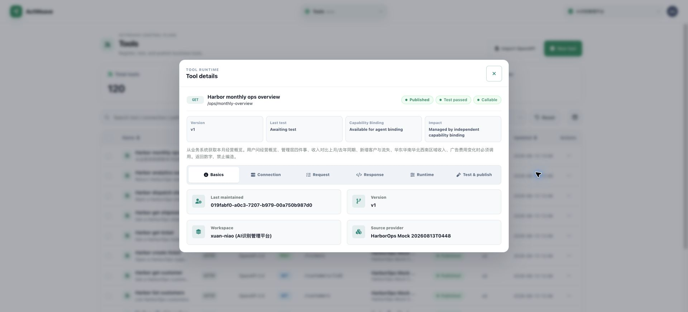

代码交叉检查确认了分叉来源：`getToolTestStatus()` 与发布清单接受新的 `latestTest`，而 `toolLastTestSummary()` / `toolLastTestDetail()` 只读取旧的 `lastTestResult`。入口集中在：

- `frontend/src/utils/tool-governance.ts`
- `frontend/src/composables/tools-page-model.ts`（约 705 行）
- `frontend/src/components/ToolDetailPanel.vue`

建议：建立单一 `ToolTestState` view model，由同一个归一化函数产出 badge、摘要、详情和发布清单；禁止各组件直接读取不同历史字段。

验收标准：

1. 仅有 `latestTest=SUCCEEDED` 时，所有位置统一显示最近测试通过及同一时间戳。
2. 没有任何测试记录时，所有位置统一显示“未测试”，发布清单不得通过。
3. 同一 Tool 页面不允许同时出现 `passed` 与 `no record / awaiting`。

### P0-02：Workflow 的成功率和发布生命周期不可信

列表把没有任何运行记录的工作流显示为 `100% (0 runs)`；详情同时显示 `Published`、`Not validated`、四个绿色生命周期步骤，以及 `No step snapshot yet`，但顶部又写有 9 个 Steps。

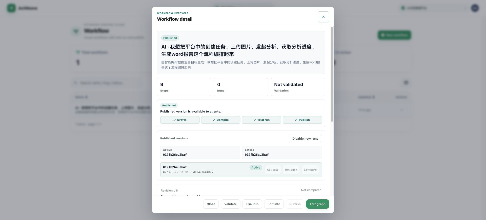

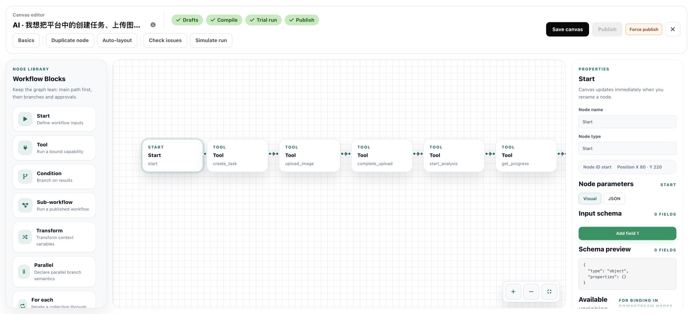

代码中 `frontend/src/composables/workflow-page-model.ts:833` 在零执行时直接返回 `workflow.successRateNone`，而英中翻译都把该值写成 100%。这是可直接修复的错误指标。

建议：

- 零样本成功率显示 `—（暂无运行）`，永远不要显示 100%。
- 将 Draft、Compile、Trial、Publish 的状态全部绑定到一个服务器返回的 readiness 快照，附带版本号和更新时间。
- 已发布但缺少历史验证证据时，显示“历史证据不可用”，不要同时画全绿步骤。
- Steps 计数与 snapshot 缺失要明确区分“当前定义节点数”和“已保存发布快照”。

验收标准：零运行绝不显示百分比；`Not validated` 时 Validate 不得为绿色完成；同一 revision 的列表、详情、编辑器状态完全一致。

### P1-01：Run Console 把核心对话让位给调试与凭证配置

桌面端中，运行摘要、非生产提示、Subject、Connection、一次性 Token 和过期时间全部常驻，真正的消息区只剩中间一小块，A2UI 结果需要在狭窄内层滚动区中寻找。

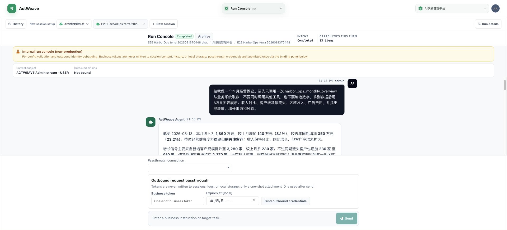

390 × 844 下，顶部设置与摘要占去大量高度，凭证面板紧贴在消息区下方，首屏只能看到用户消息的一部分，几乎看不到 Agent 回复。

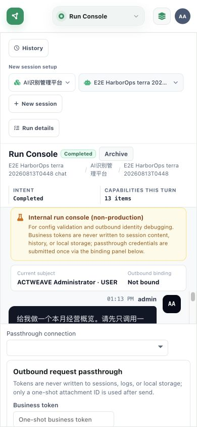

实现上，`frontend/src/components/ChatExecutionPageBody.vue:373` 将整个 `DebugOutboundCredentialPanel` 永久放进不可收缩的 composer dock；`frontend/src/views/chat-execution-page.css:1164` 又让 dock `flex-shrink: 0`。

建议：将凭证设置改为按需抽屉 / 折叠区，仅在选择需要透传的 Connection 且点击“绑定凭证”时展开；运行摘要压缩成单行；窄屏将会话设置放入独立 sheet，并保证消息区至少占可用高度的 55%。

### P1-02：失败 Trace 的根因与下一步没有被前置

列表显示 Failed 后进入详情，顶部只有时间、模型、用户和总耗时，没有失败 badge、错误码、失败阶段或“重试 / 查看相关连接”等动作。用户必须滚动完整时间线，才会在最底部看到 `unexpected end of JSON input`。

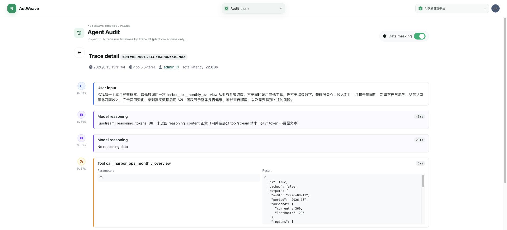

同时，Audit KPI 显示 Total runs = 64，分页却显示 63 items。若统计口径不同，页面没有解释；若口径相同，就是数据一致性缺陷。

建议：详情顶部增加固定 Failure summary（阶段、稳定错误码、用户可读原因、发生时间、相关 Tool / Connection、建议动作）；KPI 与列表明确标注统计范围，或强制同一查询条件与时间窗口。

### P1-03：Connection 异常状态不具可诊断性

列表只显示 `Needs attention`，修复动作藏在省略号菜单。详情提示“验证后才会显示诊断”，但同时标记 `Not yet verified`，用户无法区分“从未验证”和“验证失败”。此外，该连接显示 `No authentication`，同一块又写 `Inject header after auth endpoint response`，语义自相矛盾。

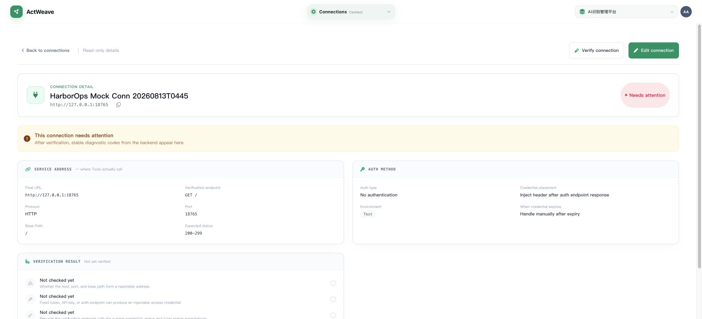

建议：把异常原因和主 CTA 直接放到状态单元格；拆分 `Never verified / Verification failed / Verification expired`；认证方式为 None 时隐藏凭证注入策略，或解释其来源与是否生效。

### P1-04：Overview 不能把风险转化为行动

Overview 能指出连接未验证、运行成功率低、Model configs 仅 7/24，但这些风险块都是静态信息，没有链接到已带过滤条件的 Connections、Audit 或 Model APIs。

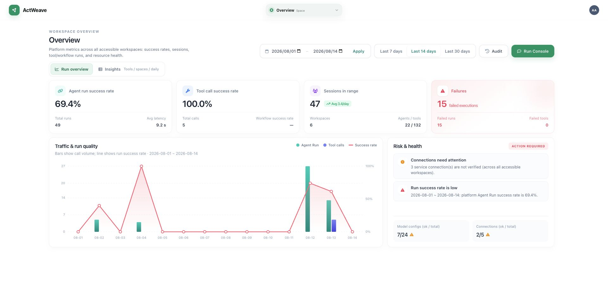

建议：每个风险项提供明确动词和数量，例如“查看 3 个异常连接”“查看 15 次失败运行”；跳转后保留时间范围与筛选条件。仪表盘的价值应是缩短处理路径，而不只是展示数字。

### P1-05：会话历史无法支持恢复任务

大量历史记录都叫 `{Agent name} chat`，同一 Agent 的多条记录只靠相近时间区分；没有首条指令摘要、运行状态、日期分组、工作区或最近结果。

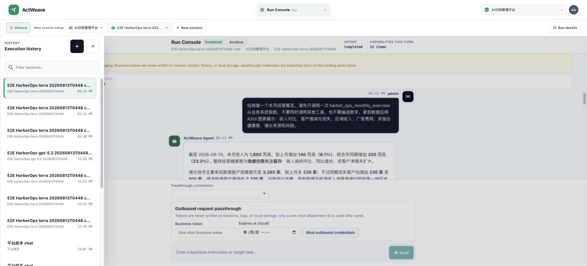

建议：默认标题取首条用户意图的 20～32 字摘要；增加状态、日期分组、工作区和最近消息预览；允许用户重命名与按失败 / 完成 / 进行中过滤。

### P1-06：Workflow 图编辑器缺乏全局可见性，危险操作层级过高

9 节点工作流打开后只看到前半段，右侧节点在视口外；Fit all 仅是右下角无文字小图标。`Force publish` 与常规发布并列，且在 Publish disabled 时成为最显眼的可用发布动作。

建议：首次进入自动 Fit all；提供 minimap、当前缩放和节点计数；Force publish 收入二级菜单并要求展示跳过的具体检查、原因和二次确认，不应成为主要按钮。

### P1-07：窄屏管理任务严重退化

Tools 在 390 px 下，标题、两个 CTA、四个纵向 KPI 和筛选器占满第一屏；继续下滑后表格只看到 Name、被截断为 `HT` 的 Type 和 Actions，关键 Status 不可见，还需要横向滚动。

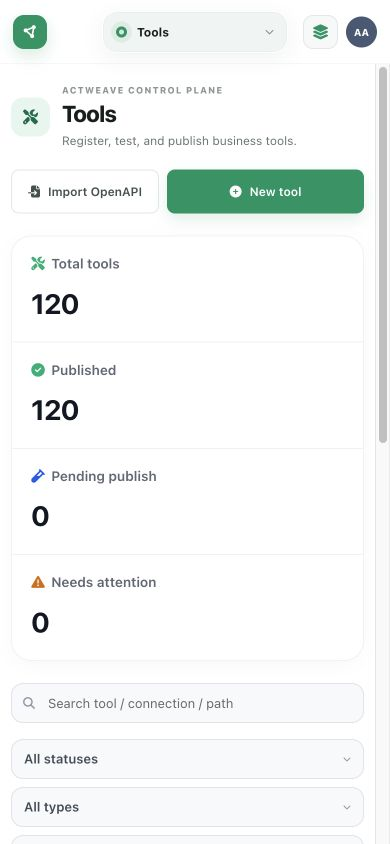

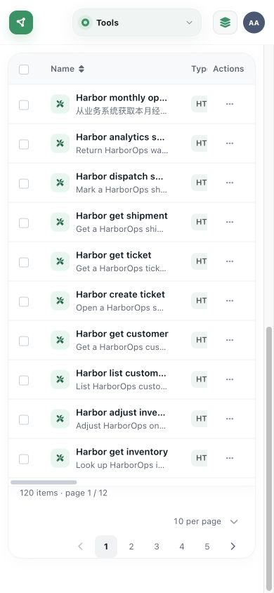

全局工作区切换也在 980 px 以下被 CSS 主动隐藏文字，仅剩图标；虽然有 aria 名称，但视觉用户无法确认当前作用域。对应规则位于 `frontend/src/styles/page-misc.css:1728`。

建议：窄屏 KPI 改为 2 × 2 紧凑网格或可折叠摘要；管理表格改为卡片式关键字段，Status 必须保留；工作区至少显示缩短后的名称或首字母 + tooltip / sheet 标题。

### P1-08：Agents 表格的交互语义和 KPI 朗读错误

DOM / 无障碍树中，整行是 button，行内名称、View 和 More actions 又是 button，形成嵌套交互。Running 卡片的数值 `4` 和比例 `100.0%` 没有可读分隔，被拼成 `4100.0%`。

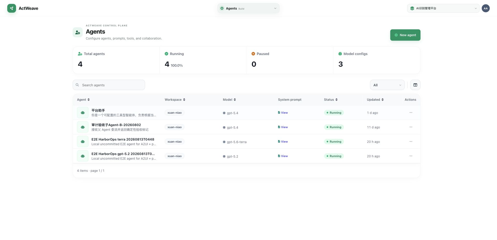

建议：表格行保持 `tr`，只让名称链接和行内操作可聚焦；统计卡增加明确可访问文本，例如“Running agents: 4, 100 percent of total”。为键盘 Tab / Enter / Space / Escape 建立回归测试。

## 其他中优先级问题

### P2-01：导航重复且在窄屏隐藏后半模块

Pinned 再次重复 Agents、Tools、Workflow、Run Console；Smart Orchestration 在桌面端被截断。窄屏 overlay 中，重复区占据上半部分，Agent Access、Audit、Users 需要滚动才能出现。

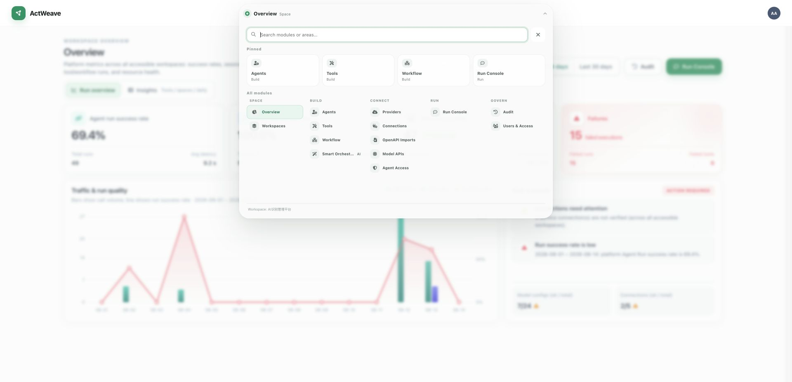

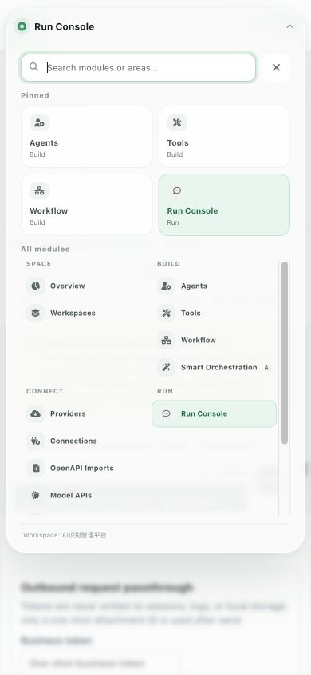

建议：Pinned 允许用户自定义或在窄屏折叠；常用模块与完整模块列表不要平铺重复；长名称禁止无提示截断。

### P2-02：Agent 编辑概念和信息密度不一致

对象是 Agent，首字段却叫 `Run name`；编辑器放在长滚动模态框中，Agent settings、Session policy、Collaboration、Inbound / Outbound、AI rewrite 全部堆在一个滚动容器。

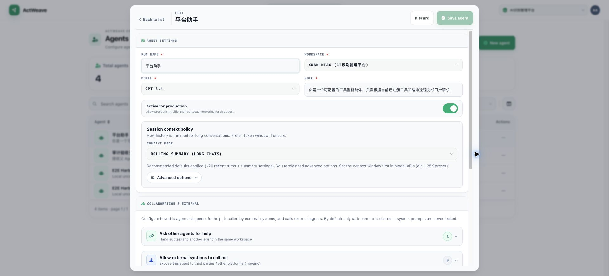

建议：改为 `Agent name`；按 Basics / Runtime / Collaboration / Prompt 分页或分栏；顶部保存区显示未保存项数量并提供清晰的离开保护。

### P2-03：内部 ID 与工程术语直接暴露

Tool 详情的 `Last maintained` 显示 UUID，而不是用户；`Capability Binding`、`Managed by independent capability binding` 无法回答“谁会受影响、能否安全停用”。

建议：展示维护者姓名 + 相对时间，UUID 仅放复制按钮或高级信息；把 Impact 改成具体对象数量和后果，例如“3 Agents 正在使用，停用后新运行将失败”。

### P2-04：筛选器缺少可见标签

Connections 页面三个筛选器视觉上都只显示 `All`，用户只有展开后才能猜出它们分别是状态、迁移状态和身份策略。

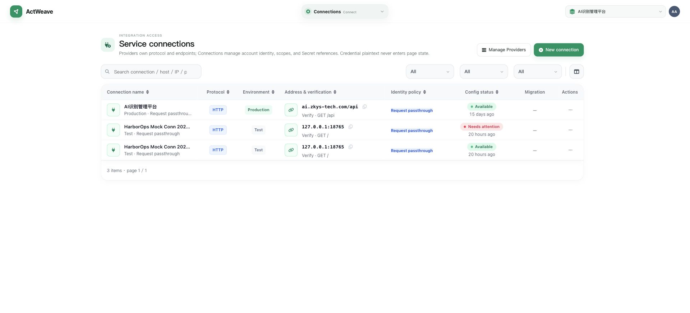

建议：使用 `Status: All`、`Migration: All`、`Identity: All`，并统一所有管理页的筛选顺序、重置逻辑和 URL 参数持久化。

### P2-05：页面地标和返回按钮语义不完整

Run Console 在应用主内容 `<main>` 内再次声明 `<main class="chat-workbench">`；Audit Trace 的返回按钮在无障碍树中只有图标字形。建议保证每页只有一个主地标，图标按钮必须有稳定的 aria-label，并将这些规则加入自动化 a11y smoke test。

## 推荐修复顺序

### 第 1 批：恢复“单一真相”（发布前必须完成）

1. 统一 Tool 测试状态 view model，消除 `latestTest` / `lastTestResult` 分叉。
2. 修正 Workflow 零样本成功率，统一 revision readiness 状态。
3. 统一 Audit 统计与列表查询口径。
4. 为所有治理状态建立互斥规则和跨页面契约测试。

### 第 2 批：恢复核心任务闭环

1. 重构 Run Console 的凭证区为按需展开，保障消息区最小高度。
2. 为失败 Trace 和异常 Connection 增加顶部根因摘要与直接修复 CTA。
3. 让 Overview 风险块可跳转并携带筛选上下文。
4. 改进会话自动命名、日期分组和状态筛选。

### 第 3 批：响应式与可访问性

1. 为 Tools / Agents / Connections 定义真正的窄屏卡片信息优先级。
2. 压缩 Workflow / Run Console 顶部控制区，保留核心工作区。
3. 移除嵌套交互与嵌套主地标，修复 KPI 朗读文本。
4. 将 390 × 844、768 × 1024、1280 × 720 纳入视觉与键盘回归。

## 建议的验收门槛

- 任一 Tool / Workflow 在列表、详情、编辑器中的状态和时间戳完全一致。
- 零样本指标不得显示成功百分比。
- 从 Overview 的每个 Action Required 项到对应修复界面不超过 1 次点击。
- 失败 Trace 打开后无需滚动即可看到失败阶段、错误码、根因和下一步。
- 390 × 844 下 Run Console 首屏能同时看到：当前会话标题、至少一条完整消息、输入框；高级凭证区默认折叠。
- 窄屏管理列表首屏必须保留 Name、Status、主要动作，不依赖横向滚动完成判断。
- 键盘用户可以遍历 Agents 表格且不会进入嵌套按钮；页面只存在一个 `<main>` 地标。
- 对 P0 / P1 场景增加端到端截图与语义断言，避免视觉修复后再次出现状态分叉。

## 截图索引

本目录保留了 21 张原始审计图和 6 张本轮 Chrome 回归图。关键截图已嵌入报告；其余用于复核列表、详情和响应式状态。截图基于本地现有数据生成，未执行保存、发布或外部提交。
