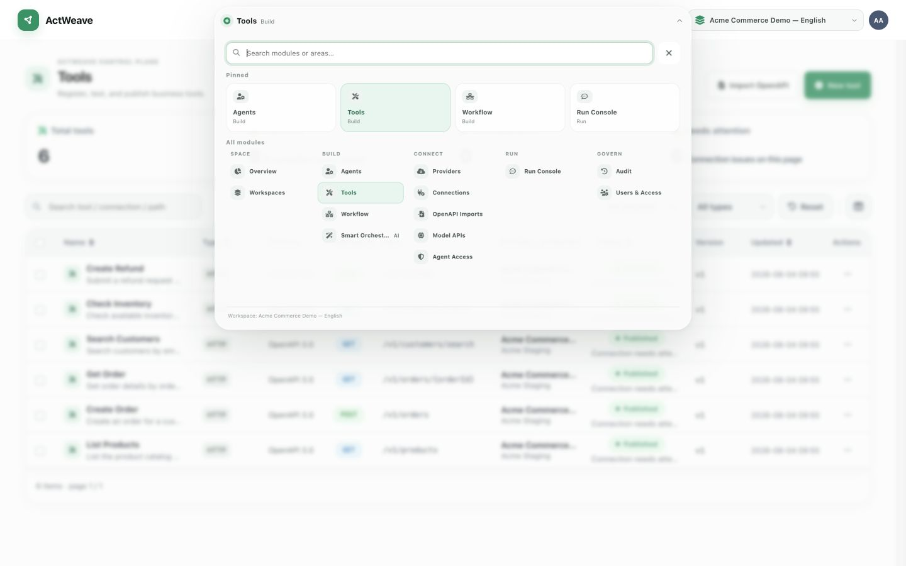
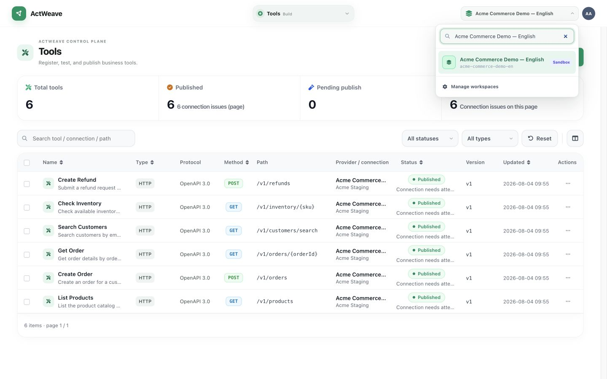
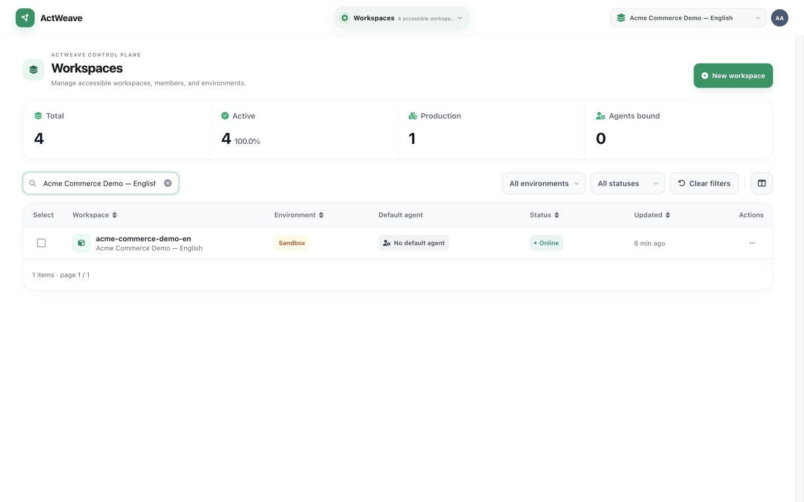
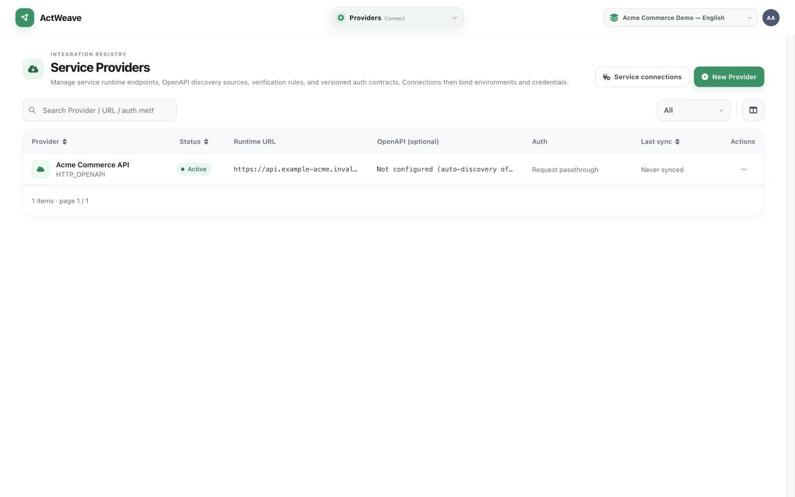
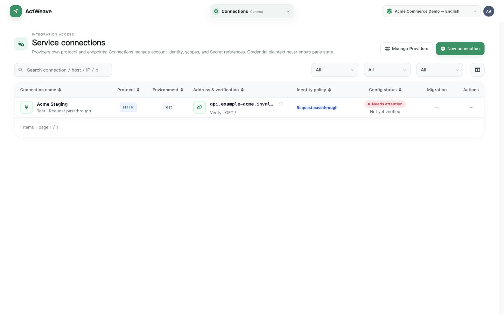
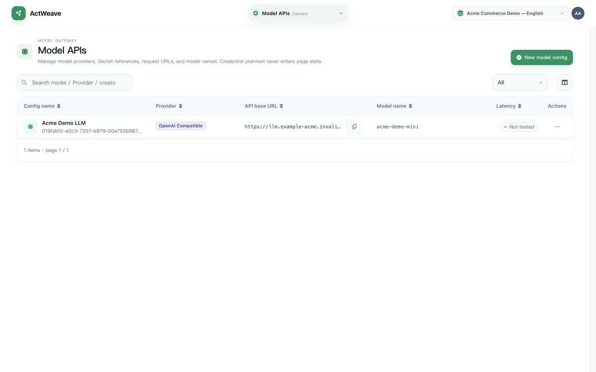
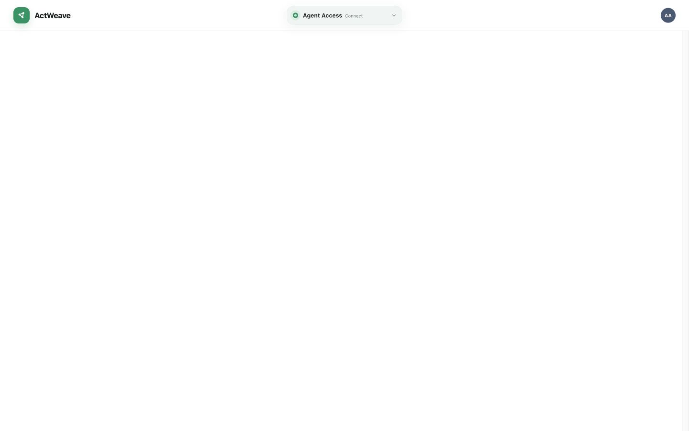
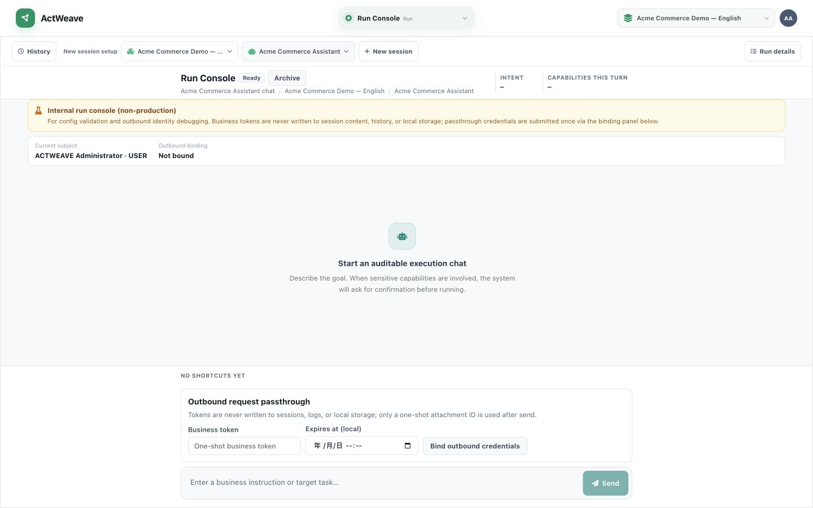

# Product tour

[中文](./product-tour.zh-CN.md) · [Documentation home](./README.md)

All screenshots in this English tour use the fictional `Acme Commerce Demo — English` Workspace with mock product, order, inventory, and refund Tools. They contain no real business-tenant data. The project home keeps five representative views—overview, Tool, Agent, Workflow, and audit; this page contains the remaining Console pages to explain the control plane without redefining the product as a collection of screens.

## Entry and navigation

| Navigation center |
| --- |
|  |

Sign-in is the standard console authentication screen. Navigation is organized as “Space → Build → Connect → Run → Govern.” It reflects the current Console information architecture; understand the product loop from [Provider/Connection/Tool](./concepts.md#tool-provider-and-connection) to Runtime and Audit instead.

## Workspace and overview

| Workspace switcher | Workspace list |
| --- | --- |
|  |  |

A Workspace is the boundary for configuration and runtime data. The overview screenshot is on the [project home](../README.md#product-preview).

## Connect business capabilities

| Provider | Service Connection |
| --- | --- |
|  |  |

A Provider represents an upstream service; a Connection holds its live endpoint, environment, and outbound identity. OpenAPI import can materialize endpoints as Tool drafts; see [OpenAPI to Tool](./integrations/openapi.md).

## Build runtime units

| Model API |
| --- |
|  |

Model API provides a model connection for Agents. Smart DAG generates a Workflow graph draft from natural language; the draft must still be reviewed, trialed, and published. It is not automatic deployment. The current Smart DAG screen is not included in this English screenshot set because some generated graph text has not yet completed localization.

The project home shows [Tool governance](../README.md#product-preview), [Agent configuration](../README.md#product-preview), and [Workflow](../README.md#product-preview) as one executable-capability chain.

## External access and debugging

| Agent Access | Console run/chat |
| --- | --- |
|  |  |

Agent Access manages control-plane AAP Client, credential, and grant objects. Console run/chat lets a signed-in console user trial an Agent; it is not the production runtime entry point for a third party. Application integration belongs in the [AAP integration guide](./aap-integration-guide.md).

## Audit

The Agent audit Trace detail screenshot is on the [project home](../README.md#product-preview). It shows a demo order path: AAP Client → Conversation/Run → model turn → inventory Agent delegation with `check_inventory` → `create_order` → final output. Platform administrators can inspect Trace timelines; available detail and readable bodies depend on permissions, retention, and debug configuration. See [runtime plane](./architecture.md#runtime-plane).

## Regenerate screenshots

The screenshot script removes PNGs from its output directory first. Run it only after deciding no local screenshots need preserving:

```bash
node scripts/seed-readme-demo-workspace.mjs
node scripts/capture-readme-screenshots.mjs
```

The script defaults to local UI `http://127.0.0.1:5173`. For the Compose console port, set `ACTWEAVE_UI_URL=http://127.0.0.1:5174`. It requires a running instance and a sign-in-capable development administrator.

To seed and capture the separate English screenshot set, use:

```bash
ACTWEAVE_DEMO_LOCALE=en \
ACTWEAVE_DEMO_OUTPUT_DIR=docs/images/readme/en \
node scripts/seed-readme-demo-workspace.mjs

ACTWEAVE_SCREENSHOT_LOCALE=en \
ACTWEAVE_SCREENSHOT_OUTPUT_DIR=docs/images/readme/en \
ACTWEAVE_UI_URL=http://127.0.0.1:5174 \
node scripts/capture-readme-screenshots.mjs
```

The English capture deliberately excludes the sign-in and Smart DAG screenshots until their visible strings are fully localized.
